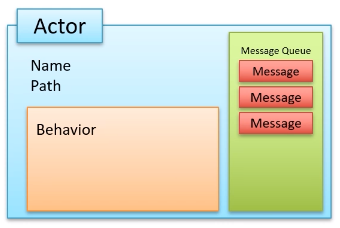

Akka Actors - это основной модуль экосистемы Akka, который реализует [Модель акторов](evernote:///view/170585988/s440/a521a326-f18c-d84b-c4ef-e7adfffde569/48961e8e-4a2c-4d01-818a-19d7bfdff159/).



Каждый актор имеет:
- Имя
- Путь
- Очередь сообщений
- Поведение

Имя актора задается при его создании.
Путь актора - это URL вида
```url
akka://ActorSystemName/<rootParentActorName>/<parentActorName>/<actorName>
```
Узнать путь до актора можно из него с помощью вызова:
```java
final ActorPath path = getContext().getSelf().path();
```

Для объявления акторов используются обычные Java-классы, которые необходимо унаследовать от абстрактного класса из библиотеки Akka Actors.

Раньше в Akka были только нетипизированные акторы, которые могли принимать сообщения любого типа, не контролируя ошибки на этапе компиляции. В последних версиях Akka Actors появились типизированные акторы.

Вне зависимости от типизированности акторов для них существуют следующие рекомендации:
- Создание экземпляра актора должно происходить в статическом методе генерации. Конструктор должен быть приватным.
- Классы сообщений должны быть иммутабельными.
- Классы сообщений должны быть сериализуемыми (в интересах развертывания Akka-кластера)
- Классы сообщений принято создавать в виде внутренних статических классов в классе актора, который это сообщение принимает.

Создание экземпляров поведения обычно происходит с помощью статических утилитных классов, различающихся для нетипизированных и типизированных акторов. Подробнее о каждом из них ниже.

---
## Жизненный цикл акторов

Каждый актор проходит через некоторый обобщенный жизненный цикл:

- создание
- жизнь
    - прием сообщений
    - отправка сообщений
    - изменение поведения
- остановка

### Создание акторов

Первый актор создается при создании акторной системы (см. ниже ActorSystem). Остальные акторы создаются с помощью метода `spawn()`.
```java
getContext().spawn(ChildActor.create(), "childActor");
```

При создании актора ему необходимо задать имя. Путь будет сформирован автоматически по пути родительского актора и имени дочернего актора.

### Получение сообщений

Поведение актора при получении сообщения задается в реализуемом методе `createRecieve()`. В нем при помощи стандартного метода `newRequestBuilder()` создается билдер, в котором можно для каждого типа сообщения задать

### Отправка сообщений

Отправка сообщений от одного актора к другому производится с помощью метода `tell()`.

### Изменение поведения

Актор может представлять собой конечный автомат, переходящий между различными моделями поведения. Текущее поведение актора задается с помощью объекта `Receive`, который возвращается из метода `createReceive`.

Если после обработки сообщения изменение поведения не требуется, то лямбда должна возвращать `Behavior.same()`:

### Остановка акторов

Актор может остановить себя сам, перейдя в состояние
```java
return Behaviors.stopped();
```

Если требуется остановить дочерний актор из родительского <mark>...</mark>

---
Akka гарантирует:
- каждое сообщение будет доставлено не более 1 раза (сообщения могут быть потеряны при выходе из строя ноды кластера)
- при отправке двух сообщений от актора А к актору Б сообщение, ушедшее первым, будет обработано актором Б раньше, чем ушедшее вторым.


---
## Нетипизированные акторы

---
## Типизированные акторы

Типизированные акторы наследуются от абстрактного класса `AbstractBehavior`, при этом необходимо реализовать метод, задающий поведение актора при получении сообщений.

Все сообщения, принимаемые типизированным актором, обычно должны реализовывать один интерфейс, который и является обобщаемым типом актора.

Создание экземпляра актора обычно производится с помощью утилитного класса `Behaviors`:

Поведение актора в зависимости от подтипа сообщения задается в реализуемом методе `createRecieve()` с помощью удобного DSL:
```java
    public Receive<ParentMessage> createReceive() {
        return newReceiveBuilder()
                .onMessageEquals(ParentMessage.SPAWN, this::createChild)
                .onMessage(ChildMessage1.class, this::doSmth1)
                .onMessage(ChildMessage2.class, this::doSmth2)
                .onAnyMessage(this::print)
                .build();
    }
```

При этом входящее сообщение будет последовательно проверятся по каждому условию и будет первое подходящее действие.

Каждый метод, описывающий поведение, должен возвращать объект класса `Receive`. Возвращение этого объекта позволяет менять поведение актора во время выполнения. В базовых случаях можно возвращать
```java
return Behaviors.same(); //Эквивалент return this;
```

Для переопределения поведения следует вернуть метод, который также будет возвращать `Receive`. После того, как поток выполнения зайдет в этот метод, все последующие сообщения будут обрабатываться в нем.

---
## Точка входа

Точкой входа в Akka является класс `ActorSystem`, экземпляр которого (акторная система) обычно создается один на все приложение. Для акторной системы задается актор и имя. Актор, который передается - обычно самый грязный, он служит для того чтобы настроить всю остальную систему.

---
## Таймеры

При работе с акторами не принято манипулировать со временем напрямую. Если требуется выполнять какое-либо действие периодически, то создается специальный таймер, который отправляет актору команды с заданным интервалом
```java
.onMessage(StartCommand.class, message -> Behaviors.withTimers(timer -> {
    //Отправление команды PeriodicCommand с интервалом 1 с.
    timer.startTimerAtFixedRate(TIMER_KEY, new SelfCommand(), Duration.ofSeconds(1L));
    return this;
}))
```

---
## К изучению
- [ ] Курс Practical Java concurrency with the Akka Actor Model в части касающейся
- [ ] javadoc на библиотеку