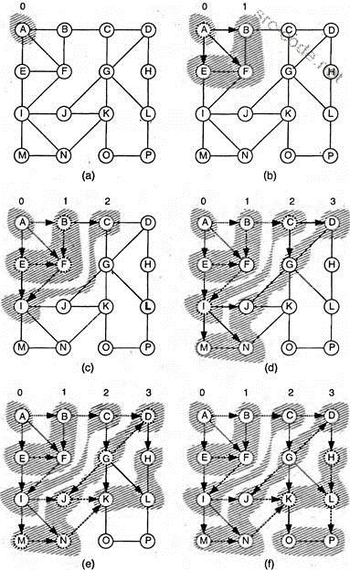

# Поиск в ширину

Алгоритм **поиска в ширину** (Breadth-First Search - BFS) предназначен для поиска кратчайшего пути *невзвешенного* графа.

Алгоритм относится к жадным.

---
## Алгоритм

- Создается очередь для хранения узлов графа и множество для хранения рассмотренных узлов. Если необходимо запомнить оптимальный маршрут, то создается карта соответствия: элемент-родитель.
- В очередь помещается начальный узел
- Пока в очереди есть объекты, из нее достается элемент и, если он не является искомым, то в очередь добавляются все его соседи, которые ранее не рассматривались
- Если в очереди закончились элементы, значит в графе нет искомого узла.

---
## Реализация на Java
<mark>todo</mark>

---
## К изучению

- [X] Глава 6 книги Адитья Бхаргава. Грокаем алгоритмы
- [ ] Вики:  https://ru.wikipedia.org/wiki/%D0%9F%D0%BE%D0%B8%D1%81%D0%BA_%D0%B2_%D1%88%D0%B8%D1%80%D0%B8%D0%BD%D1%83
