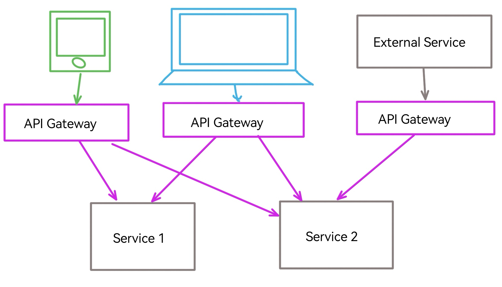

# API Gateway

__API Gateway__ - это архитектурный паттерн, при котором выделяется отдельный сервис, отвечающий за маршрутизацию запросов от клиентов API к сервисам, предоставляющим API.
Благодаря этому паттерну клиент не обязан знать какой эндпойнт API где находится, не должен знать какие сервисы вообще существуют в системе.

Основные задачи API Gateway:
- Маршрутизация (routing)
- [Балансировка](./load_balancer.md)
- [Аутентификация](../security/authentication.md)
- [Rate limiter](./rate_limiter.md)
- Композиция запросов - от клиента приходит один запрос, а API Gateway делает несколько запросов в низлежайшие сервисы, а затем объединяет ответ.

Рекомендуется устанавливать отдельный API Gateway под разные типы потребителей.
Например: для мобильных приложений отдельно, для web-UI отдельно, для админки отдельно.
Такой подход известен под названием __backend for frontend__ или (BFF).

---
## Готовые решения

Существует ряд готовых коробочных решений:
- KrakenD
- Kong - [nginx](../devops/nginx.md) с дополнительным Lua движком
- Istio - обычно берется в паре с кубером
- traefik
- Zuul
- [nginx](../devops/nginx.md) - сам по себе тоже может выступать в качестве примитивного API Gateway

---
## К изучению
- [ ] [API Gateway](https://microservices.io/patterns/apigateway.html)
- [ ] [API Composition pattern](https://microservices.io/patterns/data/api-composition.html)
- [X] [Open source API Gateways](https://www.cyberlands.io/opensourceapigateways)
- [ ] [BFF](https://samnewman.io/patterns/architectural/bff/)
- [ ] [BFF в SoundCloud](https://www.thoughtworks.com/insights/blog/bff-soundcloud)
