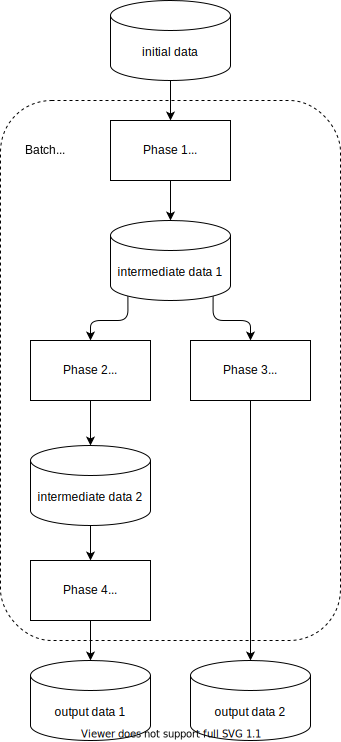

# Пакетная обработка

Пакетная обработка предусматривает обработку данных некоторыми порциями, которые называются пакетами или батчами (batch).
Такой вид обработки используется для оффлайн-процессов, не требующих сиюминутной обработки.
Пакетная обработка позволяет переварить огромные массивы данных.

Часто пакетной обработке противопоставляют [стриминг](streaming.md).
С развитием стриминга многие операции, которые раньше обрабатывались батчами, в современном мире переводят на стриминг.

Примерами пакетной обработки являются:
- клиринг в банковских системах
- генерация отчетов
- подготовка данных для обучения нейросетей

Т.е. данные поступающие в систему копятся, а потом обрабатываются одномоментно по таймеру.

Пакетная обработка позволяет более равномерно распределить нагрузку на сервера, если запускать ее ночью, когда обычная нагрузка на систему падает.

Зачастую пакетная обработка делится на несколько фаз.
Между фазами данные прихраниваются в промежуточное хранилище.
Каждая фаза обрабатывается независимо.
Таким образом можно каждую фазу масштабировать отдельно, а также использовать промежуточные результаты для разных видов последующей обработки.
Также стараются, чтобы обработку одного массива данных в одной фазе можно было раздробить на независимые шарды, которые обрабатывать разными процессами.
Таким образом можно распараллелить обработку.

Если в процессе обработки пакета произошел сбой, например сгорел сервер, то обработку всегда можно будет перезапустить с последней успешной фазы.

---
## К изучению
- [X] Книга "Грокаем Стриминг" Д. Фишер, Н. Ван. Глава 1