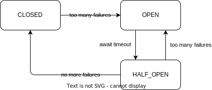

# Circuit breaker

__Circuit breaker__ - это паттерн проектирования межсервисного взаимодействия, предотвращающий массовый отказ сервисов при отказе одного из них.

Circuit breaker входит в группу паттернов, предназначенных для устойчивости к сбоям (fault tolerance).

### Описание проблемы
При интеграции сервисов между собой отказ одного сервиса может повлечь за собой отказ и других.
Например, сервис A интегрирован с сервисом B.
Сервис B на время вышел из строя, например, разорвалось сетевое взаимодействие, или сервис был отключен для проведения срочных работ.
Сервис A продолжает отправлять запросы на сервис В и ждать от него ответа.
Если на сервисе А при этом не настроены таймауты, а запросы являются синхронными, то это может привести к исчерпанию ресурсов, выделенных сервису А и его отказу.

Но введение таймаутов спасает не от всего.
Например, сервис В может не отказать полностью, а просто начать отвечать негативно (5xx в http).
В таком случае сервис А будет бессмысленно генерировать трафик (а в случае наличия [ретраев](./retry.md), этот трафик еще и вырастет кратно, что может привести уже в полному отказу сервиса В).

## Circuit breaker

Описанную проблему можно решить, отрубая вызовы на упавший сервис.
Для этого необходимо мониторить состояние сервиса и подсчитывать частоту негативных ответов.
После того, как мы отрубили вызовы на упавший сервис, через какое-то время он может восстановиться и надо снова начать отправлять на него запросы.
Для этого выжидается некоторое время, после чего только часть запросов направляется на удаленный сервис.
Если он продолжает отвечать негативно (или не отвечать вовсе), то снова выжидаем некоторый промежуток времени.
И только когда сервис начинает отвечать позитивно, направляем на него весь объем запросов.

Такое поведение описывается с помощью конечного автомата, который может находиться в одном из трех состояний:
- CLOSED - все вызовы направляются на удаленный сервис
- OPEN - ни один вызов не отправляется
- HALF-OPEN - часть вызовов направляются на удаленный сервис

Circuit breaker называется так по аналогии с устройствами защиты от коротких замыканий в электрике.
Поэтому у его состояний такие странные названия: `CLOSED` - по аналогии с замкнутой цепью, `OPEN` - с разомкнутой. 

### Скользящее окно
Подсчет вызовов, закончившихся негативно, должен выполнять в некотором скользящем окне.
Окно может быть:
- временным - подсчитывается количество негативных вызовов за некоторый промежуток времени
- количественным - подсчитывается количество негативных вызовов за последние N вызовов

Как правило скользящие окна реализуются на основе кольцевых буферов.

---
## Реализации
Circuit Breaker может быть как частью сервиса, выступающего в качестве клиента в межсервисном общении, так и входить в состав [service mech](./service_mesh.md) side-контейнера.

Для Java-приложений популярны следующие библиотеки, содержащие в себе Circuit Breaker:
- Resilience4j - самая популярная
- Hystrix - часть Netflix opensource проектов. Не развивается с 2019 г.
- Spring Retry

---
## К изучению

- [X] [Wiki. Circuit Breaker](https://en.wikipedia.org/wiki/Circuit_breaker_design_pattern)
