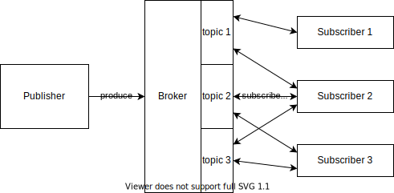

# Архитектурный паттерн Издатель-Подписчик

Издатель-Подписчик - это паттерн проектирования, при котором передача данных происходит не путем прямого вызова другой системы, а путем публикации данных в каком-либо общедоступном для других систем месте.
Система, генерирующая данные, называется **издателем** - publisher.
Система, потребляющая данные, называется **подписчиком** - subscriber.

Издатель каким-то образом классифицирует сообщение. 
А подписчики подписываются на определенные классы сообщений.

В англоязычной литературе встречается наименование Pub-Sub pattern.

## Преимущества и недостатки
### Преимущества Pub-Sub
Pub-Sub паттерн позволяет _разорвать жесткую связь_ между создателями и потребителями данных. 
У одних и тех же данных может быть несколько потребителей, которые могут добавляться с развитием системы.
При этом не нужно будет дорабатывать систему, генерирующую данные.

Также потребители могут потреблять данные только в тот момент, когда они готовы к этому. 
Например, у потребителя может быть пул тредов, которые занимаются обработкой данных.
Когда очередной тред закончит обработку предыдущего сообщения, он вычитает новое и начнет его обработку.
Если все треды из пула заняты, то система просто не потребляет новых сообщений.
В интеграции, основанной на синхронном вызове, потребитель бы выкинул ошибку в этом случае.

Еще одним преимуществом является _масштабируемость системы_.
Если данные могут быть обработаны независимо друг от друга, то для ускорения обработки можно просто поднять дополнительные инстансы подписчиков.

### Недостатки Pub-Sub
Тяжело гарантировать обработку сообщений в заданные _тайминги_, т.к. издатель даже не знает взято ли сообщение в работу.

Внезапно среди недостатков всплывает _масштабируемость системы_, которая раньше упоминалась в достоинствах.
Проблема в том, что Pub-Sub системы хорошо масштабируются только в пределах одного ЦОДа, когда же речь заходит о нескольких ЦОДах и тысячах серверов, то Pub-Sub системы начинают проседать по throughput.

_Безопасность_ - не лучшая сторона Pub-Sub систем. 
Потребители могут читать сообщения, которые не были для них предназначены.
Издатели могут писать вредоносные сообщения.
Брокер (в минимальной комплектации) ничего из этого не контролирует, и приходится предпринимать дополнительные меры для обеспечения безопасности системы.

## Топология
Публикуемые данные должны где-то храниться, чтобы быть доступными для считывания подписчиками.
Чаще всего для этих целей используется **брокер**.
Но его наличие в Pub-Sub системах необязательно, можно как-то обойтись без него (хз как, пока не нашел примеров).

Издатель публикует данные в брокер, а подписчики забирают оттуда данные.

## Фильтрация данных
Подписчикам могут быть не нужны все данные, которые генерируют издатели.
Для разделения сообщений на группы могут использоваться различные приемы:
- **топики** - физическое разделение данных по общему признаку. Например, все сообщения мониторинга, могут публиковаться в один топик, логи в другой топик, а бизнес-сообщения в третий. За выбор конкретного топика, куда нужно положить данные, отвечает издатель.
- содержимое данных

Пример топологии Pub-Sub системы, основанной на топиках:

## Реализации
Почти не существует чистых реализаций Pub-Sub паттерна. 
Все существующие брокеры помимо Pub-Sub предоставляют дополнительные способы работы с данными.
Вот несколько примеров:
- [Apache Kafka](../tools/kafka.md) - один из самых популярных инструментов. Сохраняет все данные на диск, позволяя перечитывать их многократно.
- RabbitMQ 
- Mosquitto - используется в IoT для передачи телеметрии
- Ably

## Применение
Pub-Sub системы лучше всего подходят для асинхронной передачи данных.
Например, чат - идеальное применение для Pub-Sub систем.
Передача телеметрии с каких-либо устройств, также хорошо ложится на Pub-Sub идеологию.
Например, передача данных о GPS координатах курьеров.
А вот для видео-стриминга они подходят слабо.

---
## К изучению

- [X] [Wiki](https://en.wikipedia.org/wiki/Publish%E2%80%93subscribe_pattern)
- [X] [Насыщенная статья](https://ably.com/topic/pub-sub) на Ably.com
