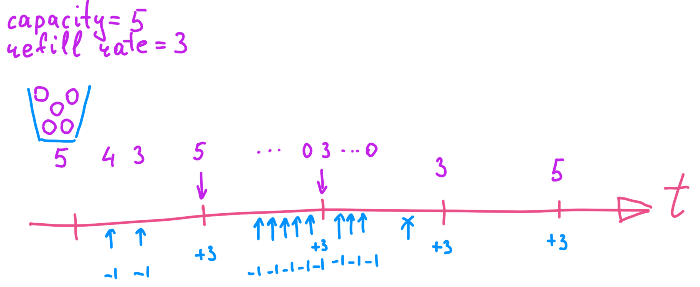

# Rate Limiter

**Rate Limiter** - ограничитель трафика - подсистема, предназначенная для отсечения избыточной нагрузки на сервис.
Как правило rate limiter реализуется на серверной стороне, хотя в некоторых случаях его пишут и на клиентской части.

Rate Limiter может быть использован в бизнес-модели монетизации сервиса.
Например, многие провайдеры API позволяют пользоваться своим сервисом бесплатно при небольшом трафике, а чтобы снять ограничение, требуется заплатить.
При этом лимиты трафика могут быть разделены по ценовым диапазонам.

Пример ограничения: один пользователь может отправить не более 300 твитов в час.

Rate limiter чаще всего включается в API Gateway, но иногда может быть реализован и отдельным сервисом.
todo схема

## Превышение лимита
При превышении лимита необходимо сообщить клиенту, что количество возможных запросов от него исчерпано, и сказать когда он сможет послать очередной запрос.
При взаимодействии клиента и сервера по HTTP сервер возвращает код статуса 429 - Too Many Requests.
Дополнительная информация передается в заголовках ответа:
- `X-???` - todo

## Виды rate limiter'ов
Существует множество различных реализаций алгоритма rate limiter'а:
- **fixed window counter** - самая простая реализация
- **token bucket** - аналог fixed window counter, но дополнительно позволяет контролировать всплески нагрузки
- **leaking bucket** - 
- **sliding window log** -
- **sliding window counter** - 

### Fixed Window Counter
Rate Limiter на основе фиксированного окна разбивает шкалу времени на равные промежутки.
В течение каждого промежутка ведется подсчет входящих запросов.
При превышении счетчиком порогового значения, запросы отклоняются.
При переходе на новый временной промежуток счетчик сбрасывается.

Недостатком фиксированного окна является то, что если запросы будут сгруппированы у окончания одного окна и начала следующего окна, то система может получить в 2 раза больше трафика (но не более), чем было заявлено в ограничениях.

В экосистеме Java алгоритм Fixed Window Counter реализован в популярной библиотеке Resilience4j.

### Token Bucket
Token Bucket - это модель, в которой у нас есть контейнер (bucket) с ограниченным количеством токенов/талонов (token).
В контейнер с заданной периодичностью добавляются токены.
При превышении объема контейнера лишние токены выбрасываются.
Каждый запрос расходует некое количество токенов (в простейшем случае - 1).

Реализация алгоритма не требует дополнительных потоков и может быть неблокирующей (с оптимистической блокировкой).
Добавление токенов производится в том же потоке, который обрабатывает запрос.

С помощью объема контейнера можно регулировать величину всплесков (__burst__).

Token Bucket конфигурируется с помощью трех параметров: 
- _capacity_ - максимальное количество токенов в контейнере;
- _refill interval_ - периодичность, с которой в контейнер добавляются токены;
- _refill rate_ - количество токенов, которые добавляются в контейнер.

При значении `capacity == refill interval` token bucket превращается в Fixed Window Counter.

В экосистеме Java алгоритм token bucket реализован в популярной библиотеке Bucket4j.

### Leaking Bucket
todo

Алгоритм Leaking Bucket используется в nginx.

### Sliding Window Log
todo

### Sliding Window Counter
todo

---
## К изучению

- [X] Книга Алекса Сюй "System Design Interview", глава 4
- [X] Подкаст javaswag. Выпуск 26 с Максимом Бартковым
- [ ] [Обзор различных вариантов](https://medium.com/figma-design/an-alternative-approach-to-rate-limiting-f8a06cf7c94c)
- [ ] [Доклад от авторов библиотеки Bucket4j](https://www.youtube.com/watch?v=OSNFNxgZZ3A)