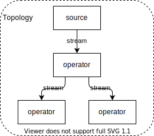

# Потоковая обработка

Потоковая обработка (Стриминг - Streaming) - это один из подходов к обработке данных, когда данные воспринимаются в виде бесконечного потока событий.

Потоковая обработка применяется в тех случаях, когда необходимо обеспечить скорость обработки данных близкую к реальной.
Например для систем антифрода или систем динамического ценообразования.

В тех задачах, где скорость обработки близкая к реальной не нужна, используется [пакетная обработка](batch_processing.md)

## Потоки данных
Поток данных - это неограниченный объем данных.
Объем неограничен, потому что с течением времени в него продолжают поступать новые данные.

Свойства потоков данных:
- **упорядоченность** - известно какие события произошли раньше, а какие позже. Это свойство отличает стриминг от реляционной модели
- события **иммутабельны** - однажды случившееся событие не может быть изменено. Если нужно его откатить или изменить его параметры, то создается новое событие с нужным эффектом.
- (опц.) **повторяемость** - события могут быть проиграны повторно с какого-либо момента. Это свойство может быть полезно при подключении к потоку данных нового обработчика.

## Работа со временем
При обработке потоковых данных очень важно правильно работать со временем.
Это особенно актуально для систем, которые обрабатывают данные в скользящем окне.

- Время происхождения события - момент времени, когда событие было сгенерировано. Обработку событий лучше всего проводить с использованием этого времени
- Время попадания события в стрим - может отличаться от времени происхождение события, например, из-за сетевых сбоев и переповторов при записи со стороны производителя события.
- Время обработки - самое ненадежное время, т.к. может отличаться от времени происхождения события непредсказуемым образом.

## Состояние
Классно, когда каждое событие может быть обработано в отрыве от остальных.
Но чаще всего необходимо агрегировать данные из нескольких событий, например, при обработке методом скользящего окна.
При этом нужно где-то хранить промежуточное состояние обработки: либо в памяти, либо где-то вовне.
- хранение состояния в оперативной памяти отличается высокой скоростью, но объем хранимых данных ограничен выделенной на приложение памятью, а при сбоях состояние может быть утрачено. Также становится невозможным разделение состояния между несколькими инстансами обработчиков стрима.
- хранение состояния вовне (например в Cassandra) инвертирует преимущества и недостатки локального хранения.

### Materialized view
Materialized view - итоговое представление состояние системы. 
По сути можно представить как табличку, в которую заливаются данные из стрима.
Для каждого события вызывается одна из операций модификации таблицы: `update`, `insert`, `delete`.

### Временное окно
Временные окна часто применяются для отслеживания каких-либо аномалий, либо нахождения локального среднего.
Например, для нахождения подозрительных операций (антифрод) или динамического ценообразования.

Характеристики временных окон:
- размер окна - временной промежуток, за который рассматриваются события
- интервал опережения - как часто окно сдвигается. Если окно сдвигается при каждом новом событии, то оно называется **скользящим**. Если размер окна равен интервалу опережения, то окно называется **кувыркающимся**.

---
## Фреймворки
Для потоковой обработки могут использоваться различные фреймворки:
- Kafka Streams
- Apache Spark
- Apache Heron
- Apache Storm
- Apache Flink

### Основные понятия
Как правило фреймворки потоковой обработки работают со следующими понятиями:
- _event_ - событие - единица обработки
- _source_ - источник событий
- _operator_ - оператор - актор, обрабатывающий события
- _stream_ - поток (стрим) - некая очередь через которую события доставляются от одного оператора к другому
- _topology_ / _job_ - топология / задание - граф, определяющий как связаны между собой источник, операторы и стримы

---
## К изучению
- [X] Книга Apache Kafka. Потоковая обработка и анализ данных. Глава 11
- [X] Книга "Грокаем Стриминг" Д. Фишер, Н. Ван. Глава 2
