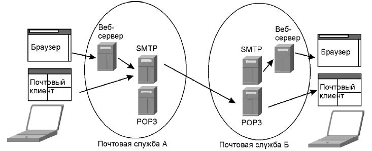

Электронная почта основана на модели клиент-сервер и для работы требует наличия специальных почтовых серверов.

В крупных компаниях сисадмины разворачивают свои собственные почтовые сервера, в маленьких компаниях используют почтовые сервера, предоставляемые специальными провайдерами, например: Яндекс.Почта, Gmail и др.

Популярные почтовые серверы: Postfix, Sendmail, Apache James.

Предположим, что человек А решил отправить письмо человеку Б. Он пишет его на своем компьютере (телефоне / планшете) и нажимает кнопку "отправить". Письмо отправляется по протоколу SMTP на почтовый сервер клиента А.

Этот почтовый сервер пересылает письмо почтовому серверу клиенту Б также при помощи протокола SMTP.

Когда клиент Б решит проверить почту, он сделает запрос к своему почтовому серверу с помощью протокола POP3 или IMAP. В случае использования протокола POP3 письма будут выкачены на устройство клиента Б и удалены с почтового сервера. При использовании протокола IMAP клиенту Б будут переданы копии писем, а оригиналы останутся храниться на почтовом сервере.

При разработке системы электронной почты, создатели позаимствовали многие термины из реальной почты: письмо, конверт и пр.

---
## Электронное письмо

Электронное письмо состоит из следующих частей:

- Заголовки - тема письма, адрес отправителя, адреса получателей и служебная информация. (подробнее о возможных заголовках см. вики)
- Тело письма - текст, html-текст, картинки, вложения.

Раньше тело письма могло состоять только из символов ASCII, но с развитием почтовых систем, появилась возможность добавлять в тело html-разметку, изображения, а также прикладывать к письму различные файлы. Для того чтобы правильно выделять различные части из письма были разработаны [MIME](../web/mime.md)-типы - многоцелевые расширения интернет-почты.

Письмо перед отправкой упаковывается в конверт, на котором указывается адресат.

Для отправки писем используется протокол **SMTP**. А для их приема используется либо протокол **POP3**, либо **IMAP**.

---
## Почтовые протоколы

Все почтовые протоколы относятся к самому высокому уровню [модели OSI](../network/osi.md) и основаны на TCP.

### SMTP

Simple Mail Transfer Protocol - простой протокол передачи писем. Используется для рассылки писем.

SMTP использует порт 25 или 587. А его защищенная версия SMTPS слушает порт 465

### POP3

Post Office Protocol v3 - почтовый протокол. Используется для чтения писем. POP3 при выкачивании письма на клиентский компьютер удаляет письмо с почтового сервера.

Недостатком этого протокола является то, что при просмотре письма на одном клиентском компьютере это письмо уже нельзя будет посмотреть с другого устройства.

POP3 слушает порт 110. А его защищенная версия POP3S слушает порт 995.

### IMAP

Internet Message Access Protocol - протокол доступа к электронной почте. Альтернатива протоколу POP3. IMAP подгружает на клиент только мета-информацию письма, а остальные данные предоставляет по требованию.

IMAP слушает порт 143. А его защищенная версия IMAPS слушает порт 993

---
## К изучению

- [X] В. Олифер, Н. Олифер. Компьютерные сети
- [X] Вики. Электронная почта: https://ru.wikipedia.org/wiki/%D0%AD%D0%BB%D0%B5%D0%BA%D1%82%D1%80%D0%BE%D0%BD%D0%BD%D0%B0%D1%8F_%D0%BF%D0%BE%D1%87%D1%82%D0%B0
- [X] Хабр. Протоколы верхнего уровня: https://habr.com/ru/post/307714/
- [X] Хабр. Моя статья по электронной почте и работе с ней из Java: https://habr.com/ru/post/526162/