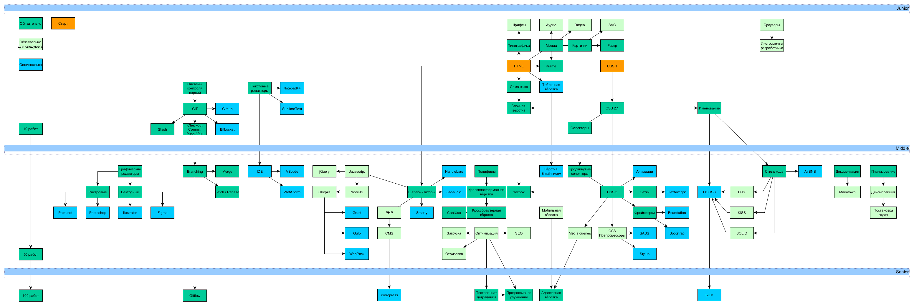

Фронтэнд - это все, что браузер может читать, выводить на экран и запускать
<mark>Что за хрень?</mark>

Основные фронтэндовые технологии:

- HTML - HyperText Markup Language - устанавливает параметры текста (заголовки, параграфы, списки)
- CSS - Cascading Style Sheets - устанавливает параметры отображения (отступы, цвет)
- JavaScript - взаимодействие с пользователем

По *CSS и HTML* у меня есть *отдельные блокноты*

Путь развития верстальщика:

---
## К изучению

- [ ] https://habr.com/ru/post/275729/
- [ ] Путь верстальщика:  https://habr.com/ru/post/346010/
- [ ] Технологии фронтендера в виде ярлычков с ссылками на полезные ресурсы: https://andreasbm.github.io/web-skills/?compact