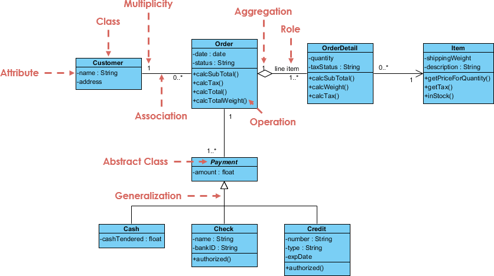

**UML** - Unified Modeling Language

Виды UML:
- Структурные диаграммы
    - Классов
    - Компонентов
    - Развертывания
    - тысячи их
- Диаграммы поведения
    - Последовательности
    - Деятельности
    - Конечных автоматов
    - тысячи их

---
## Диаграммы классов
Класс на диаграмме обозначается прямоугольником с тремя секциями:
- Название класса
- Поля
- Методы

Уровни доступа:
- `+` - public
- `~` - package-private
- `#` - protected
- `-` - private

Связи между классами:
- Агрегация - (has a) обозначается палкой с пустым ромбиком. Обычно в Java агрегирующий класс включает в себя коллекцию агрегируемого
- Композиция - обозначается палкой с закрашенным ромбиком. В Java практически не используется
- Генерализация - обозначается палкой с пустой стрелкой. Идет от классов-наследников к классам-родителям.
- Реализация - обозначается прерывистой палкой с пустой стрелкой. Идет от классов, реализующих интерфейс, к интерфейсу.
- Ассоциация - обозначается палкой со стрелкой в виде наконечника стрелы. Означает, что класс зависит от другого класса.
- Двунаправленная ассоциация - обозначается просто палкой. Классы зависят друг от друга. Такие классы нужно объединять