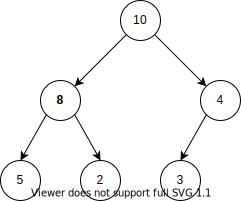

# Куча

Куча (Heap) - это [древовидная](tree.md) структура данных, обеспечивающая быстрый доступ к элементу с самым высоким (или наоборот низким) значением ключа и относительно быструю вставку / удаление новых элементов.
Куча часто используется в качестве низлежащей структуры данных для [очереди с приоритетом](priority_queue.md).

Дерево должно обладать двумя свойствами, чтобы считаться кучей:
- Если нода A является родителем для ноды B, то ключ ноды A должен быть больше или равен ключу ноды B
- Куча должна быть полным деревом. Это означает, что каждый уровень дерева должен быть либо заполнен полностью, либо в нем не должно быть пропусков при заполнении уровня слева направо.



Для хранения данных в памяти чаще всего используются бинарные кучи.

## Алгоритмы
### Получение элемента с наивысшим значением ключа
По свойству кучи в корне всегда находится элемент с наивысшим значением ключа.
Поэтому его получение - тривиальная операция со сложностью `O(1)`.

### Вставка
При вставке новый элемент всегда помещается в конец кучи.
Если все текущие уровни заполнены, то в самый левый элемент нового уровня. 
Если в нижнем уровне еще есть место, то справа от последнего элемента.

Затем происходит пересортировка кучи - значение ключа нового элемента сравнивается с ключом его родителя, и если оно больше, то они меняются местами.
Так происходит пока новый элемент не найдет свое место.
Это поднятие элемента вверх по уровням дерева похоже на всплытие пузырька, т.е. на сортировку пузырьком.

Сложность вставки определяется количеством уровней, а следовательно `O(log n)`.

### Удаление
Куча чаще всего используется для очереди с приоритетом, поэтому удалять необходимо только корневой элемент.
После его удаление, необходимо перестроить дерево.
Для этого на каждом уровне между наследниками удаленного (перемещенного) узла определяется тот, у которого выше значение узла и он сдвигается на вакантное место уровнем выше.
На его место точно так же выбирается кандидат из уровня ниже.
И так до самого низа дерева.

Сложность удаления определяется количеством уровней, а следовательно `O(log n)`.

---
## Внутреннее устройство
Самое интересное в куче - это то, что она может быть реализована с помощью обычного массива.
Хранить ссылки нод друг на друга не нужно!

Рутовый элемент записывается первым элементов в массив.
Далее последовательно в массив поэлементно записываются уровни.
Последним элементом будет крайний правый элемент нижнего уровня.

Зная позицию текущего элемента в массиве можно с помощью простых алгебраических формул вычислить позиции его родителя и наследников.
Для бинарной кучи эти формулы запишутся:
```
parent_index = (i - 1) / 2
left_child_index = 2i + 1
right_child_index = 2i + 2
```

---
## К изучению
- [X] Лекция 3.2 курса [Data Structures](https://stepik.org/course/579/syllabus)
