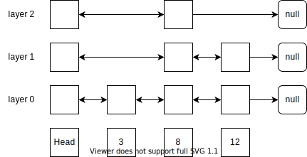

# Skip List

**Skip List** - Лист с пропусками - структура данных, сочетающая в себе преимущества ArrayList и LinkedList при некоторых недостатках.

В SkipList каждый элемент может быть связан не только со своими ближайшими соседями, но и с другими элементами, отстоящими чуть дальше.
Связи между элементами образуют слои.
На нижнем слое - нулевом - все элементы связаны между собой, как в обычном связном списке.
На первом слое представлена только часть элементов, которые связаны между собой, в том же порядке, что и на нижнем слое.
И так далее для каждого более высокого слоя.



Количество слоев, как правило, рассчитывается из планируемого количества хранимых элементов так, чтобы ускорить процесс поиска элемента с списке.

Элементы в Skip List должны быть отсортированы по значению для ускорения поиска элементов.


## Поиск элемента
Поиск элемента в Skip List начинается с верхнего уровня.
Мы начинаем движение с головного элемента и прыгаем по указателям, пока не найдем элемент, чье значение больше искомого.
Когда находим такой элемент, то возвращаемся на один шаг назад и спускаемся на уровень ниже.
Так повторяем пока не найдем элемент с искомым значением.

Алгоритм поиска элемента применяется и при проверке вхождения элемента, и при удалении элемента, и при вставке нового элемента для определения позиции вставки.

В наиболее благоприятном случае сложность поиска составляет `O(log n)`.
В наихудшем случае, если все элементы в списке имеют одинаковую высоту, сложность составит `O(n)`.


## Распределение высот
Skip List считается вероятностной структурой данных, т.к. в стандартной реализации высота вставляемого элемента определяется с помощью вероятностной функции.
Для добавления каждого нового уровня к элементу подбрасывается монетка. Повезло - добавляется новый уровень, не повезло - фиксируем высоту на текущем уровне.
Желаемую вероятность одного розыгрыша можно задать любой, на практике чаще всего используются значения `0.5` и `0,25`.
Вероятность занятия элементом уровня `l` определяется формулой Бернулли:
```
P(n) = (1 - p) * p ^ l
```
, где `p` - это единичная вероятность увеличения уровня.


## Выбор максимальной высоты
Максимальная высота Skip List'а выбирается исходя из ожидаемого количества элементов в списке так, чтобы обеспечить наилучшее время поиска элемента.
Если высота будет слишком низкой, то при поиске придется слишком долго передвигаться по низким уровням.
Если высота будет слишком высокой, то увеличатся затраты по памяти на хранение лишних ссылок.

Для расчета высоты используется формула:
```
height = floor(log of base 1/p (n))
```


## Применение
Skip List'ы используются в современных СУБД:
- [Apache Cassandra](../database/cassandra.md) для хранения вторичных индексов в memtable
- MongoDB в ядре WiredTiger


---
## К изучению
- [ ] [Wiki](https://en.wikipedia.org/wiki/Skip_list)
- [X] Лекция 2.3 курса [Data Structures](https://stepik.org/course/579/syllabus)
- [X] Книга Алекса Петрова "Распределенные данные", глава 7