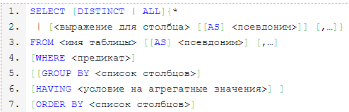

# Команды DML

**DML** - data manipulating language - язык для манипуляциями над данными

Команды DML:

- `INSERT` - вставляет данные в таблицу
- `SELECT` - выбирает данные и отображает их
- `DELETE` - удаляет данные из таблицы
- `UPDATE` - обновляет данные в таблице

---
## Вставка значений - INSERT
```sql
INSERT INTO `table_name`
(`atribut_1`, `atribut_2`, ...) VALUES
(value_1, value_2, ...),
(value_1, value_2, ...),
(value_1, value_2, ...)
;
```

Автоинкрементируемые атрибуты можно не прописывать и значения им не присваивать - это будет сделано автоматически!

Если заранее известно, что какой-то атрибут будет `NULL`, то можно его не прописывать, `NULL` ему будет присвоен автоматически.

Существует еще одна форма записи:
```sql
INSERT INTO `table_name`

VALUES (value_1, value_2, ...); #Работает, только если количество значений равно количеству атрибутов
# и переданные типы данных подходят под типы данных атрибутов в том соответствующем порядке
```

---
## Выборка SELECT
```sql
SELECT atribute1, atribute2 FROM [database1.]table1;
```



Можно объединять данные, полученные из разных атрибутов, с помощью `CONCAT`, и менять название столбцов, выводимое на экран с помощью элиэса `AS`:
```sql
SELECT CONCAT(`name`, ' ', `lastname`) AS `ФИО` FROM `shtat`;
```

Из результирующей выборки можно убрать дублирующиеся кортежи с помощью слова `DISTINCT`
```sql
SELECT DISTINCT name, salary FROM shtat;
```

Чтобы не перечислять все атрибуты одной таблицы в `SELECT` при выборке из нескольких таблиц можно указать их с помощью имени таблицы и звездочки:
```sql
SELECT table1.*, table2.created_at
FROM table1
JOIN table2 ON ...;
```

Флаги:

- `WHERE` - отсекает то, что не соответствует условию. Условие представляет собой предикат составленный с помощью обычных операций сравнения, либо с помощью специальных операций сравнения с `NULL`:
    - `IS NULL`
    - `IS NOT NULL`

Условия можно комбинировать с помощью слов `OR`, `AND` и скобок:
```sql
SELECT DISTINCT name, salary FROM shtat
WHERE (name = 'Artem' OR name = 'Lina') AND salary > 2000;
```

- `GROUP BY` - группирует значения, закладываемые в агрегатную функцию по указанному атрибуту:
```sql
SELECT atribute_1, atribute_2, AGR_FUNC(atribute_3) FROM table
GROUP BY atribute_1
```

Пример:
```sql
SELECT category, SUM(spend) FROM expenses
GROUP BY category;
```

- `HAVING` - скрывает то, что не соответствует условию (но не отсекает). Используется вместе с WHERE
- `ORDER BY` - устанавливает порядок вывода. После ключевого слова указывается атрибут, по которому проводится сортировка. Можно указать несколько атрибутов, тогда после сортировке по первому кортежи с одинаковыми значениями этого атрибута, будут отсортированы по следующему
    - `ASC` (по умолчанию) - в порядке возрастания (NULL раньше всех)
    - `DESC` - в порядке убывания

```sql
SELECT * FROM table
WHERE price > 500
ORDER BY price DESC, speed; # ORDER BY 2 DESC, 3 - можно указывать не название, а номер атрибута, но так лучше не делать
```

При сортировке по времени можно использовать функции работы со временем:
```sql
SELECT name, birthday FROM employee
ORDER BY MONTH(birthday), DAY(birthday);
```

- `ROLLUP`

- `LIMIT` -
    - `LIMIT count` - выводит только переданное количество кортежей
    - `LIMIT from, count` - выводит только переданное количество кортежей, начиная с порядкового номера, переданного первым аргументом
- `JOIN`
- `UNION`

### Получение boolean значения

Зачастую необходимо получить информацию есть ли в таблице хоть одна запись, удовлетворяющая условию.

Для этого можно воспользоваться ключевым словом `EXISTS`:
```sql
SELECT EXISTS (SELECT * FROM my_table WHERE id > 10);
```

Такой запрос вернет boolean значение в зависимости от того нашлась ли хоть одна запись, удовлетворяющая условию.


---
## Обновление UPDATE

Можно обновлять данные
```sql
UPDATE table_1 SET atribute_1 = value_1 WHERE atribute_1 > value_2;
```

- `CASE`
```sql
UPDATE table_1 SET atribute_1 = CASE
WHEN atribute_2 > 1000 THEN value_1 # Последовательно проверяет выполнение условий и присваивает необходимое значение
WHEN atribute_2 > 100 THEN value_2
WHEN atribute_2 > 10 THEN value_3
ELSE value_4;
```


---
## Удаление DELETE

Можно удалять данные из таблиц
```sql
DELETE FROM table_1 WHERE atribute_1 > value_1 OR atribute_2 < value_2;
```

В примере выше из таблицы удаляются все кортежи, для которых выполняются заданные условия.

Для того чтобы удалить из таблицы все данные, нужно не указывать предикатов
```sql
DELETE FROM table_1
```