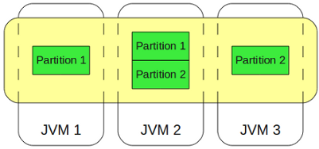
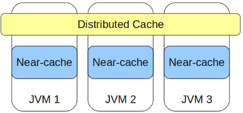

# IMDG - In-Memory Data Grid

IMDG - это распределенное хранение объектов, схожее на хэш-таблицу, производимое с использованием только оперативной памяти.

IMDG основывается в первую очередь на том, что данные хранятся исключительно в ОЗУ. Это стало возможным благодаря существенному удешевлению оперативной памяти. IMDG обещает увеличение скорости обработки данных более чем в 1000 раз.

Вендоры:
- Grid Gain
- Apache Ignite
- Oracle Coherence
- [Hazelcast](../../external_lib/hazelcast.md)
- Redis

IMDG позволяют реализовать распределенное хранение данных в нескольких инстансах.

При этом данные шардируются по интстансам, а для того чтобы они не были потеряны при вылете одной из нод, шардированные данные реплицируются на других нодах.

Для того чтобы максимально ускорить получение объектов из IMDG существует локальный кэш, который хранится на самой JVM:

В Java для унификации взаимодействия с различными реализациями IMDG существует специальный интерфейс - JSR-107 - [JCache](../java/jcache.md).

### Split Brain

Ситуация, когда ноды IMDG теряют между собой связь (обрубился сетевой провод) и перестают быть единым кластером, называется Split Brain.

В этой ситуации возможно, что разные приложения будут изменять одни и те же данные в разъединенных кластерах. После воссоединения кластера необходимо разрулить конфликты в данных. Для этого при конфигурации IMDG задаются стратегии мержа.

---
## К изучению
- [X] Основные концепции IMDG. Часть 1: https://habr.com/ru/post/126580/
- [X] Основные концепции IMDG. Часть 1: https://habr.com/ru/post/126973/
- [X] Что такое IMDG: https://habr.com/ru/post/160517/
- [X] Много, быстро, распределенно: как выбрать IMDG: https://habr.com/ru/company/jugru/blog/339322/