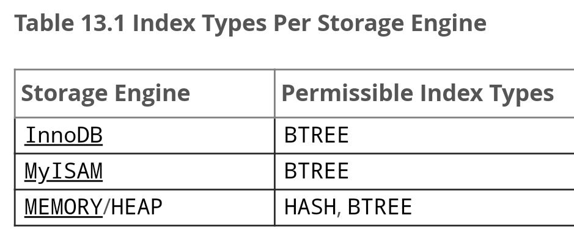

# Индексы

Для увеличения скорости выполнения запросов проводится индексация по каким-либо атрибутам.

Индекс представляет собой некоторую структуру данных, которая упрощает поиск по данным из таблицы. Например, для поиска по id может использоваться бинарный поиск.

При добавлении новых записей в таблицу / удалении старых записей индексы будут пересчитываться автоматически.

Так как индексы являются отдельными структурами данных, их наличие увеличивает объем хранимых данных.

По типу хранения индексы делятся на:
- кластерные - лежат вместе с данными
- некластерные - лежат отдельно от данных, содержат в себе указатели на данные в основном файле данных

Кластерный индекс может быть только один у каждой таблицы.
Если у таблицы есть первичный ключ, то кластерный индекс строится по нему.
Кластерные индексы чаще всего представляют собой B-дерево, сложность поиска по которому - O(log(n))

Некластерные индексы работают медленнее, чем кластерные.
Некластерные индексы представляют собой хэш-таблицу, сложность поиска по которой зависит от оптимальности хэш-функции и может колебаться от O(1) до O(n)


### Составные индексы

Если из какой-то таблицы часто извлекаются данные по нескольким столбцам, то индекс можно навесить сразу на несколько столбцов.

Такие индексы будут работать даже при выборке только по одному из индексированных столбцов, но намного хуже, чем одиночный индекс.


### Частичные индексы

Частичные индексы - это индексы, которые распространяются только на ту часть записей, которые удовлетворяют определенному условию.

Частичные индексы используются очень редко.

### Применимость индексов:

|     |     |     |     |     |
| --- | --- | --- | --- | --- |
| Вид индекса | Может быть составным | Поддерживает сортировку | MySQL | PostgreSQL |
| B-дерево | - [X] | - [X] | >, <, =, IS NULL, сортировка, группировка | >, <, =, IS NULL, IN, BETWEEN |
| Хэш | - [ ] | - [ ] | = и !=, WHERE field IN (...) | =   |
| GiST | - [X] | - [ ] | ??  | ??  |
| GIN | - [X] | - [ ] | ??  | ??  |
| BRIN | - [X] | - [ ] | ??  | ??  |



Другие типы индексов:
- Геолокация
- Перекрывающие индексы
- Многомерные структуры
- Битовые индексы

### Индексы PostgreSQL
- B-дерево (значение по умолчанию)
- хэш
- GiST
- SP-GiST
- GIN
- BRIN

---
## Создание и удаление индексов

### Создание
Индексы создаются с помощью обычных SQL запросов.
Синтаксис добавления нового индекса следующий:
```sql
CREATE INDEX <index_name> ON <table_name> (<attribute_name>, <attribute_name> ...);
```

Пример:
```sql
CREATE INDEX index_email ON users (email);
```

По умолчанию создаются индексы типа B-дерево.
Для создания индексов другого типа используется ключевое слово `USING`:
```sql
CREATE INDEX index_email_hash ON users USING HASH (email);
```

Если атрибут таблицы является уникальным (например, первичный ключ), то индекс создавать не нужно - он будет создан автоматически.

При создании индекса происходит индексирование, которое может занимать продолжительное время.

Во время создания индекса запрещается запись данных в индексируемую таблицу (`INSERT`, `UPDATE` и `DELETE`). Для того чтобы обойти это ограничение, необходимо в запрос на создание индекса добавлять ключевое слово `CONCURRENTLY`.

### Создание индекса на выражение
Иногда запросы в таблицу всегда используют какие-то преобразования над данными при их выборке. Например, сложение строк или извлечение json. В таких случаях можно создать индекс на выражение. Для этого в запросе в скобках вместо атрибута указывается требуемое выражение (выражение также нужно записывать в скобках):
```sql
CREATE INDEX index_json ON json_table ((JSON_EXTRACT_PATH_TEXT(json_attribute, 'json_field')));
```

### Создание частичных индексов
Для создания частичных индексов используется ключевое слово `WHERE`, после которого должен идти предикат:
```sql
CREATE INDEX index_salary ON users WHERE salary > 0;
```

### Удаление
Синтаксис удаления существующего индекса следующий:
```sql
DROP INDEX <index_name>
```

---
## На что вешать индекс
<mark>todo</mark>

см. https://postgrespro.ru/docs/postgresql/10/indexes-examine
и вынести в отдельную заметку

---
## К изучению

- [ ] [Обзор типов индексов](https://habr.com/ru/post/102785/)
- [ ] [Вопросы про индексы к собеседованию](https://habr.com/ru/post/247373/)
- [X] Отличная статья про [отличия между кластерными и некластерными индексами](https://habr.com/ru/post/141767/)
- [X] Видео [Вся правда об индексах в PostgreSQL](https://www.youtube.com/watch?v=aaecM4wKdhY)
- [X] [Документация на индексы в PostgreSQL](https://postgrespro.ru/docs/postgresql/10/indexes)
- [ ] Индексы в PostgreSQL. [Часть 1](https://habr.com/ru/company/postgrespro/blog/326096/)
- [ ] Индексы в PostgreSQL. [Часть 2](https://habr.com/ru/company/postgrespro/blog/326106/)
- [ ] Индексы в PostgreSQL. [Часть 3](https://habr.com/ru/company/postgrespro/blog/328280/)
- [ ] Индексы в PostgreSQL. [Часть 4](https://habrahabr.ru/company/postgrespro/blog/330544/)
- [ ] Индексы в PostgreSQL. [Часть 5](https://habr.com/ru/company/postgrespro/blog/333878/)
- [ ] Индексы в PostgreSQL. [Часть 6](https://habr.com/ru/company/postgrespro/blog/337502/)
- [ ] Индексы в PostgreSQL. [Часть 7](https://habr.com/ru/company/postgrespro/blog/340978/)
- [ ] Индексы в PostgreSQL. [Часть 8](https://habr.com/ru/company/postgrespro/blog/343488/)
- [ ] Индексы в PostgreSQL. [Часть 9](https://habr.com/ru/company/postgrespro/blog/346460/)
- [ ] Индексы в PostgreSQL. [Часть 10](https://habr.com/ru/company/postgrespro/blog/349224/)