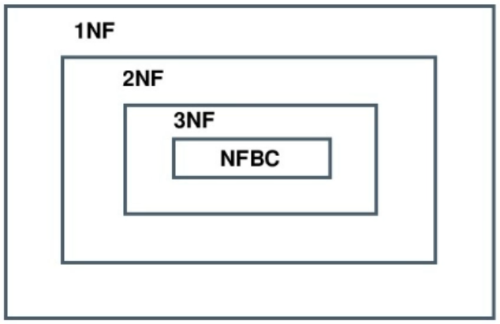

# Нормальные формы

Каждая следующая НФ включает в себя все предыдущие.
Всего около 9НФ, но в реальной жизни применяются 3 и 3+

**1НФ** - все данные в таблицах должны быть в атомарной форме

**2НФ** = 1НФ + между таблицами можно построить связи, потому что в них есть уникальные ключи.

Другое определение 2НФ: 2НФ = 1НФ + каждый атрибут полностью функционально зависит от первичного ключа

**3НФ** = 2НФ + в каждой таблице есть первичный ключ

Другое определение: 3НФ = 2НФ + все атрибуты зависят напрямую от первичного ключа

**3НФ Бойса-Кодда** = 3НФ + в каждой таблице есть только один первичный ключ
Другое определение: НФБК = 3НФ + каждый детерминант является первичным ключом

НФ 2, 3, 3+ устраняют часто возникающие аномалии
4НФ решает проблемы, связанные с многозначной зависимостью
5НФ решает проблемы с зависимостями соеднинений

Функциональная зависимость - это связь между атрибутами внутри одного отношения.

Если один атрибут функционально зависит от другого атрибута, значит каждое его значение связано только с одним значением того другого атрибута. При этом в обратную сторону эта зависимость не распространяется

Полная функциональная зависимость - это функциональная зависимость одного атрибута А от группы атрибутов В, С (составной ключ), такая что по отдельности А не зависит от В и не зависит от С.

Детерминант - атрибут, от которого полностью функционально зависит другой атрибут.

Первичные ключи являются детерминантами

Транзитивная зависимость - Это когда атрибут А зависит от атрибута С не напрямую, а через какие-то другие атрибуты. Например, А зависит от В, а В зависит от С.

## Последовательное приведение к НФ
**Приведение к 1НФ:**
- Разбиение неатомарности путем введения дополнительных кортежей
- Создание новой таблицы

**Приведение к 2НФ:**
- Добавить в таблицу атрибут id

**Приведение к 3НФ:**
- Найти транзитивные зависимости и вынести их в отдельные таблицы

**Приведение к НФБК:**
- Найти непотенциальные ключи и вынести их в отдельную таблицу
- Убрать все лишние ключи и оставить только один потенциальный ключ, который станет первичным ключом

**Цели, преследуемые нормализацией:**
- Исключение аномалий:
    - аномалии-модификации - про модификации одного кортежа могут пострадать данные в других кортежах
    - аномалии-удаления - при удалении одного кортежа могут быть случайно удалены другие кортежи
    - аномалии-добавления - в таблицу невозможно поместить новый кортеж

---
## К изучению
- [ ] https://habr.com/ru/post/254773/
- [ ] https://habr.com/ru/post/193756/