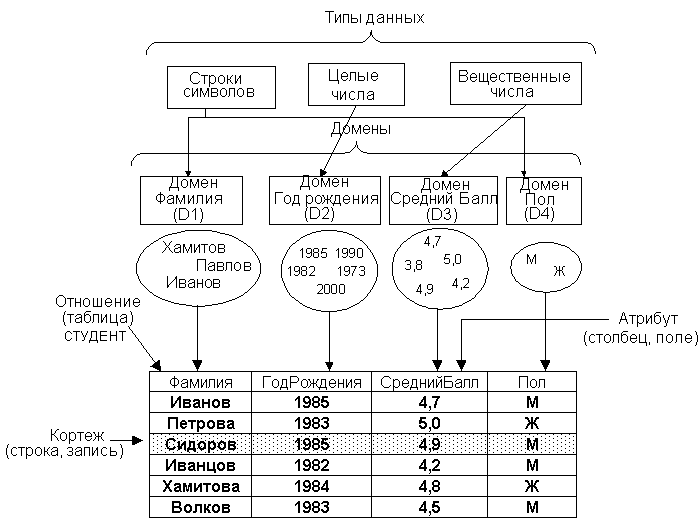
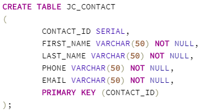
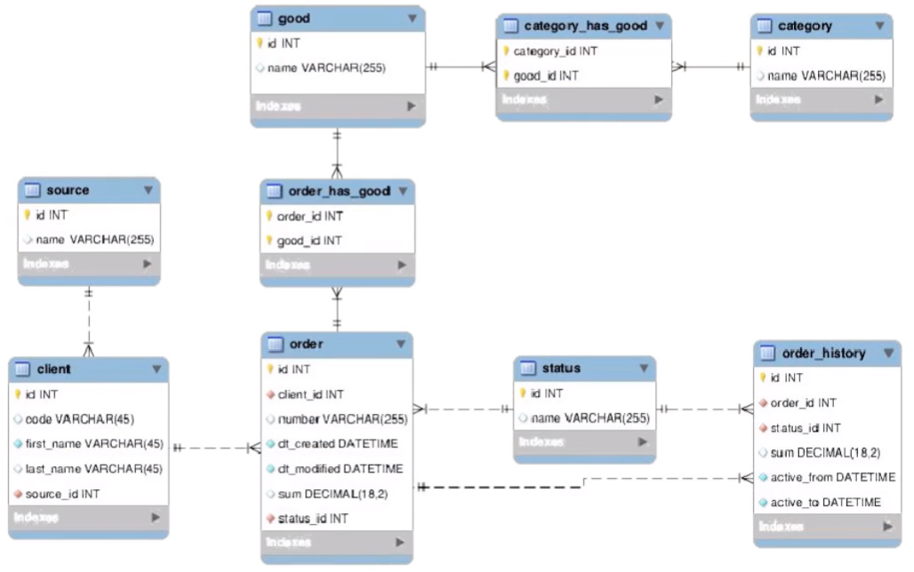
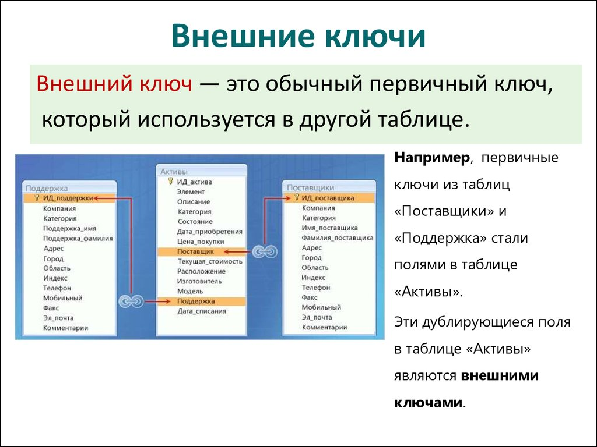

# Реляционная модель данных

У всех моделей данных есть три части:
- Структурная
- Манипуляционная
- Ограничения целостности

---
## Структурная часть 

Значения атрибутов в таблицах определяется типом данных.
Для каждого типа данных есть свой набор следующих характеристик:
- Множество значений
- Операции
- Литералы

Типы данных в БД - см. [Типы данных](sql_data_types.md)

Домен - это базовый тип данных с ограничением на принимаемые значения.
Домен устанавливается для каждого атрибута.

Атрибут - название столбца в таблице

Кортеж - строка в таблице

Схема отношений - это название таблицы и множество атрибутов с их типами данных (доменами)

Схема БД - это диаграмма со множеством схем отношений

Отношение - это таблица.
Тело отношения - множество кортежей
Значение отношения - совокупность схемы отношения и тела отношения

Свойства отношений:
- отсутствие дубликатов кортежей
- отсутствие упорядоченности кортежей
- отсутствие упорядоченности атрибутов
- атомарность значений атрибутов

---
## анипуляционная часть

Внутри реляционных баз данных работает реляционная математика (реляционная алгебра и реляционное исчисление), которую не обязательно знать пользователю или разработчику БД.

Для изменения содержимого баз данных используется DML SQL - data modification language

---
## Ограничения целостности

- Целостность сущности - в таблицах не должно быть одинаковых кортежей
- Целостность ссылок - каждому значению внешнего ключа должен соответствовать какой-либо кортеж

Потенциальный ключ - любой набор атрибутов, который может использоваться для определения каждого кортежа таблицы

Потенциальные ключи бывают:
- Простой - из одного атрибута
- Составной - из нескольких атрибутов

Тот потенциальный ключ, который в итоге был выбран для идентификации кортежей, называется первичным ключом.

Первичный ключ должен быть:
- уникален
- минимален
- долговечен (требование НФ3)

Внешний ключ - это первичный ключ, который используется в другой таблице

Способы поддержания ссылочной целостности (если удаляется запись из подчиненной таблицы, на которую были ссылки в главной таблице):
- Блокировка операции
- Указание NULL вместо ссылки
- Каскадное удаление