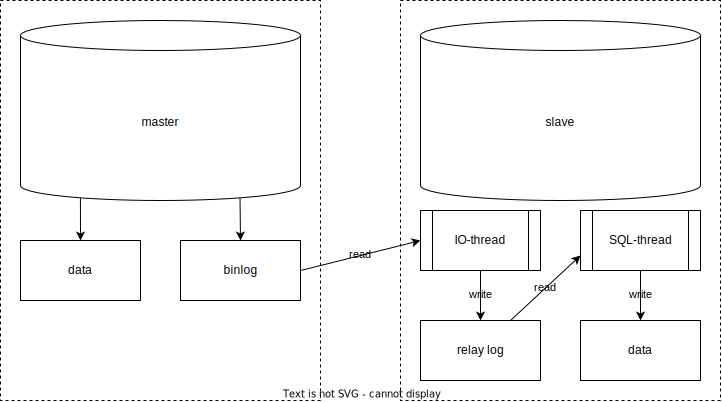

# Репликация

Общие сведения о репликации в распределенных системах приведены в [отдельной заметке](../architecture/replication.md).
Здесь же приведены сведения об алгоритмах репликации в конкретных СУБД.

Все последующие данные актуальны для PostgreSQL, возможно для других СУБД все работает не так.

У БД может быть несколько серверов:
- **мастер-сервер** (ведущий, главный - master / primary) - данные в нем можно писать и читать.
- **сервер-реплика** (ведомый, резервный - standby / secondary) - в него просто дублируются данные из мастера.
- **теплый сервер** (warm standby) - в него дублируются данные из мастера, при падении мастера теплый сервер заменяет его.
- **горячий сервер** (hot standby) - в него дублируются данные из мастера. Из него можно читать данные (но нельзя писать).

Репликация данных может быть синхронной и асинхронной:
- **синхронная** - в этом случае все транзакции на запись не считаются завершенными, пока все сервера не подтвердили транзакцию.
- **асинхронная** - в этом случае транзакция на запись подтверждается только мастером, который затем передает журнал с изменениями данных по остальным серверам.

В случае асинхронной репликации может возникнуть неконсистентность данных между мастером и другими серверами, потому что подчиненные серверы еще не успели применить изменения, переданные мастер-сервером.

Такая неконсистентность называется **лагом репликации**.

Также при асинхронной репликации в случае падения мастер-сервера некоторые данные могут быть потеряны вовсе.

Синхронная репликация плохо подходит для высоконагруженных web-приложений, у которых одновременно может быть множество запросов как на чтение, так и на запись.

У всех серверов должна быть одинаковая мажорная версия СУБД postgreSQL, иначе трансляция журналов невозможна.

Желательно чтобы минорная версия СУБД на серверах также совпадала, при этом рекомендуется обновлять сначала резервные серверы и только потом мастер-сервер.

---
## Потоковая репликация

Потоковая репликация по умолчанию относится к асинхронным. Но ее можно настроить так, что она станет синхронной.

В потоковой репликации задействованы следующие процессы:

- **WAL Sender** на стороне мастера, который занимается отправкой журнала изменений в реплики. Для каждой реплики запущен свой процесс WAL Sender.
- **WAL Receiver** на стороне реплики. Этот процесс принимает журналы транзакций от мастера и передает их в третий процесс:
- **Startup process** на стороне реплики, который читает журналы транзакций и воспроизводит на данных все изменения, описанные в журнале.

Лаг репликации - ситуация, когда один и тот же запрос, выполненный на мастере и на реплике, возвращает различные данные.

Это означает, что реплика отстает от мастера, т.к. не успевает воспроизвести журналы транзакций.

## MySQL
Репликация в MySQL происходит с помощью __binary log__ (он же __binlog__) - файла, в который пишет мастер-нода, и который постоянно вычитывается slave-нодами.
По умолчанию в MySQL репликация является асинхронной.

С точки зрения внутреннего устройства, в MySQL репликацией занимаются два потока:
- __IO-thread__ - пулит данные с удаленного сервера (читает binary log) и прихранивает в сыром виде на локальном сервере в файл __relay log__;
- __SQL-thread__ - применяет данные, выкачанные IO-потоком, на локальной базе

Из-за того, что репликация упирается в единственный поток, она может тормозить.
Бывает даже такое, что данные на мастер-ноду записываются быстрее, чем реплицируются на слейвы. 
Такое было и в одном из проектов, над которым я работал, что до реплик данные доезжали на несколько часов позже, чем появлялись на мастере.
Но с версии 5.7 в MySQL появилась возможность параллельной репликации.

С точки зрения того, что из себя представляют события в MySQL, существует три типа репликации:
- __STATEMENT__ - Записываются SQL-выражения, типа Update, Delete и т.д. Первый способ, появившийся в MySQL.
- __ROW__ - Записываются изменения строк в таблицах. По умолчанию записывается предыдущее и обновленное значение строчки.
- __MIXED__ - Смесь STATEMENT и ROW, когда в основном используется STATEMENT, но когда его возможностей не хватает, то используется ROW.

Этот тип конфигурируется на Master-ноде с помощью параметра `binlog_format`.

Отслеживание отреплицированных данных в MySQL может вестись несколькими способами:
- позиция записи в binary log. Аналог offset в [Kafka](../tools/kafka.md).
- GTID - Global Transaction Identifier

GTID - это более современный способ, рекомендуется использовать именно его.
Благодаря GTID можно легко узнать какие из транзакций были пропущены.
Также GTID позволяет упростить процесс повышения реплики до мастера.

Помимо стандартных способов репликации в MySQL также активно развивается групповая репликация, которая по своей концепции напоминает репликацию в распределенных системах вроде Cassandra.
В этом случае ноды не разделяются на master-slave, а являются одноранговыми.

### Фильтрация
Существует возможность фильтровать, что мастер-нода пишет в binary log, и что из него читают слейвы.
Настроить мастер можно с помощью переменных:
- `binlog_do_db` - схемы, данные по которым нужно писать в лог. Аналог белого списка
- `binlog_ignore_db` - Аналог черного списка

Рекомендуется на задавать эти настройки, чтобы мастер писал в лог вообще все.

На слейве можно настроить репликацию с помощью переменных:
- `replicate_do_db` - схемы, которые нужно реплицировать с мастера
- `replicate_wild_do_table` - таблицы, которые нужно реплицировать с мастера, причем названия таблиц можно задать с помощью wildcard - аналога регулярки. Например, значение `my_schema.sr_%` означает, что данные будут реплицировать по таблицам из схемы `my_schema` с названием, начинающимся на `sr_`.

---
## PostgreSQL
В PostgreSQL существует несколько видов репликации:
- физическая - перегоняет WAL мастера на реплику. Встроена в ядро postgres. Мастер и реплика должны быть одной мажорной версии.
- триггерная - работает на триггерах. На каждой ноде postgres требуется развернуть отдельный процесс. Позволяет реплицировать только DML. Не встроено в postgres, нужно использовать сторонние продукты.
- логическая - парсит записи в WAL и выполняет выражения на реплике. Позволяет реплицировать только DML. Встроена в postgres.
- кластерная - уже не совсем репликация. Требует установки сторонних расширений

Для целей резервирования рекомендуется выбирать физическую репликацию.
Для целей обновления БД лучше использовать логическую репликацию.

---
## К изучению:
- [ ] [Официальная документация](https://postgrespro.ru/docs/postgresql/10/high-availability) PostgreSQL по репликации (для версии 10) 
- [ ] [Решение проблем репликации PostgreSQL](https://habr.com/ru/company/oleg-bunin/blog/414111/)
- [ ] [В общем о репликации](https://ruhighload.com/%D0%A0%D0%B5%D0%BF%D0%BB%D0%B8%D0%BA%D0%B0%D1%86%D0%B8%D1%8F+%D0%B4%D0%B0%D0%BD%D0%BD%D1%8B%D1%85) (MySQL)
- [X] [Репликация в MySQL](https://www.youtube.com/watch?v=ppI74hTuXO0&ab_channel=HighLoadChannel). Доклад на Highload++ 2017. 49:09
- [X] [Репликация в PostgreSQL](https://www.youtube.com/watch?v=YQ63niptCTc&t=44s&ab_channel=HighLoadChannel). Доклад на Highload++ 2018. 48:23