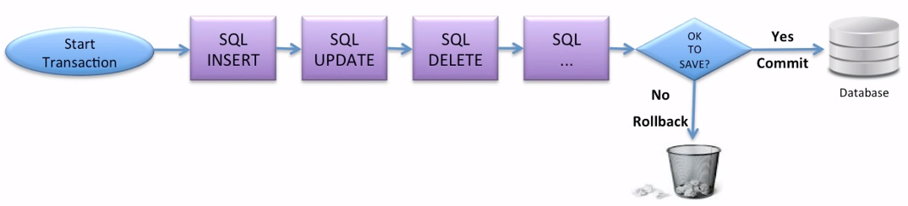

# Транзакции

Транзакция - это набор действий с базой данных, которые либо выполняются все вместе, либо не выполняются вовсе.

Если все действия выполнились - это называется COMMIT.

Если при выполнении какого-либо действия из транзакции случился сбой, то все изменения откатываются до состояния, когда транзакция еще не начала выполняться. Это называется ROLLBACK.

К транзакциям предъявляется ряд требований, называемых [ACID](acid.md).

В популярных реляционных СУБД MySQL и PostgreSQL для каждой транзакции требуется свое собственное соединение с БД.

---
## К изучению:
- [ ] Видео с JPoint 2016: https://www.youtube.com/watch?v=dFASbaIG-UU