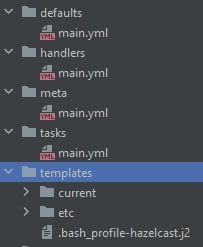

**Ansible** - система управления конфигурациями

Ansible не требует установки приложения на машину. Он подключается к машине по SSH и накатывает скрипты в соответствии с плейбуком.

<mark>//Дополнить про плейбуки</mark>

---
## Роль

Роль - это отдельный Ansible-проект с предопределенной структурой файлов:

- `/tasks/...` - таски роли, которые будут выполняться при ее запуске
- `/meta/...` - мета-данные для Ansible. Например требуемая версия Ansible
- `/templates/...` - шаблоны файлов, которые могут генерироваться Ansible. Шаблоны могут иметь расширение `.j2`
- `/defaults/...` - дефолтные значения переменных, если они не были получены их плейбука, запускающего роль. Значения переменных подставляются в различные файлы, в том числе в шаблоны
- `/handlers/...` - дополнительные задачи роли