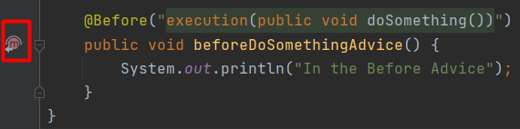

AspectJ - это наиболее популярная библиотека для [аспектно-ориентированного программирования](../java/aop.md) в Java.

---
## Advice

Адвайс - это указание на вызов какого-либо дополнительного кода перед и / или после вызова определенного метода.

Адвайсы записываются в отдельных классах, над которыми ставится аннотация `@Aspect`.
```java
@Aspect
@Component
public class LoggingAspect {
    //Advices
}
```

Адвайсы описываются с помощью методов, на которыми ставятся специальные аннотации, предоставляемые библиотекой AssertJ.
```java
@Before("execution(public void doSomething())")
public void beforeDoSomethingAdvice() {
    System.out.println("In the Before Advice");
}
```

При задании типа адвайса в аннотации с помощью аргументов можно описать для каких методов приложения должны применяться адвайсы (подробнее см. ниже Pointcut).

### Виды адвайсов
- Before - адвайс, который выполняется перед вызовом метода. Устанавливается с помощью аннотации `@Before`.
- AfterReturning -  адвайс, который выполняется после успешного выполнения метода. Устанавливается с помощью аннотации `@AfterReturning`.
- AfterThrowing - адвайс, который выполняется при выбрасывании исключения из метода. Устанавливается с помощью аннотации `@AfterThrowing`.
- After - адвайс, который выполняется в любом случае после снятия метода со стека. Устанавливается с помощью аннотации `@After`.
- Around - адвайс, который выполняется до и после выполнения метода. Устанавливается с помощью аннотации `@Around`.

### Порядок работы адвайсов

Если один и тот же метод обрабатывают несколько адвайсов, по умолчанию порядок их выполнения не определен. Чтобы жестко задать порядок применения адвайсов, необходимо над классом аспекта повесить спринговую аннотацию `@Order`. Чем меньше число, переданное в аннотацию, тем раньше будет выполняться адвайс. Можно передавать даже отрицательные числа
```java
@Aspect
@Order(1)
@Component
public class LoggingAspect {
    //Advices
}
```

---
## Pointcut

Пойнткат - это предикат, который устанавливает условия вызова аспекта.
AssertJ предоставляет Expression Language (EL) для создания предикатов

### execution - вызов метода с указанной сигнатурой
```
execution(modifiers-pattern? return-type-pattern declaring-type-pattern?.method-name-pattern(param-pattern) throws-pattern?)
```

Вопросительными знаками помечены необязательные параметры.
Паттерн аргументов метода имеет несколько вайлдкардов:

- `*` - один любой параметр
- `..` - любое количество любых параметров

### Переиспользование

Для того чтобы переиспользовать одно и то же pointcut-выражение в разных адвайсах необходимо создать метод, над которым ставится аннотация `@Pointcut` с желаемым предикатом. После чего этот метод указывается в аннотациях адвайсов вместо pointcut'ов:
```java
@Pointcut("execution(* dev.boiarshinov.project.service.mail.*.*(..))")
private void mailPointcut() { }

@Before("mailPoincut()")
public void mailLoggingAdvice() { /* */ }

@Before("mailPoincut()")
public void mailAuditAdvice() { /* */ }
```

### Комбинирование

Так как pointcut'ы представляют собой предикаты, то это значит, что их можно комбинировать между собой с помощью логических операндов:

- `&&` - AND
- `||` - OR
- `!` - NOT
```java
@Before("mailPointcut() && !(getterPointcut() || setterPointcut()))
```

---
## JoinPoint

JoinPoint - это информация о состоянии системы в момент вызова адвайса.

Для того чтобы получить эту информацию, необходимо в метод адвайса передать аргумент интерфейса `JoinPoint`:
```java
@Before("execution(public void doSomething())")
public void beforeDoSomethingAdvice(final JoinPoint joinPoint) {
    Arrays.stream(joinPoint.getArgs()).forEach(System.out::println);
    System.out.println("In the Before Advice");
}
```

---
## Подключение библиотеки

AspectJ состоит из нескольких модулей, каждый из которых подключается отдельно
```xml
<dependency>
    <groupId>org.aspectj</groupId>
    <artifactId>aspectjweaver</artifactId>
    <version>1.9.6</version>
</dependency>
```

В Spring для того чтобы аннотации `AspectJ` считывались необходимо над конфигурационным классом поставить аннотацию `@EnableAspectJAutoProxy`:

```java
@EnableAspectJAutoProxy
@Configuration
public class AspectConfig {
}
```

---
## Интеграция с Intellij IDEA

Intellij IDEA отслеживает применение аспектов и позволяет перемещаться от метода, помеченного адвайсом к аспекту и наоборот.




---
## К изучению
- [X] Курс по Spring и Hibernate на Udemy (в части касающейся): https://www.udemy.com/course/spring-hibernate-tutorial
- [ ] Книга AspectJ in action