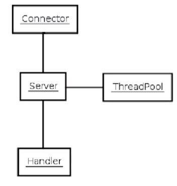

**Jetty** - это http-сервер

Части jetty-сервера:

- `Connector` - принимает запросы от браузера
- `ThreadPool` - Executor нитей. Содержит в себе несколько нитей, в которые могут быть положены необходимые инструкции для выполнения.
- `Handler` - обработчик запроса
- `Server` - принимает запрос от коннектора, выбирает нить и обрабатывает с помощью handler-а

---
## К изучению
- [ ] https://www.eclipse.org/jetty/documentation/current/introduction.html#what-is-jetty