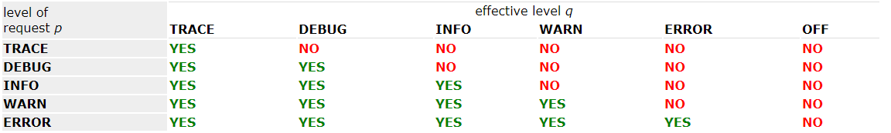

**Logback** - популярная библиотека для Java, предназначенная для [логирования](../logging.md).

Logback имеет три модуля:

- `logback-core` - ядро, основа всего logback
- `logback-classic` - расширяет ядро. Для подключения требует наличия logback-core и slf4j-api.
- `logback-access` - расширяет ядро

<mark>Для использования в обычном проекте</mark>

---
## Подключение logback к проекту

При использовании [maven](../build/maven.md)  для подключения logback к проекту необходимо добавить к зависимостям требуемые модули logback. Официальный URI logback - `ch.qos.logback`.

```xml
<dependency>
    <groupId>ch.qos.logback</groupId>
    <artifactId>logback-classic</artifactId>
    <version>${logback-version}</version>
</dependency>
<dependency>
    <groupId>ch.qos.logback</groupId>
    <artifactId>logback-core</artifactId>
    <version>${logback-version}</version>
</dependency>
```

---
## Конфигурирование logback

Настройка logback производится в [xml](../xml.md) с именем `logback.xml`, который должен располагаться в папке resourses. Схемы для данного xml не существует в природе.

В .xml проводится конфигурация в тегах `<configuration>` с помощью трех основных тегов:

- `appender` - определяет источник куда будет записываться лог
- `logger` - определяет уровень логирования
- `root` - корневой логер, настройки которого будут распространяться на остальные логеры. Обязательный элемент.

### Уровни логирования


### Паттерны
Ниже приведены некоторые варианты паттернов логирования:
```xml
<!-- default pattern -->
<pattern>%d{HH:mm:ss.SSS} [%thread] %-5level %logger{36} - %msg%n</pattern>
<!-- better than default pattern -->
<pattern>%date %-5level %logger{0} [%file:%line] %msg%n</pattern>
```

Здесь вывод работает аналогично методу `printf()`. Существуют следующие управляющие последовательности:

- `%date` - дата
- `%-5level` - уровень логирования
- `%logger` - имя логера. Число в фигурных скобках определяет количество символов под имя логера. Если полное имя логера не помещается, то названия директорий будут сокращены до 1 символа.
- `%msg` - сообщение, отправленное в лог
- `%file` - указывает на файл, из которого было отправлено сообщение в лог (очень удобно!)
- `%line` - указывает на строку кода, из которой было отправлено сообщение в лог (очень удобно!)

---
## Аппендеры

Аппендеры указывают куда будут выводиться сообщения логера. Это могут быть: консоль, файл, удаленный сервер, база данных и пр.

Основные аппендеры:

- `ConsoleAppender` - выводит на консоль
- `FileAppender` - записывает в файл. Записывает логи в один файл до бесконечности, поэтому обычно не используется, вместо него используются его наследники, описанные ниже.
- `RollingFileAppender` - записывает в файл. Когда файл достигает определенного размера, запись начинает происходить в следующий файл. Когда количество файлов достигает определенного максимума, самые старые файлы удаляются.

При конфигурировании аппендера необходимо указать два атрибута:

- `name` - имя, по которому аппендер затем будет подключаться к логеру.
- `class` - Java-класс аппендера. Про них см. выше.

Аппендер может включать в себя:

- `layout` -
- `encoder` -
- `filter` -

---
## Логеры

Логеры могут быть наследниками друг друга. Структура наследования отображается в названии логера: `myLogger` является родителем `myLogger.mySweetLogger`. Если уровень логирования явно не указывается, то он принимается равным уровню логера-родителя.

В качестве имени логера чаще всего используется имя класса, в котором он используется. Это позволяет упростить отлов багов, потому что будет понятно из какого класса было выведено сообщение в лог.

У каждого логера может быть несколько аппендеров. Аппендеры добавляются к логеру в соответствии с иерархией логеров (то есть если у рута есть аппендер на консоль, то и у всех наследников тоже будет вывод на консоль) при выставленном флаге `additivity`.

При объявлении логера могут быть использованы следующие *атрибуты*:

- `name` - имя логера, по которому он затем будет вызываться из фабрики. Единственный обязательный атрибут.
- `level` - начиная с какого уровня будут логироваться сообщения.
- `additivity` - будут ли добавлены наследникам этого логера его аппендеры.

```xml
<logger name="logger" level="DEBUG" additivity="false">
    <appender-ref ref="consoleAppender"/>
    <appender-ref ref="fileAppender" />
</logger>
```

---
## Использование логера в Java-коде

Для использования логера необходимо получить его экземпляр. Сделать это можно так:
```java
Logger logger = LoggerFactory.getLogger("loggerName"); //Передается имя логера из logback.xml
```

При этом Logger должен быть взят из библиотеки `org.slf4j`.

Для логирования используются методы:

- `void trace(String)` - записывает переданное сообщение в лог с уровнем TRACE
- `void debug(String)` - записывает переданное сообщение в лог с уровнем DEBUG
- `void info(String)` - записывает переданное сообщение в лог с уровнем INFO
- `void warn(String)` - записывает переданное сообщение в лог с уровнем WARN
- `void error(String)` - записывает переданное сообщение в лог с уровнем ERROR

Все вышеприведенные методы несколько раз перегружены и могут принимать в себя несколько аргументов аналогично методу `printf()`:
```java
logger.debug(
    "User {} create new table with name {} and number of rows = {}.", 
    user.getName(), 
    table.getName(), 
    table.getRowsCount()
);
```

---
## К изучению:

- [ ] Официальный мануал: http://logback.qos.ch/manual/
- [X] Пример подключения logback к Maven: https://examples.javacodegeeks.com/enterprise-java/maven/logback-maven-example/