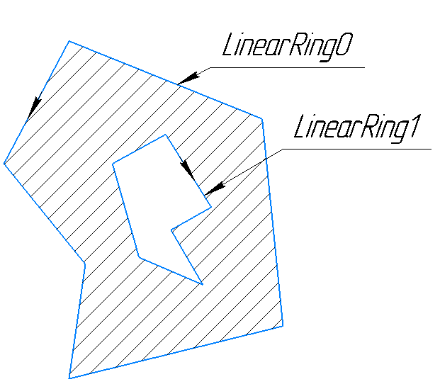

### Мультиполигон
Мультиполигон - это массив полигонов.

### Полигон
Полигон представляет собой сочетание нескольких линейных колец.

В полигоне первое кольцо всегда должно образовывать область, а остальные кольца всегда должны образовывать дыры.

Сведения о линейных кольцах:

- Линейное кольцо - это замкнутый набор точек в количестве не менее 4
- Для реализации замкнутости в линейном кольце первая точка идентична последней
- Если в линейном кольце точки идут против часовой области, то они образуют область. А если по часовой стрелке, то они образуют дыру в области.

---
## К изучению

- [ ] Официальная документация: https://tools.ietf.org/html/rfc7946
- [ ] Википедия:  https://en.wikipedia.org/wiki/GeoJSON
- [ ] https://nominatim.org/release-docs/develop/api/Search/