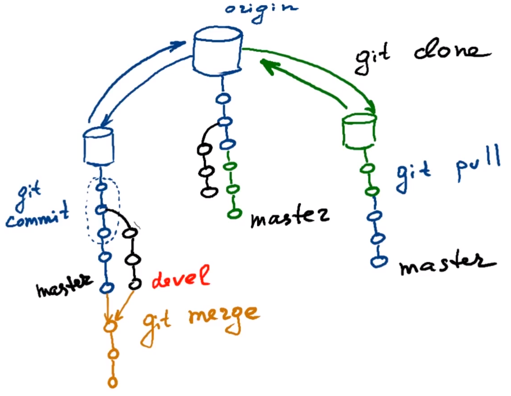

# Основы Git

Git - система контроля версий
С помощью Git можно создавать для себя чекпойнты.

Также git помогает организовать командную разработку. Он учитывает изменения, которые вносит каждый программист

Типы систем контроля версий:

- Распределенные - когда у каждого разработчика своя копия истории проекта
- Централизованные - когда вся история проекта хранится на одном сервере

Основной репозиторий обычно называется origin

Основные команды:

- `git commit` - создает новый коммит
- `git push` - передает коммиты в центральный репозиторий
- `git pull` - подтягивает с центрального репозитория коммиты
- `git clone` - выкачать репозиторий
- `git merge` - сливает две ветки в одну

Состояния документов:

- отслеживаемые
    - commited - зафиксированное - файл сохранен в локальной базе
    - modified - измененное - файл изменен, но изменение еще не зафиксировано в базе
    - staged - подготовленное - измененный файл, помеченный к включению в следующий коммит
- неотслеживаемые