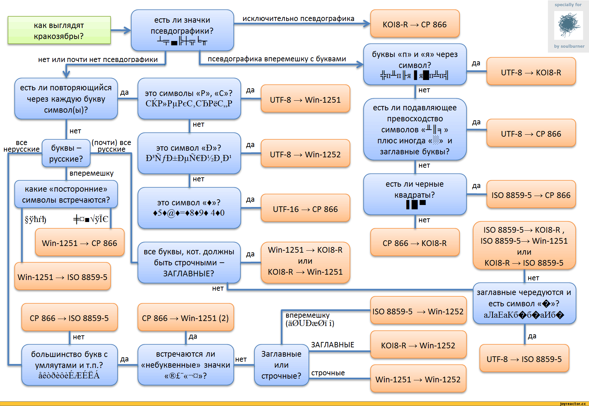

В Java существуют различные кодировки. Для их описания служит класс Charset.

Кодировки:
- `US_ASCII` - кодировка, в которой первоначально было всего 128 символов. Стала предтечей основных современных кодировок. Символ записывался с помощью одного байта, в котором 1 бит еще и оставался свободным.
- `CP866` - расширенная кодировка ASCII с кириллицей и большим количеством псевдографики (распространялась IBM)
- `KOI8-R` - расширенная кодировка ASCII с кириллицей и большим количеством псевдографики
- `Windows-1251` - расширенная кодировка ASCII с кириллицей без псевдографики
- Unicode-кодировки:
    - `UTF-32` - использует 4 байта для представления символа
    - `UTF-16` - использует 2 байта для представления символа. В Java строки по умолчанию создаются в ней.
    - `UTF-8` - использует переменное количество байтов от 1 до 4 для представления символа. Самая популярная Unicode кодировка, в которой написано большинство текстов.

`BOM` - Byte Order Mark - порядок записи байтов в кодировке UTF-16. Представляет собой 3 байта, которые помещаются в начале документа. В UTF-8 такого нет, все байты записываются в строгом порядке, но из-за этого могут возникать ошибки при чтении текстовых файлов, т.к. в UTF-8 первые три байта могут быть прочитаны как часть символа и из-за этого поплывет весь остальной текст.

### Класс Charset
Методы:
- `static Map<String, Charset> availableCharsets()` - возвращает словарь доступных кодировок
- `static Charset defaultCharset()` - возвращает кодировку, которая используется в настоящий момент
- `static forName(String)` - возвращает кодировку с переданным именем

