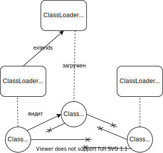

# Class Loader

В JVM не все классы, используемые в приложении загружаются в виртуальную машину на старте.
Обычно классы подгружаются в момент первого к ним обращения.
Загрузкой классов в виртуальную машину занимаются **Class Loader**'ы.

Существует несколько стандартных Class Loader'ов.
При этом всегда можно написать собственный.
Стандартные:
- `bootstrap Class Loader` - загружает все основные классы Java, необходимые для функционирования JRE. Написан на нативном языке, поэтому java-класс для него отсутствует. Интересно, что в логах bootstrap class loader отображается как `null`
- `Platform Class Loader` - загружает платформенные классы стандратной Java библиотеки
- `System (Application) Class Loader` - загружает кастомные классы приложения. Наследуюется от платформенного загрузчика

Основной метод в Class Loader'ах - это `loadClass(String)`.
Обычно метод делает следующее:
- проверяет, что класс с таким именем еще не загружен
- делегирует загрузку класса родительскому class loader'у.
- если родительский класс не нашел, то ищет файл класса в classpath самостоятельно

Хотя в собственных реализациях можно вытягивать класс хоть с удаленного сервера, хоть генерировать его на лету.

Все Class Loader'ы наследуются от абстрактного класса `ClassLoader`.
Самый популярный Class Loader - `URLClassLoader`

## Как вытащить Class Loader?
Стандартные Class Loader'ы можно получить из класса-фабрики `ClassLoaders`.
Если нужно узнать каким Class Loader'ом был загружен класс, можно вызвать у него метод `getClassLoader()`.

---
## Области видимости 
Классы, загруженные одним Class Loader'ом могут быть не всегда видны классам, загружаемым другим Class Loader'ом.
На этом в свое время были построены апплеты, а затем контейнеры приложений вроде JBoss.

Класс, загруженный Class Loader'ом A будет видеть другие классы, загруженные тем же Class Loader'ом.
Также он видит классы, загруженные родителем A - Class Loader'ом B, и его родителями, если они есть.
Классы, загруженные B, не видят классы, загруженные A.

Интересно, что один и тот же класс может быть загружен разными Class Loader'ами и эти два экземпляра даже не будут подозревать о существовании друг друга.
С одной стороны это позволяет создавать контейнеры приложений и обновлять Java-приложения без полного редеплоя, путем полной перезагрузки классов с помощью нового Class Loader'а и выкидывания на мороз старых классов.
С другой стороны это порождает трудноуловимые баги, связанные с разными версиями одного класса, загруженные разными Class Loader'ами.

---
## К изучению
- [X] [Baeldung. Classloaders](https://www.baeldung.com/java-classloaders)
- [X] Видео [Антон Архипов. Грабли ClassLoader'ов](https://www.youtube.com/watch?v=RHVzgXff9jg&t=1s&ab_channel=JPoint%2CJoker%D0%B8JUGru)
- [X] Видео [Class Loader'ы в Groovy](https://www.youtube.com/watch?v=LjW9SVfLjRw&ab_channel=dmdev)(но и про джавовые тоже хорошо рассказано)
