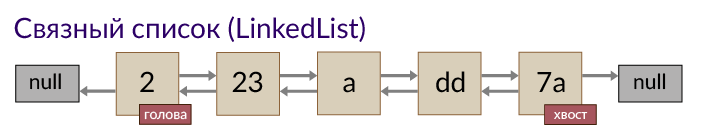

Списки относятся к [коллекциям](collections.md).

## List-коллекции
Множество элементов хранящихся по индексу. Иначе - список.
Основные представители:
- `ArrayList` - Представляет собой обыкновенный массив, но с расширенными возможностями
- `LinkedList` - связанный список, в котором каждый элемент хранит ссылки на два соседних. Рекомендуется использовать во всех случаях вместо `LinkedList` - `ArrayList`, потому что он занимает в 6 раз меньше памяти.
- ~~`Vector`~~ - вектор - устарел
- ~~`Stack`~~ - стек - устарел, теперь все пользуются `Deque`

| Операция | Метод | ArrayList | LinkedList | Vector | Stack |
| --- | --- | --- | --- | --- | --- |
| Взятие элемента | get() | Быстро | Медленно |     |     |
| Присваивание элемента | set() | Быстро | Медленно |     |     |
| Добавление элемента | add(Object) | Быстро | Быстро |     |     |
| Вставка элемента | add(index, Object) | Медленно | Быстро |     |     |
| Удаление элемента | remove() | Медленно | Быстро |     |     |

## Интерфейс List
Методы:
- `E get(int index)` - возвращает элемент коллекции с выбранным индексом
- `E set(int index, E)` - заменяет элемент коллекции с выбранным индексом на переданный
- `void add(int index, E)` - добавляет элемент в коллекцию на указанную позицию, сдвигая остальные элементы на одну позицию вправо
- `E remove(int index)` - удаляет элемент из коллекции, сдвигая все элементы справа на одну позицию влево
- `int indexOf(Object)` - возвращает индекс первого элемента, совпадающего с переданным. Если такого элемента нет, то возвращает -1
- `int lastIndexOf(Object)` - возвращает индекс последнего элемента, совпадающего с переданным. Если такого элемента нет, то возвращает -1
- `List<E> subList(int fromIndex, int toIndex)` - выделяет подсписок и возвращает его. При этом изменения одного списка будет сказываться на другом
- `boolean equals(List<E>)` - сравнивает списки поэлементно

## LinkedList


Интересно, что класс `LinkedList<E>` реализует еще и интерфейс `Deque<E>`, то есть является еще и [очередью](queue.md).

Методы:
- add()
- remove()
- indexOf()
- clear()
- contains()
- set()
- size() - все так же, как и в ArrayList
- addFirst() - вставляет элемент в начало списка
- addLast() - вставляет элемент в конец списка
- peekFirst() - возвращает первый элемент списка
- peekLast() - возвращает последний элемент списка
- pollFirst() - возвращает и удаляет первый элемент списка
- pollLast() - возвращает и удаляет последний элемент списка
- toArray() - возвращает массив из элементов списка

## ArrayList

Класс ArrayList предназначен для хранения массива объектов (не примитивов!) в виде списка.

Настоятельно рекомендуется вместо массивов использовать объекты класса ArrayList.

При создании объекта класса ArrayList необходимо указать тип принимаемых объектов
```java
ArrayList<String> myList = new ArrayList<String>();

ArrayList<int> myList = new ArrayList<int>; //так нельзя - класс принимает только объекты

ArrayList<Integer> myList = new ArrayList<Integer>; //а так уже можно
```

Проводить перебор элементов, и одновременно изменять список нельзя!!

При создании списка можно указать какого размера массив должен быть в нем создан.
```java
ArrayList<String> myList = new ArrayList<String>(100); //на 100 строк
```

Методы:
- add(Object elem) - добавляет в список параметр Object
- remove(int index) - удаляет объект по переданному индексу, сдвигает все остальные объекты и уменьшает количество элементов
- remove(Object elem) - удаляет указанный объект (если он есть внутри)
- contains(Object elem) - возвращает true, если в массиве есть совпадение
- isEmpty() - возвращает true, если массив не содержит элементов
- indexOf(Object elem) - возвращает либо индекс объекта, переданного в параметре, либо -1
- size() - возвращает количество элементов в списке на текущий момент
- get(int index) - возвращает объект, который находится по индексу, переданному в параметре
- addAll(ArrayList<> list) - копирует все элементы списка
- String toString() - преобразует список в строку вида [Arty, Lina, Kot]
- [] toArray(new [0]) - преобразует список в массив
- iterator() - создает итератор (см. ниже)
- trimToSize() - обрезает размер внутреннего массива до количества элементов, содержащихся в нем.