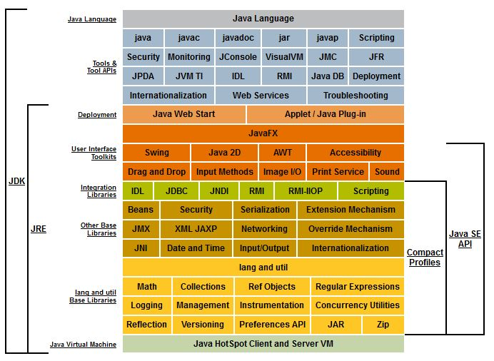

Компилятор java преобразовывает текст программы в байткод, который читается виртуальной машиной

`java` - виртуальная машина
`javac` - компилятор
`javap` - байткод

Статья к первому тесту

https://www.journaldev.com/12552/public-static-void-main-string-args-java-main-method

Под каждый класс сохраняется свой файл.
Для того чтобы эти файлы не поработили компьютер их запаковывают в `jar`

запаковать программу:
```sh
jar cfe archiveName.jar mainClass firstClass.class secondClass.class
```

- `jar` -
- `cfe` -
- `archuveName.jar` - название архива
- `mainClass` - название главного класса

далее следуют названия классов, которые нужно запаковать в архив

Чтобы посмотреть содержимое архива, не распаковывая его, используется следующая конструкция:

```sh
jar tf archiveName.jar
```

Распаковка архива производится с помощью команды
```sh
jar xf archiveName.jar
```

Запуск главного метода архива производится с помощью команды
```sh
java -jar archiveName.jar
```

## Основные аббревиатуры

- JDK - "Java Development Kit" Набор инструментов для разработки Java-программ, включая компилятор
- JRE - "Java Runtime Enviroment" - Набор инструментов для запуска Java-программ, включая виртуальную машину (не включая компилятор)
- JVM - "Java Virtual Machine" - Виртуальная машина Java
- JIT - "Just in Time" - Подход к реализации виртуальной машины, при котором байткод не интерпретируется, а компилируется в машинный код для исполнения аппаратным процессором
- JAR - "Java Archive" - Формат архива, в который обычно упаковываются Java программы и библиотеки




## Инструменты для сборки программ

Для сборки программ используются специальные инструменты:
- Ant
- Gradle
- Maven - самый популярный

---
## К изучению

- [ ] http://www.skipy.ru/technics/likbez.html