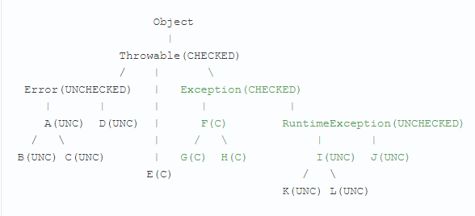

**Исключения** - механизм для контроля над ошибками в программе.

При возникновении ошибки JVM создает объект exception и записывает в него информацию об ошибке, а затем раскручивает стек вызовов до выхода из программы.

Исключения делятся на
- Проверяемые - их обязательно перехватывать
- Непроверяемые - пробрасываются либо до catch блока, в котором будут перехвачены, либо до смерти нити


Всего существует более 400 подклассов Throwable.

Error не относится к исключениям - они являются следствиями плохо написанного кода.

`RuntimeException` тоже обычно являются недоработкой программиста.

Наиболее часто встречающиеся исключения:

- NPE - `NullPointerException` - вылезает, когда пытаются вызвать метод из ссылочной переменной, которая ведет на null
- `ArrayIndexOutOfBoundsException` - обращение к элементу массива с несуществующим индексом.
- `StringIOOBE` - обращение к несуществующему символу в строке
- `FileNotFoundException` - попытка открытия несуществующего файла

<mark>//добавить исключения из Шилдта 343 с.</mark>

## Предупреждение об исключениях

При объявлении метода указывается, если метод не обрабатывает, а прокидывает исключение дальше, с помощью ключевого слова throws. Если в метод могут прийти исключения из методов, которые он вызывает, то он должен либо их обработать, либо прокинуть дальше. Прописывать для прокидывания нужно только checked (зеленые) исключения.
```java
public static void method() throws IOException, ClassNotFoundException
```

Кидать можно только то, что кидается, и поэтому в Java есть специальный класс `Throwable`

Если в коде метода создается объект класса-потомка со ссылкой родительского класса, то в сигнатуре метода необходимо указывать возможность выброса исключения типа родительского класса.

```java
public static void myMethod throws Throwable { //класс Exception не пройдет, т.к. ссылка типа Throwable
    Throwable e = new Exception();
    throw e;
}
```

## Бросание исключений

Исключения бросаются с помощью ключевого слова `throw`. Затем обычно создается объект исключения (унаследованный от `Throwable`) и в скобках указывается сообщение, которое хотелось бы вывести пользователю.
```java
throw new IllegalStateException("Invalid user");
```

## Класс Throwable
Конструкторы:

- Throwable()
- Throwable(Throwable

Методы:
- `String getMessage()` - возвращает сообщение, введенное при создании объекта исключения
- `void printStackTrace()` - выводит стек вызванных методов (можно не писать, JVM сделает это сама)
- `void printStackTrace(PrintStream)` - выводит стек вызванных методов в указанный поток
- `StackTraceElement[] getStackTrace()` - возвращает стек вызванных методов
- `Throwable getCause()` - возвращает исключение, явившееся причинной данного, или null
- `Throwable initCause()` - связывает причинное исключение и сгенерированное и возвращает ссылку на него
- `Throwable getSupressed()` - упаковывает все исключения, которые были и возвращает их
- `String toString()` - возвращает строку с полным описанием исключения

## Перехват исключений

Для перехвата исключений с целью продолжения работы программы используется конструкция `try-catch`.

Если внутри блока try возникает исключение, то оно захватывается и дальше выполняется код, записанный в `catch`.

Если исключения не возникает, то блок `catch` не выполняется.

В скобках после `catch` записывается вид исключения, который он ловит. 
При этом здесь работает полиморфизм - исключения предки будут захватывать потомков.

Для одного блока `try`, может быть несколько блоков `catch` с разными видами исключений.

```java
try {

} catch (ArithmeticException e) {

} catch (Exception e) {

}
```

При записи нескольких `catch` подряд нельзя ставить потомка после предка.

Если разные исключения должны обрабатываться одинаково, то выражение в скобках `catch` можно записать в виде:
```java
catch (FirstException | SecondException e) { ... }
```

При этом переменная, в которую записывается исключение, неявно помечается как `final`.

## `finally`

Блок кода, заключенный в `finally` выполняется всегда, даже если в try вылетело исключение. Не выполнится только если в `try` программа будет принудительно остановлена.

```java
try {

} catch (ArithmeticException e) {

} finally {

}
```

Если и в `try` и в `finally` вызывается `return` или кидаются исключения, то выполняться будет то, что записано в `finally`.

Из `finally` невозможно узнать было ли исключение в `try`.

Обычно в `finally` прописываются действия, которые необходимо выполнить несмотря ни на что.

Если в `finally` тоже вылетит исключение, то оно перебьет собой исключение летящее из `try`. Для того чтобы не нужно было выискивать хитрости в Java введено указание источников в скобках после `try` с их автоматическим закрытием. Это называется `try-with-resourses`.

В скобках try можно указывать только те ресурсы, которые реализуют интерфейс `AutoCloseable`.
```java
try (InputStream is = new FileInputStream("a.txt")) { ... }
```

Ресурсы, объявленные в операторе `try`, неявно принимают модификатор `final`. Это значит, что в объявленную переменную нельзя записать новый поток.

## Рекомендации по исключениям

Выводить сообщения об ошибке в консоль лучше не через `System.out`, а через `System.err` - тогда сообщения гарантированно выйдут в консоль сразу (такие сообщения не буферизируются).

Рекомендуется не прописывать в `finally` методов, которые могут кинуть исключения, и не использовать оператор `return`, чтобы случайно не затереть данные, полученные в `try`.

При создании своих собственных исключений считается хорошим тоном заканчивать его название на Exception

## Исключения при наследовании

У методов, переопределенных в классах-потомках, исключения не обязаны соответствовать исключениям класса-предка, но они должны быть не сильнее их. Это правило связано с полиморфизмом.

## Создание своих классов исключений

При создании пользовательских классов исключений их свойство checked/unchecked должно совпадать с свойством класса-родителя.



При создании своих классов исключений обычно создают два конструктора с сообщением и с сообщением и причиной:

```java
public class CalcException extends RuntimeException {
    public CalcExceprion (String message) {
        super(message);
    }
    public CalcExceprion (String message, Throwable cause) {
        super(message, cause);
    }
}
```

---
## К изучению

- [ ] https://dev64.wordpress.com/2012/10/07/exception-handling-antipatterns/
- [ ] https://habr.com/ru/post/337536/
- [X] Про NPE: https://habr.com/ru/post/221243/