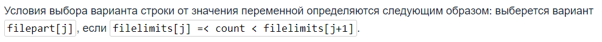

Для форматирования строк используется статический метод `format()`, объявленный в классе String.
```java
String s = String.format("цифры %, d кончились", 1234567890);
System.out.println(s) //Выведется "цифры 1,234,567,890 кончились"
```
Символ `%` показывает, куда будет вставлен аргумент
Метод `printf()` включает в себя ту же функциональность
```java
System.out.printf("%s получает зарплату %.2f $", "Вова", 120);
```

## Форматирование чисел


Типы:
- `d` - десятичное число (подходит для byte, short, int, char и их классов-оберток)
- `f` - с плавающей точкой (подходит для float, double и их классов-оберток)
- `e` - с плавающей точкой для представления в виде "2,71e+5"
- `x` - шестнадцатеричное число (подходит для byte, short, int, long и их классов-оберток
- `c` - символ (подходит для byte, short, int, char и их классов-оберток)
- `s` - строка
- `S` - строка (преобразует все буквы в заглавные)

Номер аргумента (не является обязательной частью):
- `1$` - указывается номер и знак доллара. Аргументы читаются подряд, если номер не указан

Флаги (не является обязательной частью):
- `,` - тысячи, миллионы и т.д. будут отделены запятыми
- `-` - выравнивание по левому краю (по умолчанию по правому краю)
- `+` - положительные числа будут отображаться с плюсом

Ширина (не является обязательной частью):
- любое число - количество символов в представлении числа/строки (остальное будет заполнено пробелами)
- 0любое число - количество знаков в представлении числа (остальное будет заполнено нулями)
- Примечание: если число или строка по количеству символов превышают ширину, то они будут выведены полностью, что может нарушить красоту вашего форматирования

Разрядность (не является обязательной частью):
- `.любое число`
    - для числа - количество знаков после запятой
    - для строки - количество выводимых символов

Дополнительные функции:
- `%n` - переносит строку
- `%%` - знак процента

## Форматирование дат

- `%tr` - просто время: 03:01:47 PM
- `%tc` - полное представление даты и времени: Вос Ноя 28 14:52:41 MST 2004
- `%tA` - день недели: Воскресенье
- `%tB` - месяц: Ноябрь
- `%td` - день: 28
- `%tm` - месяц: 12
- `%ty` - год: 19
- `%tH` - часы: 23
- `%tM` - минуты: 59
- `%tS` - секунды: 59

Флаги:
- `<` - еще раз вызвать предыдущий аргумент
```java
Date today = new Date();
String.format("%tA, %tB", today, today);
String.format("%tA, %<tB", today); //Аналог предыдущей записи
```

## Класс `Format`

Абстрактный класс, который представляет несколько различных форматировщиков текста:
- `ChoiseFormat`
- `MessageFormat`
- `DateFormat`
    - `SimpleDateFormat`

### Класс `ChoiseFormat`

Класс чаще всего используется для обращения с множественными числами слов. Используется всегда вместе с `MessageFormat`.

В `ChoiseFormat` необходимо передать два массива - один из них должен содержать вещественные числа, а второй строки. Вещественные числа формируют диапазоны, которые определяют какая из строк будет выдана.




### Класс `MessageFormat`

Предназначен для форматирования строк. Является альтернативой методу `String.format()`.

Форматирование происходит с помощью шаблона. В шаблоне помечаются места, в которые будут вставлены нужные объекты, с помощью фигурных скобок с цифрой внутри, которая отвечает за номер параметра. Также в фигурные скобки может записываться тип форматирования
```java
"At {0} there was {1} on {2}", param0, param1, param2
```

Конструкторы:
- `MessageFormat(String pattern)` - создает объект на основе шаблона

Методы:
- `static String format(String pattern, Object...)` - выдает строку, отформатированную с помощью шаблона, на выделенные места которого подставлены нужные объекты.
- `void setFormatByArgumentIndex(int index, ChoiseFormat)` - значение, подставляемое в шаблон на место объекта с переданным индексом, будет выбираться с помощью переданного ChoiseFormat
- `void setFormats(Format[])` - принимает массив форматов. При выдаче результата с помощью метода `format()` каждый объект вставляемый в шаблон будет отформатирован в соответствии с форматом с совпадающим индексом

---
## К изучению
- [ ] Официальная документация:  https://docs.oracle.com/javase/8/docs/api/java/util/Formatter.html
- [X] https://javarush.ru/groups/posts/590-klass-messageformat