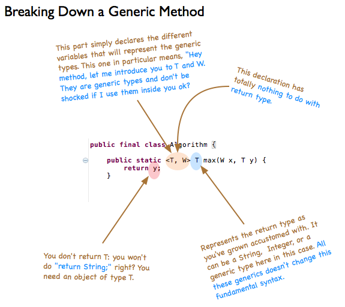

Обобщение - тип данных, который может становиться любым типом в зависимости от контекста.

Если существует класс с обобщением, то при создании объектов этого класса можно вместо параметризованного типа подставить любой тип

```java
class MyClassGen<T> { //Класс с обобщением, вместо которого при создании экземпляра класса может быть подставлен любой тип
    T ob;
    MyClassGen(T o) { ob = o; }
    T getOb() { return ob; }
}
```

Обычно для обозначения параметров типа используются имена T, E, V.

При компиляции создается обобщенная версия класса для типа `Object`. В байткоде никаких дженериков нет.

### Ограничения на подставляемые типы

- В качестве подставляемого типа могут выступать только классы, примитивные типы не могут быть использованы (а вот массив примитивов может, потому что он объект)
- Для того чтобы ограничить перечень типов, которые могут быть использованы для замены обобщения используется ключевое слово extends, после которого записываются разрешенные классы и интерфейсы. Запись производится через &:

```java
class MyClassGen<T extends InputStream & AutoClosable> { ... }
```

Причем, если мы ограничиваем обобщение, то в тексте класса можно использовать методы, определенные в ограничивающих классах и интерфейсах.

- С помощью ограничений можно обеспечивать совместимость перечислений, например:
```java
class Pair<T, V extends T> { ... } //V будет того же класса, что и T, или его наследником
```

- Внутри параметризованных классов нельзя делать следующие вещи (программа не скомпилируется):
    - Вызывать конструктор типа T
    - ??? Создавать массив типа T (да вроде можно)
    - Проводить проверку на принадлежность к классу с помощью оператора instanceOf

### Множественные обобщения
Можно запихивать в класс сразу несколько обобщений
```java
class ClassWithTwoGen<T, V> { ... }
```
В качестве примера таких классов можно привести класс `Map<T,V>`

### Обобщения в статических методах


### Шаблон аргумента

Шаблон аргумента - это способ обобщения, который используется для того, чтобы дать свободу при создании методов. Шаблон аргумента обозначается знаком вопроса `?`. Если в классе, который использует обобщение в метод нужно передать объект этого же класса, но с неизвестным обобщением, то используется шаблон аргумента:
```java
class MyClass<T> {
    T obj;
    MyClass(T o) { obj = o; }

    public equals (MyClass<?>) { ... } //Теперь в аргументы может прийти объект с любым шаблоном
}
```

Можно ограничивать шаблон аргумента с помощью ключевого слова `extends`
```java
public T orElseGet(Supplier<? extends T> other) { ... } //Можно запихнуть T и любой подтип T
```

А можно расширять возможные подставляемые типы с помощью ключевого слова `super`:
```java
public void ifPresent(Consumer<? super T> consumer) { ... } //Можно запихнуть T и любой супертип T
```

Если ты не определился какой тип запихнуть при объявлении новой переменной класса с обобщением, то можно поставить шаблон аргумента, но при этом станут недоступны все методы, возвращающие объект класса T.

```java
Optional<?> optional = Optional.of(1);
```

### Обобщенные методы
Для того чтобы создать статический метод с обобщенными аргументами необходимо подсказать это компилятору, прописав ограничения шаблонов перед возвращаемым типом метода:
```java
public static <T extends Comparable<T>, V extends T> boolean arraysEqual(T[] x, V[] y) { ... }
```

### Обобщенные конструкторы
Конструкторы могут быть обобщенными, даже если класс необобщенный

### Обобщенные интерфейсы
Любой класс, реализующий обобщенный интерфейс, также должен быть обобщенным.

Класс, реализующий обобщенный интерфейс, может не обобщен только если при имплементировании интерфейса указывается конкретный тип

```java
class MyClass1<T> implements MyInterface<T> { ... }
class MyClass2 implements MyInterface<Integer> { ... }
```

### Базовые типы

Базовый тип создается при использовании обобщенных классов без указания аргументов типа.

Это возможно в Java, потому что обобщения были добавлены только в JDK 5, и в нем же были переписаны многие стандартные классы. Для того чтобы весь старый код, использующий переписанные классы, не сломался были добавлены базовые типы.
```java
ArrayList list = new ArrayList();
```

## Недостатки обобщений

1. Внутри обобщенных классов нельзя объявлять перегруженные методы с обобщенными входными данными
2. Обобщенные классы не могут расширять Throwable