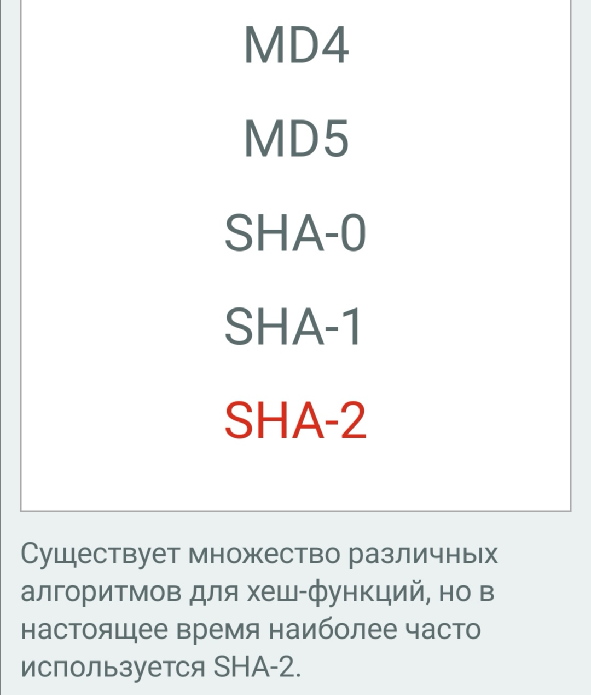

**Хэшкод** - это целое число фиксированной длины, полученное из массива произвольной длины.

В Java хэшкод ограничен значениями примитивного типа int.

Область применения: основная область использования хэшкода - коллекции. Там он используется для ускорения поиска по элементам коллекции.

Для одного и того же объекта хэшкод всегда будет одинаковым.

Два основных правила:

- Если хэшкоды разные, то и входные объекты гарантированно разные
- Если хэшкоды одинаковые, то скорее всего объекты равны, но это не гарантированно (может просто совпало)

*Коллизия* - ситуация, когда у разных объектов один и тот же хэшкод.

Вероятность возникновения коллизии зависит от используемого алгоритма генерации хэшкода.



## Переопределение метода hashcode()

Если не переопределять в своем классе метод hashcode(), то при его вызове будет использоваться реализация класса Object, а она при каждом вызове возвращает новый результат.

Поэтому необходимо для каждого класса, из которого будет вызываться метод hashcode(), переопределять его!

Для этого можно воспользоваться средствами IDE.

Можно переопределить реализацию метода hashcode() с помощью стандартного метода hash(), который определен в классе Objects. В метод в качестве аргументов передаются поля, которые должны участвовать в формировании хэшкода.

```java
class MyClass {
    private int a;
    private int b;

    public MyClass(int a, int b) { this.a = a; this.b = b;}

    public int hashCode() {
        return Objects.hash(a, b);
    }
}
```

При переводе числовых значений в хэшкод их обычно прибавляют к предыдущему значению, перемноженному на какое-то нечетное число, чаще всего на 31. Это позволяет перемешать хэшкоды более равномерно, уменьшая количество коллизий

```java
class MyClass {
    private String s;
    private int b;

    public int hashCode() {
        int result = s.hashCode();
        result = 31 * result + b;
        return result;
    }
}
```

---
## К изучению

- [X] https://habr.com/ru/post/168195/
- [X] https://javarush.ru/quests/lectures/questmultithreading.level01.lecture04
- [ ] Блох Философия Java 3 часть 8-9 главы
- [X] http://www.seostella.com/ru/article/2012/10/04/kak-sgenerirovat-hashcode-v-java.html