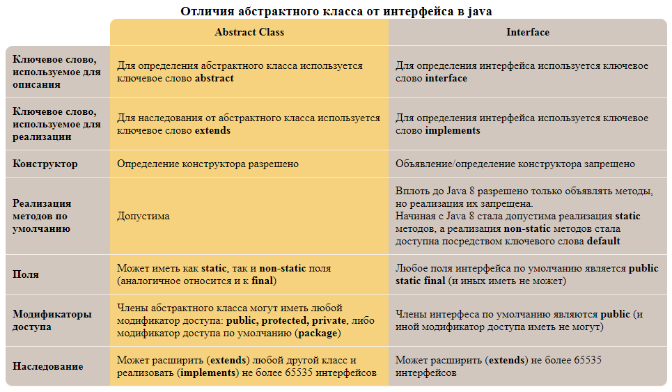

**Интерфейс** - <mark>это абстрактный класс (но не только).</mark>

Обычно интерфейсы выделяются, когда нужно выделить среди нескольких классов общее поведение.



Объявляются интерфейсы с помощью ключевого слова `interface`
```java
public interface myInterface{
    void myMethod();
}
```

Все поля в интерфейсах - константы. При их создании не обязательно писать `public static final` - это будет сделано неявно.

Все методы в интерфейсах - абстрактные и не имеют реализации! Ключевое слово `abstract` указывается неявно.

Для реализации интерфейса в создаваемом классе используется ключевое слово `implements`

```java
public class Dog extends Animal implements Pet {...}
```

Все методы в интерфейсах по умолчанию `public`. В классах, где они реализовываются, они должны быть указаны, как `public`.

Интерфейс может наследоваться только от интерфейсов через ключевое слово `extends`.

С ссылочными переменными с типом интерфейс работает полиморфизм - с их помощью можно вызывать методы, переопределенные в наследниках.

## `default` методы
Также существуют default методы, которые могут иметь реализацию:
```java
public interface CanEat{
    public default void eat(int amountOfFood){
        System.out.println("Я съел " + amountOfFood + " еды");
    }
}
```

Используются `default` методы для того, чтобы перегрузить методы без поломки чужого кода.

Если класс имплементирован от двух интерфейсов, каждый из которых имеет дефолтный метод с одним и тем же названием, то класс обязан переопределить такой метод.

Дефолтные методов ввели в Java 8 для того чтобы можно было добавлять новые методы в интерфейс, не ломая при этом старый код.

Интерфейс может переопределять Дефолтные методов родительских интерфейсов.

## Статические методы
В интерфейсе могут быть определены статические методы.

Статические методы не реализуются ни на следующими интерфейсами, ни имплементирующими классами.

## Функциональные интерфейсы

Подробнее - тут: [Функциональные интерфейсы](stream_and_lambda/functional_interface.md)

## Интерфейсы с константами

Можно создавать интерфейсы, в которых будут храниться только константы. Такие интерфейсы имплементируются всеми классами, которые должны пользоваться одним набором констант.

Насчёт целесообразности создания таких интерфейсов ведутся споры.

## Интерфейсы-маркеры

Интерфейсы-маркеры используются для того, чтобы показывать другим классам, что данный класс обладает некими свойствами.

При этом в других классах обычно проводится проверка типа `instanceOf` на то, имплементирован ли интерфейс данному классу, и если нет, то выдают исключение типа not_____Exception

Интерфейсы-маркеры как правило не имеют методов и полей.

Примерами интерфейса-маркера являются:

- интерфейс `Serializible` - класс можно сериализовывать
- интерфейс `Remote` - класс поддерживает вызов своих объектов с другого компьютера
- интерфейс `Clonable` - класс поддерживает клонирование