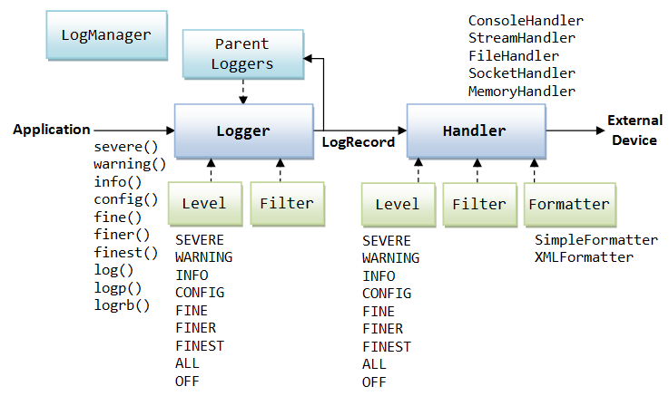

**JUL** - это библиотека для логирования, входящая в стандартную сборку JDK Java, располагающаяся в пакете java.util.logging. Про логирование ошибок в Java см. отдельную заметку: [Логирование](../logging.md)

---
## Класс Logger
Обычно логгер записывается в константу класса (в поле)
```java
public static final Logger LOGGER = Logger.getLogger(MyClass.class.getName()); //В метод передается строка с полным именем класса
```

Логгер можно сконфигурировать так, что он будет игнорировать все сообщения с уровнем ниже определенного

Логгер может быть локализован (будет подставлять необходимый язык для вашей страны).

Методы:
- `static Logger getLogger()` - возвращает новый логгер
- `log(Level.*, String)` - записывает в лог новую запись
    - `OFF` - вообще ничего не записывает;
    - `SEVERE` - критическая ошибка, все сломалось;
    - `WARNING` - предупреждение;
    - `INFO` - нейтральное сообщение;
    - `CONFIG` - информация о конфигурации;
    - `FINE` - что программа делает;
    - `FINER` - что программа делает подробно;
    - `FINEST` - что программа делает очень подробно;
    - `ALL` - записывает все.
- `log(Level.*, String, Exception)` - записывает в лог стэктрейс исключения
- `warning(String)` - записывает в лог предупреждение
- `setLevel(Level.*)` - конфигурация логгера на игнорирование сообщений с уровнем ниже указанного
- `void addHandler(Handler)` - создает объект класса Handler
- `void setUseParentHandlers(boolean)` - определяет, будет ли класс передавать логи вышестоящему классу

В сообщения логгера могут подставляться некоторые значения:
```java
LOGGER.log(Level.FINE, "Current values: x = {0}, y = {1}", new Object[]{x, y});
```

Значения x, y будут подставлены на места {} в том порядке, в котором они записаны в массив.

Логгер не сам обрабатывает сообщения, он делегирует их классу `Handler`

---
## Класс `Handler`
Класс `Handler` является абстрактным и имеет три реализации:
- `ConsoleHandler` - выводит сообщения в консоль
- `FileHandler` - записывает сообщения в файл
- `SocketHandler` - отправляет лог сообщений по сети

Создание объекта класса Handler происходит следующим образом:
```java
Handler ch = new ConsoleHandler();
ch.setLevel(Level.ALL);
LOGGER.addHandler(ch);
```

Обработка логов и запись их в файл или передача по сети делегируется объектом класса `Handler` объекту класса `Formatter`

## Класс `Formatter`
Класс `Formatter` имеет две реализации:

- `SimpleFormatter` - выводит лог в читаемом формате
- `XMLFormatter` - выводит машиночитаемый лог в формате .xml

Создание объекта класса Formatter происходит следующим образом:
```java
Formatter f = new XMLFormatter();
ch.addFormatter(f);
//ch.addFormatter(new XMLFormatter()); //можно и так
```



---
## К изучению

- [ ] Javadoc на классы пакета `java.util.logging`