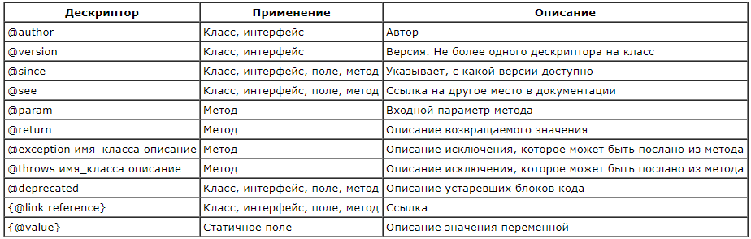

Javadoc комментарии. Служат для отображения подсказок при вызове методов и для автоматической генерации документации на код в формате html-страниц.
```java
/**
* Моя любимая программа
* @autor Бояршинов
* @version 1.0
*/
```

При составлении javadoc комментариев используются различные дескрипторы. Они начинаются с символа `@` и записываются только внутри блока javadoc-комментария.

Основные дескрипторы:


Дескрипторы ставятся первыми в строке комментария.

Дескрипторы поддерживают html, соответственно можно форматировать текст, вставлять ссылки и изображения.

Изображения подгружаются из специальной директории "doc-files"

---
## Документирование пакетов

Документация также может быть создана на целый пакет с java-классами.

Для документирования пакетов в них создается файл со специальным названием - `package-info.java`. В нем документация пишется в формате javadoc.

Раньше для этих целей в пакетах создавали `package.html`, но сейчас этот способ устарел.

---
## Наследование документации

Зачастую интерфейсы реализуются всего одним классом. В таких случаях бессмысленно повторять документацию на методы, достаточно написать ее для методов интерфейса. Если при этом в классе не писать документацию над методом, то она будет автоматически подтянута из интерфейса.

В некоторых программах бывает принято писать над методами, документация к которым должна наследоваться, специальную ссылку `{@inheritDoc}`:
```java
/**
* {@inheritDoc}
*/
@Override
public void method() { }
```

---
## К изучению
- [ ] https://docs.oracle.com/javase/8/docs/technotes/tools/windows/javadoc.html
- [ ] https://www.oracle.com/technetwork/java/javase/documentation/codeconventions-141999.html#385
- [ ] https://www.oracle.com/technetwork/java/javase/tech/index-137868.html