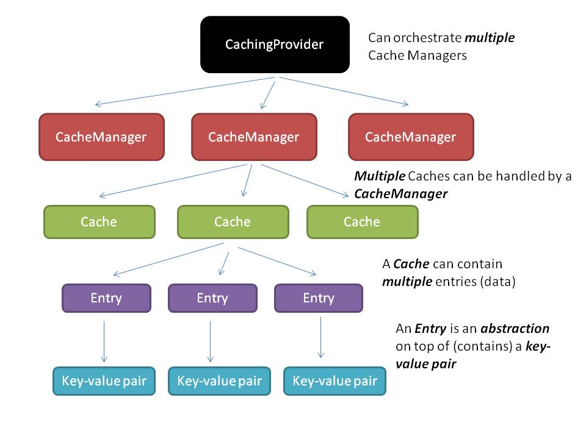

**JCache** - API для кэширования данных, разработанное в рамках JSR-107.

Несмотря на то, что jcache находится в библиотеке javax, JCache не является частью [Java EE](../java_ee/java_ee.md).

### Основные реализации

- JCache Reference Implementation - не рекомендуется к использованию из-за проблем с многопоточностью.
- [Ehcache](../external_lib/ehcache.md) -
- Hazelcast - IMDG, способная выступать в роли распределенного кэша
- Oracle Coherence -
- Apache Ignite - первоначально распределенный кэш, но затем развился до ML-проекта.
- Terracota Ehcache -
- Infinispan -
- [JCS](../external_lib/jcs.md) -

---
## Устройство системы кэширования


- `CachingProvider` - позволяет управлять жизненным циклом CacheManager'ов.
- `CacheManager` - создает, конфигурирует и закрывает кэши
- `Cache` - кэш, в котором хранятся данные

---
## Интерфейс Cache

- `V get(K key)` - возвращает значение элемента по ключу. Если элемента нет в кэше, возвращает null.
- `void put(K key, V value)` - помещает элемент в кэш.
- `boolean containsKey(K key)` - сообщает имеется ли в кэше элемент с переданным ключом.
- `Map<K,V> getAll(Set<K> keys)` - возвращает в виде словаря все элементы, ключи которых переданы во множестве.
- `V getAndRemove(K key)` - возвращает элемент по ключу и удаляет его из кэша.
- `void clear()` - очищает кэш.
- `T invoke(K key, EntryProcessor<,>, Object...)` - позволяет выполнить действия над элементом кэша. Действия записываются в виде лямбда выражения.
- ... еще много методов, которые можно посмотреть в `javax.cache.Cache`.

---
## Конфигурирование кэша
Конфигурирование кэша производится с помощью интерфейса `Configuration`.

JCache по умолчанию предоставляет только одну реализацию интерфейса - `MutableConfiguration`. Другие реализации предоставляются вендорами, список которых представлен выше.

---
## Использование кэширования в проекте
Для подключения jcache в Maven-проекте необходимо добавить зависимость:
```xml
<dependency>
    <groupId>javax.cache</groupId>
    <artifactId>cache-api</artifactId>
    <version>${cache-api-version}</version>
</dependency>
```

Также необходимо добавить зависимость какой-либо реализации стандарта, например hazelcast:
```xml
<dependency>
    <groupId>com.hazelcast</groupId>
    <artifactId>hazelcast</artifactId>
    <version>${hazelcast-version}</version>
</dependency>
```

---
## Слушатели кэша

Если необходимо выполнять какие-либо действия при добавлении, изменении или удалении данных из кэша необходимо реализовать необходимые интерфейсы из списка:

- `CacheEntryCreatedListener` - получает событие при записи в кэш нового объекта
- `CacheEntryUpdatedListener` - получает событие при перезаписи в кэш по существующему ключу
- `CacheEntryRemovedListener` - получает событие при удалении данных из кэша
- `CacheEntryExpiredListener` - получает событие при вытеснении данных из кэша

в которых объявлены следующие методы:

- `void onCreated()`
- `void onUpdated()`
- `void onRemoved()`
- `void onExpired()`

---
## Аннотации

Для использования в Spring приложениях существуют аннотации, которые будут указывать методам, чтобы они выполняли свои действия в сотрудничестве с кэшом.

- `@CacheDefaults(cacheName = "name")` - прикрепляет к классу кэш с указанным названием. Ставится над классом.
- над методами:
    - `@CacheResult`
    - `@CachePut`
    - `@CacheRemove`
    - `@CacheRemoveAll`
- перед аргументами:
    - `@CacheKey`
    - `@CacheValue`

---
## Самоочистка кэша

Для того чтобы кэш не разрастался до невероятных размеров, необходимо выкидывать из него некоторую хранимую информацию. Существует несколько политик самоочистки кэша:

| **Политика** | **Описание** | **Класс** |
| --- | --- | --- |
| Eternal | Кэш может разрастаться, пока не кончится память. Политика по умолчанию | `EternalExpirePolicy` |
| Access | Данные удаляются из кэша, если к ним не обращались заданное время | `AccessedExpirePolicy` |
| Creation | Данные удаляются из кэша по истечению заданного времени с момента их записи в кэш | `CreatedExpiryPolicy` |
| Update | Данные удаляются из кэша, если они не были модифицированы заданное время | `ModifiedExpirePolicy` |
| Touch | Совокупность предыдущих трех политик | `TouchedExpirePolicy` |

```java
CachingProvider cachingProvider = Caching.getCachingProvider();
CacheManager cacheManager = cachingProvider.getCacheManager();
MutableConfiguration<String, GeoObject> config = new MutableConfiguration<>();
Factory expirePolicyFactory = CreatedExpiryPolicy.factoryOf(Duration.ONE_HOUR);
config.setExpiryPolicyFactory(expirePolicyFactory);
Cache<String, GeoObject> cache = cacheManager.createCache("mainCache", config);
```

---
## К изучению

- [X] Hello world на Baeldung: https://www.baeldung.com/jcache
- [ ] Видео с конференции JPoint (половина непонятна): https://www.youtube.com/watch?v=mU893v4HtF4
- [X] Видео от разработчиков стандарта: https://www.youtube.com/watch?v=UaK8560TWEA
- [X] Презентация от создателя стандарта: https://www.jfokus.se/jfokus16/preso/How-to-Speed-Up-Your-Application-using-JCache.pdf
- [X] Иллюстрированная статья на англ.: https://labs.consol.de/cache/java/development/2016/03/12/caching-with-jcache.html
- [X] Почему нельзя установить максимальное количество элементов в кэше: https://stackoverflow.com/questions/37289599/limit-cache-size-using-jcache-configuration-api