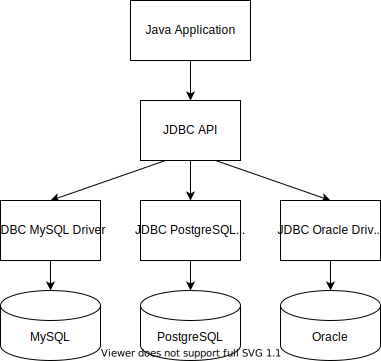
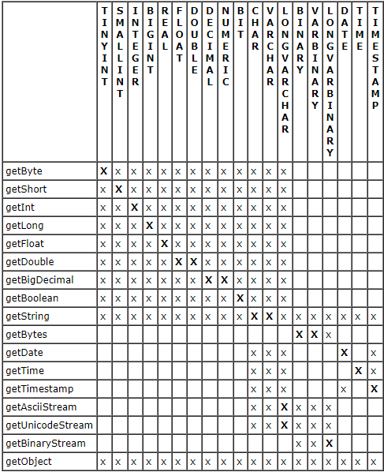

**JDBC** - Java DataBase Connectivity - это библиотека для работы с базами данных.

Библиотека JDBC предоставляет набор верхнеуровневых абстракций, которые позволяют одинаковым образом работать с различными СУБД.
Для работы с конкретной СУБД необходимо подключить к проекту ее драйвер.
Данный драйвер реализует абстракции, объявленные в JDBC, и по сути является адаптером между JDBC-интерфейсом и интерфейсом СУБД.



Подключение к большинству СУБД происходит через протокол TCP.
Из-за этого создание соединения - достаточно затратная операция.
Поэтому рекомендуется использовать пулы соединений. 
Существует несколько реализаций пулов соединений:
- С3P0 - один из самых популярных
- Hikari - самый быстрый пул соединений

JDBC представлен двумя пакетами: `java.sql` и `javax.sql`.
Почему их два?
Так сложилось по историческим причинам.
Первоначально пакет `javax.sql` предназначался для Java EE, но с 3 версией стандарта JDBC он стал частью Java SE.

---
## Выражения

- `Statement` - SQL выражение, которое не содержит параметров
- `Prepared statement` - подготовленное SQL выражение, содержащее параметры
- `Callable Statement` - SQL выражение, позволяющее получить данные

---
## Основные классы JDBC

- `DriverManager` - основная задача - подгрузить драйверы и подсоединиться к базе данных
- `Connection` (интерфейс) -

---
## `DriverManager`

Методы:

- `static Connection getConnection(URL, String user, String password)` - соединяет приложение с базой данных
- `static Connection getConnection(URL)` - то же, что и предыдущий, но в URL должны быть переданы юзер и пароль в качестве параметров URL

Переданный URL содержит сведения о драйвере, порте и пр.
Структура и пример URL:
```url
jdbc:<driverName>:[//host[:port/]]<databaseName>

jdbc:mysql://localhost:3306/my_first_db
```

---
## Интерфейс Connection
Объект Connection отвечает за соединение с базой и режим работы с ней

Объект Connection получается путем вызова метода `getConnection()` из класса `DriverManager` (см. выше)

Методы:

- `Statement createStatement()` - создает Statement
- `PreparedStatement prepareStatement(Sting sql)` - создает PreparedStatement. Необходимо сразу указать SQL-запрос.`
- `CallableStatement prepareCall(String storedProcedure)` - подготавливает хранимую процедуру
```java
CallableStatement call = connection.prepareCall("{call stored_procedure_name(?, ?)}");
```

- `DatabaseMetaData getMetaData()` - возвращает метаданные базы данных, с которой установлена связь
- `void close()` - закрывает connection
- Методы, обеспечивающие транзакционность:
    - `void setAutoCommit(boolean)` - устанавливает автоматическое применение каждого запроса к БД.
    - `void commit()` - применяет все вышеприведенные изменения к базе данных
    - `void rollback()` - сбрасывает все вышеприведенные изменения
- `void setReadOnly(boolean)` - помечает соединение как "только для чтения" (или снимает метку), что позволяет оптимизировать запросы на чтение к БД.

Рекомендуется на каждый вызов создавать новый Connection (либо брать из пула), другими словами: каждый метод в любом классе DAO должен получать свой выделенный Connection.


---
## Statement
Представляет собой выражение, которое реализует какую-то команду DML.
Методы:

- `boolean execute(String sql)` - выполняет запрос по выборке данных - SELECT
- `ResultSet executeQuery(String sql)` - выполняет запрос и возвращает результат в виде ResultSet
- `int executeUpdate(String sql)` - выполняет запрос, который изменяет данные - UPDATE, INSERT INTO, DELETE. Возвращает количество измененных (вставленных, удаленных) кортежей
- `ResultSet getResultSet()` - если в результате выполнения выражения было получено несколько таблиц (такое возможно при выполнении хранимых процедур), тогда возвращает результат в виде ResultSet
- `void close()` - закрывает выражение

**ВАЖНО!** Необходимо закрывать выражения, для того чтобы не происходила утечка памяти
```java
Statement statement = connection.createStatement();
ResultSet resultSet = statement.executeQuery("SELECT * FROM table;");
```

---
## Класс `PreparedStatement`

Улучшенная версия `Statement`, в которой в некоторые места SQL-запроса можно вставить какие хочешь значения. Унаследован от класса `Statement`.

Для создания параметра в строку запроса записывается имя параметра через двоеточие:
```sql
SELECT * FROM users WHERE users.id = :id; # id - это параметр
```

Благодаря тому, что такие запросы могут быть предкомпилированы, они выполняются гораздо быстрее, чем обычные `Statement`.

Еще одним плюсом таких выражений является то, что они могут быть соптимизированы администратором баз данных без изменения вашей программной логики, которая обращается к базам данных.

Методы:

- `void setInteger(String paramName, int value)` - устанавливает значение параметра запроса
- `void setBinaryStream(int paramIndex, InputStream)` - указывает, что в параметр с переданным индексом значение будет передано с помощью байтового потока ввода.
- `void setCharacterStream(int paramIndex, Reader)` - указывает, что в параметр с переданным индексом значение будет передано с помощью символьного потока ввода.
- те же методы, что и у родителя

---
## Класс `CallableStatement`

Наследуется от `PreparedStatement`.

Класс предназначен для вызова хранимых процедур. Параметры, которые необходимо передать в хранимую процедуру, передаются с помощью вопросительного знака.

В хранимых процедурах есть три типа параметров:

- `IN` - входной параметр
- `INOUT` - параметр, который подается на вход, изменяется внутри процедуры и возвращается
- `OUT` - выходной параметр

Методы работы с ними разные.
Для `IN` все также, как обычно.

Для `OUT` необходимо зарегистрировать выходной параметр. После выполнения хранимой процедуры считывание результата производится с помощью методов `get...(int)`

Методы:
- те же методы, что и у родителя
- `void registerOutParameter(int, Types)` - регистрирует выходные параметры. Для этого нужно указать тип выходных данных с помощью перечисления

Важно, что параметры, которые указываются при создании выражения, ведут свой отсчет не с нуля, а с 1.

Пример:
Для хранимой процедуры
```sql
PROCEDURE `increase_salaries_for_department`(
    IN current_department VARCHAR(45), IN increase_amount DECIMAL(10, 2))
BEGIN
    UPDATE employees SET salary = salary + increase_amount
        WHERE department = current_department;
END
```

Вызов будет следующим:
```java
CallableStatement statement = connection.prepareCall("{call increase_salaries_for_department(?, ?)}");

statement.setString(1, "IT");
statement.setDouble(2, 10000);
statement.execute();
```

---
## ResultSet

`ResultSet` - класс, который хранит результаты выборки SELECT

Так как результат выборки представляет собой таблицу, то для того, чтобы гулять по кортежам этой таблицы, существует маркер, который первоначально указывает на первый кортеж.

Методы:

- `String getString(int atribute_index)` - возвращает данные из текущего кортежа из атрибута с указанным номером
- `String getString(String atribute_name)` - возвращает данные из текущего кортежа из атрибута с указанным именем
- ... то же самое для всех примитивов и `Date`

Важно! Если в атрибуте записан NULL, а мы пытаемся прочитать его с помощью метода, который возвращает примитивный тип, то вернется 0. Для того чтобы предотвратить ошибки, существует метод `isNull()`

- `boolean isNull(String atribute_name)` - проверяет не NULL ли записан в кортеже с переданным именем
- `ResultSetMetaData getMetaData()` - возвращает метаданные по выборке
- `InputStream getBinaryStream(String atribute)` - возвращает байтовый поток ввода, из которого можно считать данные, записанные в формате BLOB
- `Reader getCharacterStream(String atribute)` - возвращает символьный поток ввода, из которого можно считать данные, записанные в формате CLOB
- Для того чтобы перемещать маркер между кортежами есть методы, которые возвращают true, если можно переместиться к выбранному кортежу
    - `boolean next()` - перескакивает на следующий кортеж
    - `boolean previous()` - перескакивает на следующий кортеж
    - `boolean first()` - перескакивает на первый кортеж
    - `boolean last()` - перескакивает на последний кортеж
- `void close()` - закрывает `ResultSet` и выгружает результаты выборки из памяти

**ВАЖНО**! После прочтения данных из выборки нужно обязательно закрывать `ResultSet`, чтобы не происходила утечка памяти. Но если вы закрыли `Statement`, из которого был получен `ResultSet`, то `ResultSet` будет закрыт автоматически



---
## Класс `DatabaseMetaData`

Объект класса получается путем вызова метода `getMetaData()` из экземпляра класса `Connection` (см. выше)

Методы:
- `getDatabaseProductName()`
- `getDatabaseProductVersion()`
- `getDriverName()`
- ...
- `ResultSet getTables(String catalog, String schemaPattern, String tableNamePattern, String[] types)`
- `ResultSet getColumns(String catalog, String schemaPattern, String tableNamePattern, String columnNamePattern)`

---
## Класс ResultSetMetaData

Объект класса получается путем вызова метода getMetaData из экземпляра класса `ResultSet` (см. выше).

Методы:
- `int getColumnCount()` - возвращает количество атрибутов
- `String getColumnName(int index)` - возвращается название атрибута с указанным индексом
- `String getColumnTypeName(int index)` - возвращает тип атрибута с указанным индексом
- `boolean isNullable(int index)` - показывает: может ли атрибут с указанным индексом принимать значение NULL
- `boolean isAutoIncrement(int index)`

Важно не забывать, что индексация атрибутов начинается с 1.

--
## К изучению

- [X] Полная, но сумбурная [статья](https://javarush.ru/groups/posts/2172-jdbc-ili-s-chego-vsje-nachinaetsja) про JDBC, транзакции, пулы и проч. 
- [X] Видео про [JDBC](https://www.youtube.com/watch?v=aje9gtFEyC4&list=PLB0276A0A62BDEF06&index=15) от Юрия Ткача
- [ ] Видео про [типичные ошибки](https://www.youtube.com/watch?time_continue=1&v=flMFICpPfcI&feature=emb_title) от Немчинского
- [X] Статья про [преимущества пула соединений](https://habr.com/ru/post/194142/)
- [X] [Мой пример](https://github.com/Boiarshinov/JdbcConnectionPoolExample) применения пула соединений