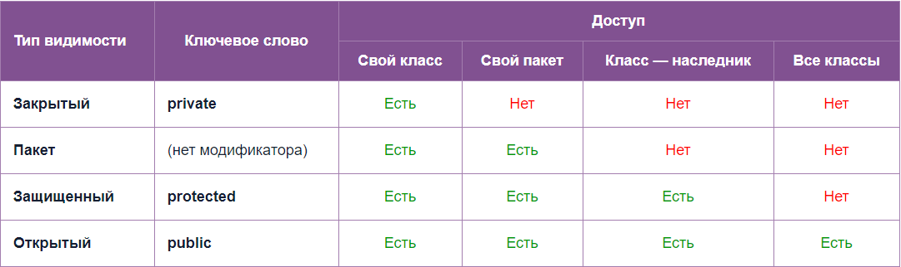

# Модификаторы доступа

- `public` - метод, класс или переменную можно использовать отовсюду. Главный метод класса обязан быть `public`
- `protected` - доступ разрешен для классов-наследников и для классов текущего пакета.
- `private` - переменную или метод с таким модификатором можно использовать только в том классе, где она/он определена.
    - конструктор - нельзя создавать объекты этого класса
    - метод - можно использовать только в том классе, где он определен
    - поле - нельзя получить доступ к полю за пределами класса напрямую (только через геттер и сеттер) - даже из дочерних классов
    - класс - не применимо. Классы могут быть либо `public`, либо `default`
    - внутренний класс - доступ только из внешнего класса.
- `package` (стандартный - не указывается) -
    - переменная или метод - переменную или метод с таким модификатором можно использовать в своем классе и во всех классах, входящих в тот же пакет, где содержится класс, в котором определены переменная или метод.
    - класс - доступен только классам, находящимся в том же пакете



Модификаторы protected и private могут быть применены только к вложенным классам.

Правило установки модификатора доступа: сомневаешься - поставь модификатор построже, будет нужно - исправишь.

Если в одном файле несколько классов, то public может быть только один из них.

# Другие ключевые слова

- `static` - метод или поле предназначены для использования внутри класса и не могут вызываться из объектов класса.
    - для класса - используется для классов, вложенных в класс, для создания объектов без создания объекта внешнего класса. Такие классы могут обращаться только к статическим полям и методам внешнего класса.
    - для метода - метод принадлежит классу в целом, его можно вызывать не создавая объектов. Не может работать с нестатическими переменными без ссылки на объект, переданной в явном виде. Используется в util-классах. Главный метод основного класса программы обязан быть static, для того чтобы программа запустилась без создания объектов.
    - для поля - поле принадлежит классу в целом, его можно вызывать, не создавая объектов. Поля с модификатором static могут использоваться например для подсчета созданных объектов.
    - для переменной -
    - для импорта - можно не писать класс при вызове статических методов
    - для блока кода - код выполняется при первом обращении к данному классу

```java
class myClass{
    static{

    }
}
```

- Модификатор `final`
    - для класса - от данного класса нельзя наследоваться (все методы тоже становятся final) (к абстрактным классам не применяется)
    - для поля - значение полю можно будет присвоить только один раз (финальным полям значения должны быть присвоены сразу же, либо в конструкторе, иначе код не скомпилируется)
    - для переменной - значение переменной можно будет присвоить только один раз
    - для метода - этот метод не может быть переопределен в классах-наследниках
    - для аргумента метода - показывает, что должна быть передана константа

- Модификатор `abstract`
    - для класса - делает класс абстрактным (невозможно создавать объекты этого класса- но можно его классов-потомков). В абстрактном классе могут существовать как абстрактные, так и не абстрактные методы.
    - для метода - абстрактный метод ничего не делает, его необходимо будет переопределить в классах-потомках. Абстрактные методы могут существовать только в абстрактном классе! Создавать абстрактные методы нужно, чтобы можно было вызывать методы дочерних классов из объектов, определенных с помощью родительского класса. Абстрактные методы не могут быть статическими.

```java
public abstract void method(); //В конце ставится точка с запятой
```

- Модификатор `native`
    - для метода - реализацию данного метода необходимо искать в исходном коде, написанном на C или в машинных кодах
- Модификатор `volatile`
    - для поля - запрещает помещать объект в кэш. Таким образом при каждом чтении объекта необходимо извлекать его из памяти, что замедляет работу программы, но зато уберегает от ошибок, которые могут возникнуть при одновременном обращении к одному объекту из разных нитей (тк. при этом копия объекта помещается в кэш, изменение этой копии происходит в кэше, и потом объект перезаписывается в долговременной памяти, что может привести к ошибкам при одновременном обращении из разных нитей). Объект при этом не блокируется, как в случае с synchronized. Также volatile обеспечивает атомарность операций
- Модификатор `synchronized` - служит для обеспечения [нитебезопасности](multithreading/threadsafe.md)
    - для метода - *блокирует объект, из которого вызван метод*, для других нитей до окончания выполнения метода (ни один синхронизированный метод этого объекта не может быть вызван из другой нити до конца выполнения метода)
    - как метод - synchronized(Object) {} - блокирует объект, указанный в скобках и выполняет код в фигурных скобках.
- Модификатор `extends` - используется при создании классов, чтобы определить родительский класс
- Модификатор `implements` - используется при создании классов, чтобы определить от каких интерфейсов наследуется класс
- Модификатор `default` - используется в интерфейсах для определения поведения метода по умолчанию. Появился с выходом Java 8.
- Модификатор `transient`
    - для поля - указывает, что поле не нужно кешировать при сериализации
- Модификатор `import` - используется для импортирования классов в свой класс, для того чтобы получить возможность создавать объекты данных классов и вызывать статические методы этих классов.
- Модификатор `assert` - создает утверждение, использующееся для тестирования программы. Для того чтобы утверждения проверялись при выполнении программы, интерпретатор необходимо запускать с параметром "-ea".
- Модификатор `strictfp` - меняет модель вычислений чисел с плавающей точкой

## Комбинация модификаторов

- `static final` - для объявления констант
- `import static` - позволяет импортировать статические методы класса, чтобы можно было обращаться к ним без имени класса