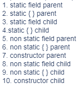

**Метод** - функция, которую может выполнять класс или объект класса

При вызове нестатических методов в аргументы в неявном виде передается ссылка на объект. Эта ссылка хранится в переменной `this`, через которую можно обращаться к полям объекта. В статических методах ссылка на объект не передается, поэтому доступ к полям и методам класса может быть осуществлен только через ссылку на существующий объект.

### Сигнатура метода

Сигнатурой метода называется совокупность имени метода и типов его параметров (аргументов).
```java
public static void myMethod (double n, String s, int i){
    // Сигнатура - myMethod (double, String, int)
}
```

### Аргументы (параметры) метода

Аргументами называются данные, передаваемые методу, они записываются в круглых скобках после имени метода
```java
public double squareCircle(double radius){
    return Math.Pi * radius * radius;
}
```

Если необходимо передать в метод переменное количество аргументов, то можно вместо массива использовать следующую форму записи
```java
public void printNames(String...names){
    for(String name : names)
        System.out.println(name);
}
```

В теле метода к этому аргументу можно обращаться как к обычному массиву.
Такой массив должен быть последним аргументом в методе!

При вызове такого метода в аргумент переменной длины можно ничего не передавать. Но здесь нужно быть осторожным с перегрузкой: система не поймёт какой метод вызывать.

Также плохой идеей является написание следующей сигнатуры:
```java
//код : void method(int n, int... vals)
```

Примитивные типы данных передаются в методы по значению
```java
public void plus5(int val){
    val += 5;
} //Такой метод никак не изменит значение переданной в него переменной
```

Если в метод передаются аргументы ссылочного типа, то изменения над ними будут

## Перегрузка методов
Происходит так же, как и перегрузка конструкторов (см. далее)

Возвращаемый тип не может быть единственным изменением при перегрузке. Компилятор не поймёт какой метод нужно вызывать.

## Конструкторы

При создании объектов можно сразу указывать значения полей, для этого существуют методы-конструкторы.

У методов конструктора должно быть такое же название, как и у класса. Тип возвращаемого значения у конструктора не указывается!

```java
public class Dog{
    String name;
    int weight;

    //конструктор
    public Dog(String name, int weight){
        this.name = name;
        this.weight = weight;
    }
}
```

Как видно из примера, обращение к полям класса в методе-конструкторе происходит через ключевое слово `this`.

Если наименования параметров конструктора не совпадают с наименованиями полей класса, то `this` можно не писать.

По умолчанию в классе существует пустой конструктор (не принимающий никаких аргументов), но он исчезает при создании любого конструктора пользователем.

Если нужно запретить создание экземпляров класса, то конструктор нужно сделать `private`. Конструктор по умолчанию имеет модификатор доступа `public`.

При вызове конструктора класса-наследника в неявном виде всегда сначала вызывается конструктор родителя, если при этом необходимо передать конструктору какие-то поля, то это делается с помощью ключевого слова super. Этот super должен стоять в самом начале конструктора.

```java
super(param1, param2);
```
Порядок инициализации при первом создании экземпляра класса следующий:



**Перегрузка конструкторов**

Конструкторы могут быть перегружены для создания экземпляров класса с разными полями
```java
public class Dog{
    String name;
    int weight;

    public Dog(String name, int weight){ //Конструктор для домашних собак с именем

        this.name = name;
        this.weight = weight;
    }
    public Dog(int weight){ //Конструктор для бродячих собак без имени
        this.weight = weight;
                name = "Bobik";
    }
}
```

Из одного конструктора можно вызывать другой с помощью `this()`
```java
public class Dog{
    String name;
    int weight;

    public Dog(String name, int weight){ //Конструктор для домашних собак с именем

        this.name = name;
        this.weight = weight;
    }
    public Dog(int weight){ //Конструктор для бродячих собак без имени
        this("Bobik", weight);
    }
}
```

`this()` должно стоять в самом начале фрагмента кода конструктора.
В конструкторе может быть либо `this()`, либо `super()`, но не оба сразу!

### Деструкторы
Деструкторов в Java нет!

## Абстрактные методы

Абстрактные методы не имеют тела. Они должны быть переопределены в конкретных классах.

Перед абстрактными методами записывается [ключевое слово](keywords.md) `abstract`:

```java
public abstract void myMethod(String s, int n);
```