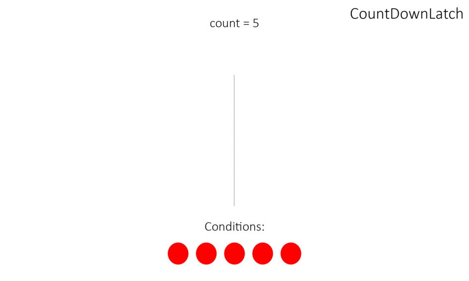
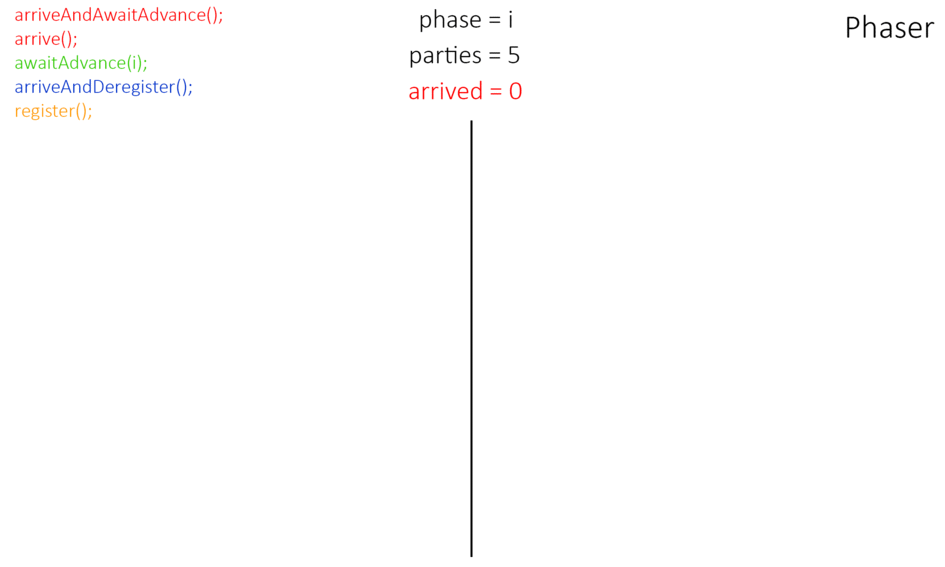

# Барьеры

Барьер - это такой паттерн, при котором группа потоков останавливается в какой-то общей точке, а потом одновременно проходят дальше при выполнении какого-либо условия или наступления некоторого события.

В Java 5 были добавлены классы, реализующие данный паттерн:
- `CountDownLatch`
- `CyclicBarrier`
- `Phaser`

---
## CountDownLatch

Класс создан для того, чтобы заменить неудобные wait и notify на что-то более компактное.
Удобно использовать, когда нужно одновременно запустить несколько потоков.



При создании `CountDownLatch` устанавливается количество раз, которое должен быть вызван метод `countDown()` для того чтобы метод `await()` завершился:
```java
var latch = new CountDownLatch(1);
```

Методы:
- `void await()` - ожидает, пока метод countDown() не будет вызван то количество раз, которое было передано в конструктор
- `boolean await(long timeout, TimeUnit)` - то же, но гарантированно разблокируется спустя указанное время
- `void countDown()` - уменьшает на единицу счетчик, приближая к завершению метод `await()`. Когда счетчик дойдет до нуля, защелка откроется.
- `int getCount()` - сколько раз еще нужно вызвать `countDown()`, чтобы защелка открылась.

Важно понимать, что в сценарии использования `CountDownLatch` обязанности разделены: одни потоки заблокированы в методе `await()`, а другие потоки дергают `countDown()`, чтобы довести счетчик до нуля.

Пример использования: допустим мы хотим смоделировать гонку потоков: нам нужно сначала подготовить потоки, а потом одновременно их запустить:
```java
var latch = new CountDownLatch(1);
Runnable task = () -> {
    try {
        latch.await(); //All threads will wait here until latch will open
    } catch (InterruptedException ignored) {
    }
    doJob();
};
new Thread(task).start();
new Thread(task).start();
new Thread(task).start();
latch.countDown();
```

`CountDownLatch` применяется в случаях:
- Ожидание завершения работы подзадач (подходит только при низкой нагрузке)
- Ожидание загрузки компонентов при старте приложения (аналог спрингового `@PostConstruct`)
- Нагрузочные тесты

Минус `CountDownLatch` в том, что он одноразовый, но существует `CyclicBarrier`.


---
## CyclicBarrier

То же самое, что и CountDownLatch, но барьер можно восстановить с помощью метода `reset()`


Конструкторы:
- `CyclicBarrier(int count, Runnable)` - задает количество вызовов await после которого барьер будет сломан

Методы:
- `void await()` - уменьшает на единицу счетчик вызовов и ждет, когда сломается барьер
- `void reset()` - сбрасывает счетчик барьера к первоначальному значению


---
## Phaser

Класс `Phaser` - это тоже барьер, но более гибкий.



Конструкторы:
- `Phaser()` - пустой
- `Phaser(int parties)` - указывается количество участников

Методы:
- `register()` - регистрирует тот поток, из которого вызван метод
- `int arriveAndAwaitAdvance()` - указывает, что поток закончил выполнять фазу. Поток приостанавливается и ждет пока другие потоки тоже закончат выполнение фазы. Возвращает номер текущей фазы
- `int arrive()` - сообщает, что поток закончил выполнять фазу. Поток не останавливается, а продолжает работу. Возвращает номер фазы
- `int arriveAndDeregister()` - сообщает, что он завершил выполнять все фазы и снимается с регистрации. Возвращает номер фазы.
- `int awaitAdvance(int phase)` - если phase равно номеру текущей фазы, то поток приостанавливается до ее завершения.
- `int getPhase()` - возвращает номер текущей фазы


---
## К изучению
- [X] Про CountDownLatch: https://www.youtube.com/watch?v=XkAjmCIY2WI&feature=youtu.be&t=798
- [ ] Про синхронизаторы: https://habr.com/ru/post/277669/
- [ ] Про Phaser: https://habr.com/ru/post/117185/