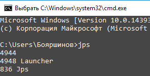
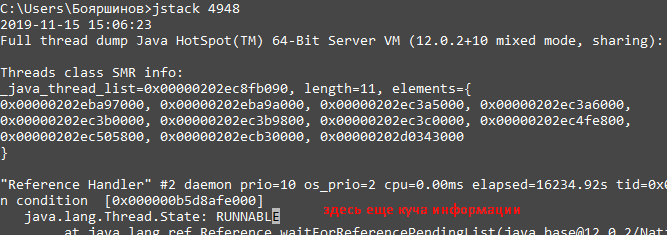

Основными проблемы многонитевости являются:
- Взаимная блокировка (deadlock) - ситуация, когда процессы не могут завершиться, потому что ждут результатов выполнения друг друга.
- Динамическая взаимоблокировка (livelock)
- Голодание (starvation) - поток не может получить доступ к совместно используемым ресурсам
- Потерянный апдейт (modify-and-then) - два потока одновременно меняют одну переменную (например, инкрементируют значение), но из-за того, что изменение и запись происходят неатомарно, второй апдейт перезатирает первый.
- Гонка (check-and-act) - когда в потоке сначала проверяется условие и только потом происходит действие. Если в этом случае в блок кода зайдут два потока одновременно, то один поток может сделать условие невалидным, хотя второй поток уже зашел в тело условного оператора.
- Несогласованные переменные - если в объекте две переменные связаны между собой, то при их конкурентном изменении из нескольких потоков значения могут разойтись и инвариант объекта может быть нарушен.
- Гонка данных - data race (race condition) - результат выполнения кода зависит от порядка исполнения разными потоками
- Устаревшие значения:
- 

---
## Deadlock

Способы борьбы:
- Писать логи!
- Thread dump
    - jps - получить id всех запущенных Java процессов

    - jstack - получить thread dump конкретного процесса

    - jconsole - открывает GUI

- Введение иерархии ресурсов - см. классическую задачу про обедающих философов. Решается с помощью семафора.
- Введение дополнительного монитора - так себе вариант, т.к. уменьшает быстродействие программ
- Гибкий захват ресурсов - применение Lock.

---
## Race Condition

Race Condition (состояние гонки) - ошибки в написании многонитевых программ, ведущие к тому, что результат выполнения двух параллельно идущих нитей зависит от порядка выполнения кода.

Для борьбы с состоянием гонки используются различные методы:
- Синхронизация небезопасных операций. Ведет к потерям производительности, и так же чревато ошибками
- Использование иммутабельных объектов. Ведет к увеличению мусора в системе
- Использование различных способов исполнения задач (`CompletableFuture`, `ExecutorPool` и пр.)

Многие методы борьбы описаны в заметке [Потокобезопасность](./threadsafe.md).

---
## Инструменты
- утилиты, встроенные в Java
  - jstack - получить thread dump конкретного процесса
  - jcmd
  - jconsole - открывает GUI
- графические:
  - Java Mission Control (Java 11+)
  - VisualVM
- Thread Dump Analyzers (TDA)
  - [fastThread](https://fastthread.io/)
  - Spotify TDA
  - IBM Thread and Monitor Dump Analyze
  - irockel TDA

---
## К изучению
- [X] [Про Deadlock очень доступно](https://www.youtube.com/watch?v=s032s29-NUU&list=PL6jg6AGdCNaXo06LjCBmRao-qJdf38oKp)
- [X] [Race Condition на Вики](https://ru.wikipedia.org/wiki/%D0%A1%D0%BE%D1%81%D1%82%D0%BE%D1%8F%D0%BD%D0%B8%D0%B5_%D0%B3%D0%BE%D0%BD%D0%BA%D0%B8)
- [X] [Курс по многопоточности в Java](https://fillthegaps.getcourse.ru/mt7)