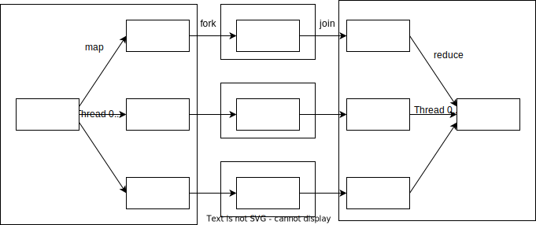

# Fork/Join

Для распараллеливания задач в [Java 7](../java_versions.md) появился фреймворк **Fork/Join**.
Он является воплощением методологии работы с большими данными **map reduce**.



Глобальная задача дробится на большое количество маленьких подзадач, каждая из которых выполняется отдельно, а затем результаты исполнения маленьких задач объединяются в общий результат.
Разбиение глобальной задачи на подзадачи называется операцией `map`, а объединение результатов - `reduce`.

В фреймворке Fork/Join передача подзадачи на исполнение в отдельный поток называется `fork`, а получение результата исполнения подзадачи - `join`.

На Fork/Join фреймворке построена к примеру [Akka](../../akka/akka.md).

Основными классами фреймворка являются:
- `ForkJoinPool` - [пул потоков](./thread_pools.md), предназначенный для работы с подзадачами
- `ForkJoinTask` - абстракция для подзадачи


---
## ForkJoinTask
В этом классе спящие задачи на самом деле не спят, а выполняют другие задачи.
Методы:
- `ForkJoinTask fork()` - отправляет задачу на исполнение
- `V join()` - дожидается выполнения задачи и возвращает результат ее выполнения
- `V get()` - то же самое, что `join()`, метод есть, потому что `ForkJoinTask` реализует интерфейс `Future`
- `V invoke()` - `fork + join` в одном флаконе
- `static void invokeAll(ForkJoinTask...)` - запускает все переданные задачи и дожидается результата
- принудительное завершение:
  - `boolean cancel()`
  - `void complete(V)`
  - `boolean tryUnfork()`
  - `void quietlyComplete()` - игнорирует возможные исключения

Наследники:
- `RecursiveAction` - (а-ля `Runnable`) используется, когда не нужно считать значения, а нужно просто выполнить какие-либо действия
- `RecursiveTask` - (а-ля `Callable`) используется, когда нужно что-то вернуть
- `CountedCompleter` - 

Все эти наследники являются абстрактными классами. 
Чтобы ими воспользоваться необходимо отнаследоваться и реализовать нужные методы.

Пример создания задачи:
```java
/** 
  * Задача, которая подсчитывает сколько раз в переданном списке значений встретилось число 80. 
  * Если в задачу пришло слишком большое количество элементов (больше THRESHOLD), то она делится на две
  */
public class CountTask extends RecursiveTask<Integer> {
  private static final int THRESHOLD = 32000;
  private List<Integer> source;
  private int start, end; 

  public CountTask(List<Integer> source, int start, int end) { /* ... */ }

  protected Integer compute() {
    if (end - start < THRESHOLD) {
      return getCount();
    }
    int middle = start + (end - start) / 2;
    CountTask subTask1 = new CountTask(source, start, middle);
    CountTask subTask2 = new CountTask(source, middle, end);

    invokeAll(subTask1, subTask2);
    return subTask1.join() + subTask2.join();
  }

  private int getCount() { /* ... */ }
}
```


Обычные `Runnable` и `Callable` можно обернуть в `ForkJoinTask` с помощью методов-адаптеров:
- `static ForkJoinTask adapt(Runnable)`
- `static <V> ForkJoinTask<V> adapt(Callable<V>)`

Fork/Join фреймворк предназначен для выполнения большого количества маленьких задач. Поэтому задачи должны быть:
- независимыми
- не иметь блокирующих вызовов:
  - IO
  - Locks, syncronized
  - http вызовы


---
## ForkJoinPool

`ForkJoinPool` - это [пул потоков](./thread_pools.md), предназначенный для работы с подзадачами.

Чем больше задач прилетает в `ForkJoinPool`, тем эффективнее он их распределяет по потокам, поэтому разработчики JDK рекомендуют использовать только один экземпляр `ForkJoinPool` на все приложение.
```java
var executor = ForkJoinPool.commonPool();
```
Но у такого подхода есть и минусы:
- нельзя задать кастомные имена для потоков
- нет обработки вылетающих исключений
- потоки являются демонами

Пример передачи задачи в пул:
```java
var executor = ForkJoinPool.commonPool();

// Что такое CountTask см. выше
CountTask task = new CountTask(intList, 0, intList.size());
int result = executor.invoke(task);
```

В отличие от различных сетапов `ThreadPoolExecutor` в `ForkJoinPool` используется своя очередь для каждого из потоков исполнения. 
Так сделано, из-за того, что при дроблении задач подзадачи помещаются в ту же входную очередь, и если бы она была одна, то стала бы бутылочным горлышком.
Для того чтобы не возникло ситуации, когда все подзадачи оказались только в одной очереди, потоки могут воровать подзадачи из начал очередей других потоков, когда их собственная очередь опустеет.
Поэтому в `Executors` фабричный метод для создания `ForkJoinPool` называется `newWorkStealingPool()`.

Еще одной необычное свойство `ForkJoinPool` - каждый поток читает из конца своей очереди, т.е. работает по принципу LIFO. 
При этом конец очереди несинхронизирован, а начало синхронизировано, т.к. к нему могут обращаться другие потоки.
Благодаря этому большие неразделенные задачи остаются в начале очереди и могут быть переданы другим потокам, а в конце очереди группируются маленькие уже раздробленные подзадачи, и поток обрабатывает в первую очередь именно их.
Можно сказать, что деление задач происходит вглубь, а не вширь.
Но это поведение можно переопределить, выставив в `true` флажок `async`, тогда очередь потока начнет работать в режиме FIFO.

Методы:
- `T invoke(ForkJoinTask)` - 
- `List<Future> invokeAll(Collection<Callable>)` - 
- `void execute(Runnable)` - 
- `ForkJoinTask submit(Callable)` - 
- куча методов для мониторинга

---
## Рекомендации
Для определения насколько сильно стоит дробить задачу, можно воспользоваться формулой:
```
T = N / (L * C)
```
, где `N` - общее количество атомарных подзадач, `C` - количество ядер, `L` - коэффициент нагрузки, учитывающий, что в приложении совершается и другая работа, а `T` - количество атомарных подзадач на одну таску.
Коэффициент `L` рекомендуют первоначально брать в районе `10`, а точное значение подбирать под свой профиль нагрузки.


---
## К изучению
- [X] [Статья на хабре (удалена)](https://habr.com/ru/post/128985/)
- [X] [Курс по многопоточности в Java](https://fillthegaps.getcourse.ru/mt7)
- [ ] [Доклад Шипилева "ForkJoinPool в Java 8"](https://www.youtube.com/watch?v=t0dGLFtRR9c). 1:40:00
- [ ] [Doug Lea. Java Fork/Join Framework](https://gee.cs.oswego.edu/dl/papers/fj.pdf)