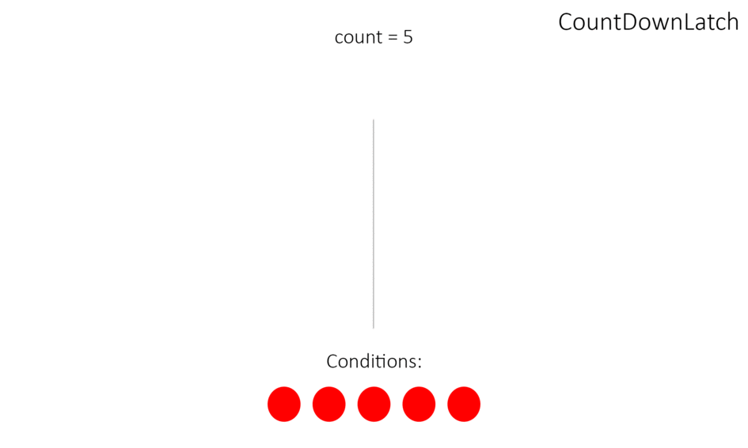

<mark>//Добавить описание, а не просто перечисление классов и их методов</mark>

---

**Интерфейс Lock** - замок

Методы:
- `void lock()` - закрывает замок (блокирует доступ к переданному объекту). Если доступ заблокирован, то метод будет ждать разблокировки (возможно вечно)
- `void unlock()` - открывает замок (разблокирует доступ к переданному объекту). Рекомендуется открывать замок в finally блоке

```java
Lock lock = ...;
lock.lock();
try {
} finally {
    lock.unlock();
}
```

- `boolean tryLock()` - пробует в момент вызова закрыть замок, если получается, то возвращает true
- `boolean tryLock(long time, TimeUnit unit)` -  пробует закрыть замок через указанное время, если получается, то возвращает true

Реализации:
- `ReentrantLock` - основная реализация
- `ReadLock`
- `WriteLock`

**Класс ReentrantLock**

Конструкторы:
- `ReentrantLock()` - пустой
- `ReentrantLock(boolean fair)`

Методы:
-

---

**Класс CountDownLatch**

Класс создан для того, чтобы заменить неудобные wait и notify на что-то более компактное.

Удобно использовать, когда нужно одновременно запустить несколько потоков.



Конструкторы:
- `CountDownLatch(int)` - устанавливает количество раз, которое должен быть вызван метод countDown() для того чтобы метод await() завершился

Методы:
- `void await()` - ожидает, пока метод countDown() не будет вызван то количество раз, которое было передано в конструктор
- `boolean await(long timeout, TimeUnit)` - то же, но гарантированно разблокируется спустя указанное время
- `void countDown()` - уменьшает на единицу счетчик, приближая к завершению метод await().

Минус CountDownLatch в том, что он одноразовый, но существует:

---

**Класс CyclicBarrier**

То же самое, что и CountDownLatch, но барьер можно восстановить с помощью метода `reset()`


Конструкторы:
- `CyclicBarrier(int count, Runnable)` - задает количество вызовов await после которого барьер будет сломан

Методы:
- `void await()` - уменьшает на единицу счетчик вызовов и ждет, когда сломается барьер
- `void reset()` - сбрасывает счетчик барьера к первоначальному значению

---

**Класс Phaser**

Класс Phaser - это тоже барьер, но более гибкий.


Конструкторы:
- `Phaser()` - пустой
- `Phaser(int parties)` - указывается количество участников

Методы:
- `register()` - регистрирует тот поток, из которого вызван метод
- `int arriveAndAwaitAdvance()` - указывает, что поток закончил выполнять фазу. Поток приостанавливается и ждет пока другие потоки тоже закончат выполнение фазы. Возвращает номер текущей фазы
- `int arrive()` - сообщает, что поток закончил выполнять фазу. Поток не останавливается, а продолжает работу. Возвращает номер фазы
- `int arriveAndDeregister()` - сообщает, что он завершил выполнять все фазы и снимается с регистрации. Возвращает номер фазы.
- `int awaitAdvance(int phase)` - если phase равно номеру текущей фазы, то поток приостанавливается до ее завершения.
- `int getPhase()` - возвращает номер текущей фазы

---

## К изучению

- [ ] https://metanit.com/java/tutorial/8.9.php
- [ ] (http://java-online.ru/concurrent-atomic.xhtml)  https://docs.oracle.com/javase/7/docs/api/java/util/concurrent/locks/Lock.html
- [X] Про Lock очень доступно: https://www.youtube.com/watch?v=s032s29-NUU&list=PL6jg6AGdCNaXo06LjCBmRao-qJdf38oKp
- [X] Про CountDownLatch: https://www.youtube.com/watch?v=XkAjmCIY2WI&feature=youtu.be&t=798
- [ ] Про синхронизаторы: https://habr.com/ru/post/277669/
- [ ] Про Phaser: https://habr.com/ru/post/117185/