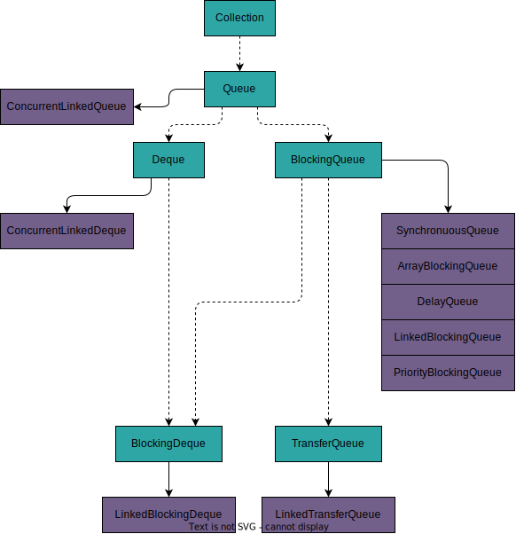

# Многопоточные очереди

Очереди отлично годятся для использования в качестве буферов входящих данных или задач.
В каких-то случаях буфер разгребается только одним потоком и в таком случае могут использоваться [обычные очереди](../collections/queue.md).
Но когда одного потока недостаточно, чтобы обработать задачи, попадающие в буфер, на помощь приходят многопоточные очереди.

Блокирующие очереди часто используются в [pub-sub архитектурах](../../architecture/pub_sub.md), когда один тред публикует события в очередь, а другие треды их вычитывают.
Таким образом разрывается связь между продюсерами и консьюмерами, и мы получаем возможность гибко изменять количество консьюмеров под входящую нагрузку.

Реализации в `java.util.concurrent`:
- `ConcurrentLinkedQueue` - обычная неблокирующая очередь на основе связного списка
- `BlockingQueue` - интерфейс, добавляющий блокирующие методы публикации и извлечения элементов
  - `ArrayBlockingQueue` - обычная очередь на основе массива
  - `LinkedBlockingQueue` - обычная очередь на основе связного списка
  - `PriorityBlockingQueue` - [очередь с приоритетом](../../data_structures/priority_queue.md), элементы сортируются на основе переданного `Comparator`
  - `SynchronousQueue` - не имеет буфера, поток производителя блокируется, пока поток потребителя не заберет элемент. Очень похоже на `Exchanger`. За счет своего механизма работы обеспечивает гаранитрованную доставку от производителя к потребителю.
  - `LinkedTransferQueue` - то же, что `SynchronousQueue`, но лучше. Работает в несколько раз быстрее
  - `DelayQueue` - элементы отдаются только спустя какое-то время после вставки

Дэки:
- `ConcurrentLinkedDeque` - неблокирующая дэка
- `LinkedBlockingDeque` - блокирующая дэка
Дэки дают дополнительный функционал извлечения из конца очереди и вставки в начало очереди, но за счет этого начинают проседать по производительности до 40% по сравнению с очередями.
Поэтому их не следует использовать, когда можно обойтись обычной очередью.

---
## `ConcurrentLinkedQueue`
`ConcurrentLinkedQueue` - это обычная неблокирующая очередь на основе связного списка.
Внутри у нее лежат ссылки на начало и хвост очереди, помеченный модификатором `volatile`.
Вставка в очередь происходит с помощью CAS-операции.

За счет использования оптимистичных блокировок `ConcurrentLinkedQueue` обладает одной из лучших производительностей среди очередей.

Недостатки очереди:
- не отслеживается длина очереди
- нет блокирующих методов

---
## Блокирующая очередь
Для работы с потоками данных может пригодиться очередь `BlockingQueue`.
Основная фишка этой очереди в том, что она может блокировать поток исполнения при добавлении или извлечении элементов.
Для этого в интерфейс были добавлены новые методы:
- `put(E)` - пытается положить элемент в очередь. Если очередь заполнена, то поток исполнения блокируется пока в очереди не появится место, чтобы положить туда элемент
- `E take()` - пытается достать из очереди элемент. Если очередь пуста, то поток исполнения блокируется пока в очереди не появится новый элемент, который можно забрать

Если требуется падать по таймауту, когда блокировка происходит слишком долго, то можно использовать отдельные методы `offer()` и `poll()`.

При использовании блокирующих очередей нужно очень внимательно подходить к выбору используемых методов, особенно при рассмотрении краевых случаев, когда очередь переполнена или наоборот пуста.

### `LinkedBlockingQueue`
Внутри у `LinkedBlockingQueue` помимо ссылок на начало и хвост очереди есть два [лока](./locks.md) на вставку и извлечение элементов.
Также в ней есть счетчик количества элементов, сделанный с помощью [атомарного класса](./atomic.md) `AtomicInteger`.
Локи используются в блокирующих методах.

Благодаря счетчику можно осуществлять мониторинг очереди и гибко менять количество консьюмеров.

### `ArrayBlockingQueue`
Внутри у `ArrayBlockingQueue` находится массив с элементами и один лок с двумя `Condition`.

Этот вариант очереди хорошо подходит для тех случаев, когда количество элементов в очереди колеблется около нуля.

---
## К изучению
- [ ] http://tutorials.jenkov.com/java-util-concurrent/blockingqueue.html
- [X] [Курс по многопоточности в Java](https://fillthegaps.getcourse.ru/mt7)