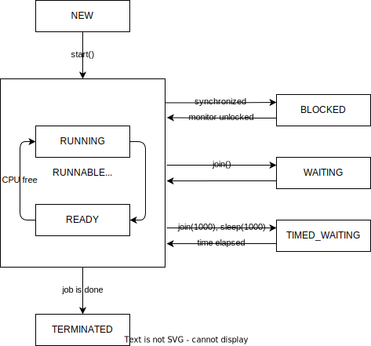

Жизненный цикл нитей:
- `new` - нить создана, но еще не запущена
- `running` - нить в процессе выполнения
- `ready-to-run` - нить заморожена JVM на время выполнения других нитей
- `blocked` - нить заблокирована, потому что ожидает освобождения ресурсов
- `waiting` - нить ожидает чего-либо thread1.join();
- `timed waiting` - нить ожидает чего-либо ограниченное время: Thread.sleep(1000);
- `terminated` - нить закончила выполнять свою работу и скоро будет уничтожена GC.

Внутри класса Thread есть внутреннее перечисление State:

- `NEW` - нить создана, но еще не стартовала
- `RUNNABLE`
    - `RUNNING` - прямо сейчас процессор работает над этой задачей
    - `READY` - процессор работает с другой нитью, а данная ожидает своей очереди
- `BLOCKED` - выполнение нити заблокировано из-за блокированного монитора в синхронизированном блоке
- `WAITING` - нить ожидает чего-либо, например, освобождения заблокированных ресурсов или окончания выполнения другой нити
- `TIMED_WAITING` - нить бездействует в течение какого-то конкретного времени, что может быть вызвано методами `sleep(long)`, `wait(long)` и др.
- `TERMINATED` - нить закончила свою работу (полностью выполнился метод `run()`)

---
## К изучению
- [X] [Жизненный цикл с картинками](https://www.baeldung.com/java-thread-lifecycle)
