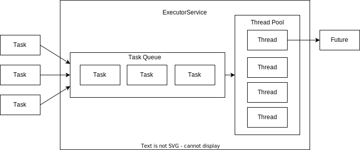

# Пулы потоков (нитей)

Создавать новый поток под каждую новую задачу нерационально.
Иногда время, затраченное на создание потока, может быть больше времени, когда поток выполнял полезную работу.
Для таких короткоживущих задач следует использовать пулы потоков.

В пуле находится некоторое количество нитей, которые выполняют некую работу.
В пул можно передать задачу, она будет помещена в очередь, а клиенту вернется `Future`, с помощью которого можно узнать статус выполнения задачи.
Когда в пуле освобождается поток, он забирает задачу из очереди и начинает ее выполнять.
Очередь нужна для тех случаев, когда множество задач приходит одновременно и на всех не хватает свободных потоков.


Количество нитей в пуле подбирается эмпирическим путем.


Нижеперечисленные классы и интерфейсы используются в многонитевости и включены в API `java.util.concurrent`.

## Интерфейс ExecutorService
Интерфейс представляет собой усовершенствованную реализацию шаблона `WorkerThread`.

Методы:
- `Future submit(Callable)` - задача ставится в очередь на выполнение. Возвращается Future, через который можно узнать выполнена ли задача с помощью `isDone()` и получить результат выполнения с помощью `get()`;
- `Future submit(Runnable)` - то же самое, но при завершении работы вернется не результат, а `null`;
- `void shutdown()` - закрыть все нити (будут закрыты, когда выполнится последняя задача). По сути это graceful shutdown.
- `List<Runnable> shutdownNow()` - запрещает всем нитям брать новые задачи, даже если в очереди еще есть задачи, пытается прервать все текущие нити и возвращает список задач, которые никогда не будут выполнены. Этот метод используется, когда какие-то потоки зависли и не могут завершиться самостоятельно
- `void awaitTermination(long, TimeUnit)` - выжидает указанное количество времени прежде чем завершить работу всех нитей.

Реализации:
- `ThreadPoolExecutor` - пул, который может немного растягиваться (до максимального значения). Существуют популярные конфигурации:
  - `singleThread` - всего одна нить
  - `fixedThread` - фиксированное количество нитей
  - `cachedThread` - кэшируемый пул нитей
- `ScheduledThreadPoolExecutor` - позволяет запланировать выполнение задачи через какой-то промежуток времени, а также запланировать периодическое выполнение задач
- `ForkJoinPool`

Для создания экземпляров пулов используется специальный класс фабрика `Executors`:
- `Executors.newSingleThreadExecutor()`
- `Executors.newFixedThreadPool(int nThread)` - создает пул нитей с указанным количеством нитей
- `Executors.newCachedThreadPool()` - создает кэширующий пул нитей, который создает нити только когда все уже существующие заняты работой. Потоки, простаивающие в течение длительного времени, уничтожаются
- `Executors.newScheduledThreadPool()` - создает `ScheduledThreadPoolExecutor`
- `Executors.newWorkStealingPool()` - создает `ForkJoinPool`
```java
ExecutorService service = Executors.newFixedThreadPool(2);
```

---
## ThreadPoolExecutor

При создании пула можно контролировать:
- начальное количество нитей в пуле
- максимальное количество нитей в пуле
- максимальное время выполнения нитью задачи
- вид используемой очереди
- действия до и после выполнения задачи

Создать `ThreadPoolExecutor` можно с помощью:
- фабричных методов в утилитном классе `Executors`
- одного из конструкторов
- фабричных методов в утилитном классе `Executors`, а потом донастроить их желаемыми параметрами
```java
var threadPool = Executors.newFixedThreadPool(5);
((ThreadPoolExecutor) threadPool).setKeepAliveTime(10, SECONDS);
```

Все предконфигурированные пулы из `Executors` оказываются не очень хороши в продакшене.
`singleThreadExecutor` хорош для планирования задач, которые должны быть выполнены последовательно, но в высоконагруженных приложениях такие задачи редки.
`fixedThreadExecutor` не адаптируется под нагрузку. Потоки либо будут простаивать, отжирая ресурсы, либо станут бутылочным горлышком в системе.
`cachedThreadExecutor` хорош для адаптивности, но может наплодить бесконечное количество потоков, из-за чего приложение упадет с OOM.

Для того чтобы настроить пул потоков под свои задачи, нужно мониторить очередь задач.
Две важнейшие метрики: 
- количество задач в очереди
- среднее время ожидания задачи в очереди

Если очередь все время пустая, то можно уменьшить количество нитей в пуле.
По времени ожидания можно контролировать относительную величину `executionTime / (queueTime + executionTime)`. 
В идеале метрика должна стремиться к `1`, если она падает ниже какого-то значения, то можно добавлять нити в пул.

### Обработка исключений
Бывают исключительные ситуации, связанные с пулом потоков.
Например, может переполниться очередь задач.
Для таких случаев можно задать обработчик исключений с помощью интерфейса `RejectionExecutionHandler`.
Существует несколько готовых решений:
- `AbortPolicy` - тредпул выбрасывает исключение. Используется по умолчанию
- `CallerRunsPolicy` - таска выполняется не в пуле, а из того треда, который вызвал `execute()`
- `DiscardPolicy` - таска молча игнорируется
- `DiscardOldestPolicy` - из очереди задач удаляется самая старая таска и вместо нее выполняется текущая


---
## CompletionService
Допустим мы создали пул потоков и запихнули в него несколько задач.
Теперь нам нужно отслеживать какие из задач уже выполнились и их результат можно передавать в последующую обработку.
Для этого придется написать самостоятельно какой-то код, который будет опрашивать `Future` и обрабатывать готовые задачи.
Вместо этого можно использовать `CompletionService`.

`CompletionService` - это такой же пул потоков, но на выходе у него добавлена очередь выполненных задач.
Из него можно забирать выполненные задачи с помощью метода `poll()`.
Если на момент вызова еще ни одна из задач не готова, то возвращается `null`.

```java
var threadPool = Executors.newFixedThreadPool(5);
var completionService = new ExecutorCompletionService<ReturnValue>(threadPool);

completionService.submit(task1);
completionService.submit(task2);

while(true) { //дано для примера
  Future<ReturnValue> taskResult = completionService.poll();
  if (taskResult != null) {
    // do work
  }
}
```


---
## Интерфейс `Callable<V>`

Данный интерфейс является [функциональным](../stream_and_lambda/functional_interface.md) и очень похож на `Runnable`, но его метод `call()`, в отличие от `run()` возвращает результат. Тип возвращаемого результата указывается в обобщении.

- `V call()` - возвращает результат типа, указанного в обобщении

В случаях, когда хочется использовать `Callable`, но метод `call()` не должен ничего возвращать, можно сделать в обобщение поставить класс `Void`, тогда всем сразу будет понятно, что метод ничего не возвращает.

---
## Интерфейс `Future<V>`

Интерфейс обобщенный, в обобщении указывается тип возвращаемого значения метода `get()`.

Методы:
- `boolean cancel(boolean)` - пытается остановить выполнение задачи
- `V get()` - ждет при необходимости окончания вычислений и возвращает результат
- `V get(long timeout, TimeUnit unit)` - ждет указанное время окончания вычислений, и если они успевают выполниться, то возвращает результат
- `boolean isCancelled()` - возвращает true, если выполнение задачи отменено
- `boolean isDone()` - возвращает true, если задача выполнена

---
## Класс `FutureTask<V>`
Класс нужен для создания задач, которые будут выполнены в будущем.

Конструкторы:
- `FutureTask(Callable<V>)` -
- `FutureTask(Runnable, V result)` -

Помимо методов, определенных в Future, класс предоставляет еще следующие методы:

- `void done()` - метод, который выполняется, когда статус задачи становится isDone
- `void run()` -
- `boolean runAndReset()` -
- `void set(V)` - устанавливает результат, возвращаемый при выполнении задачи
- `void setException(Throwable)` - устанавливает исключение, которое будет являться причиной выкинутых исключений при исполнении задачи.


---
## К изучению

- [X] https://javarush.ru/groups/posts/2065-threadom-java-ne-isportishjh--chastjh-iv---callable-future-i-druzjhja
- [X] https://docs.oracle.com/javase/8/docs/api/java/util/concurrent/Future.html
- [X] https://docs.oracle.com/javase/8/docs/api/java/util/concurrent/Callable.html
- [X] https://docs.oracle.com/javase/8/docs/api/java/util/concurrent/FutureTask.html
- [X] [Javadoc на ThreadPoolExecutor](https://docs.oracle.com/en/java/javase/17/docs/api/java.base/java/util/concurrent/ThreadPoolExecutor.html)
- [ ] https://winterbe.com/posts/2015/04/07/java8-concurrency-tutorial-thread-executor-examples/
- [ ] https://habr.com/ru/post/116363/
- [X] [Курс по многопоточности в Java](https://fillthegaps.getcourse.ru/mt7)