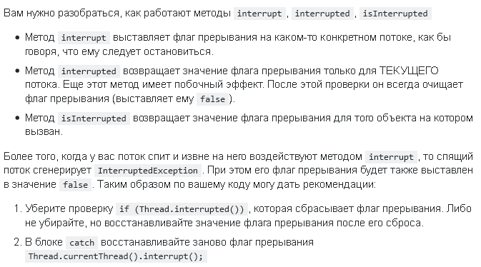

# Threads
__Thread__ (нить или поток) - это абстракция, которая представляет последовательное выполнение кода.
Внутри одного потока код исполняется построчно сверху вниз.
Если необходимо распараллелить выполнение какой-либо задачи, или одновременно запустить выполнение сразу нескольких задач, то создаются новые нити.

Так как Java - глубоко объектно-ориентированный язык, то в ней для описания потоков существует специальный класс, который так и называется - `Thread`.

Потоки бывают двух видов:
- обычные
- __daemon__ - фоновый (демон)
Программа завершает свою работу, когда умирают все обычные треды, демоны при этом могут быть все еще в активном состоянии.
Все вспомогательные JVM-потоки являются демонами: GC, JIT и др.
Также имеет смысл делать свои потоки демонами, если они выполяют функции: мониторинга, healthcheck'ов, сбора статистики и т.д.
В фоновых потоках можно использовать бесконечные циклы.
Поток можно указать, как фоновый, только при его создании до старта.
После старта поменять тип потока уже не получится.
Про работу с демонами есть [отдельная заметка](./daemon_threads.md).

## Устройство
У потока есть несколько свойств:
- Program Counter - указатель на текущую исполняемую строчку байткода
- Native Stack - стэк вызовов нативных методов
- Stack - стэк вызовов методов. Внизу стэка всегда находится метод `Thread.run()`
- TLAB - Thread Local Allocation Buffer - область памяти на хипе, в которой хранятся данные, принадлежащие потоку

Под стэк потока в ОС резервируется некоторый объем памяти (обычно 1 МБ).
Если память переполняется, то выбрасывается `StackOverflowError`.

Элементы стэка называются фреймами.
У фрейма есть следующие свойства:
- возвращаемое значение
- ссылка на константы класса
- локальные переменные (примитивы и ссылки на объекты)
- стэк операндов - для хранения промежуточных результатов

Из-за того, что создание треда требует создания кучи всяких вспомогательных штук, не считая выделения потока в ОС, считается хорошей практикой не создавать новые потоки в рантайме, а переиспользовать существующие потоки, храня их в [пуле потоков](./thread_pools.md).

## Создание потока
При создании потока ему необходимо передать тот код, который должен исполняться в потоке.
Этот код должен быть записан в классе, реализующим интерфейс `Runnable` с единственным методом `run()`.
Данный интерфейс является [функциональным](../stream_and_lambda/functional_interface.md), а значит может быть заменен [лямбда-выражением](../stream_and_lambda/lambda_expressions.md).
В методе run() прописываются команды для выполнения в отдельном потоке.

Для того чтобы запустить новый поток, нужно создать новый объект класса `Thread` и передать в конструктор в качестве аргумента ссылку на объект класса, реализующего интерфейс `Runnable`.
```java
void threadTest() {
    Thread thread = new Thread(new Job());
    Thread lambdaThread = new Thread(() -> doSomething());
    thread.start();
    lambdaThread.start();
}

private static class Job implements Runnable {
    void run(){
        doSomething();
    }
}
```

Также можно наследовать интересующий класс от класса Thread.

## Интерфейс Runnable

Интерфейс имеет всего один нереализованный метод, поэтому относится к [функциональным интерфейсам](../stream_and_lambda/functional_interface.md)

- `void run()` - одним из недостатков этого метода является то, что он не допускает выбрасывания проверяемых исключений

## Класс Thread implements Runnable

У каждой нити есть состояние, в котором она находится. Состояние описывается с помощью внутреннего перечисления State. Подробнее о состояниях [здесь](thread_lifecycle.md).

Конструкторы:
- `Thread(Runnable)` - принимает объект класса, реализующего интерфейс Runnable
- `Thread(Runnable, String name)` - принимает объект класса, реализующего интерфейс Runnable, и имя нити
- `Thread()` - начинает выполнять свой внутренний метод `run()`

Поля:
- `String name` - имя нити
- `boolean isInterrupted` - прервана ли нить
- `int priority` - приоритет нити

Методы:
- `void start()` - создает новый поток в JVM и выполняет в нем метод `run()`
- `void join()` - та нить, в которой вызван метод, ждет завершения той нити, через точку которой вызван метод. Нить переходит в состояние WAITING
- `void join(long)` - то же, что `join()`, только с таймаутом. Если время, переданное в параметре, вышло, то нить разблокируется. Нить на время переходит в состояние TIMED_WAITING
```java
thread1.join(); //основная нить ждет пока закончится выполнение нити thread1
```
- `static void sleep(long)` - нить приостанавливается на количество миллисекунд, указанное в аргументе, и переходит в состояние `TIMED_WAITING`. *Важно!* метод статический и поэтому вызывается не для той нити, из которой вызван, даже если был вызван через точку у другой нити
```java
public static void main(String[] args){
    Thread thread = new Thread(){ void run() {
        for(int i = 0; i < 99999999; i++) i * i;
    };
    thread.start();

    thread.sleep(100500L); //Заснет главная нить, а не thread, потому что метод статический!

}
```

- `static void yield()` - процесс уступает процессорное время другим нитям. Равнозначно написанию Thread.sleep(0); Нить переходит из состояния RUNNING в состояние READY. *Важно!* метод статический и поэтому вызывается для той нити, из которой вызван, даже если был вызван через точку у другой нити
- `void interrupt()` - просим поток остановиться, когда у него будет такая возможность. Метод устанавливает флаг прерывания нити в true. Она прервется при первом же вызове sleep()
- `boolean interrupted()` - возвращает значение флага прерывания текущей нити и устанавливает его в false
- `boolean isInterrupted()` - возвращает значение флага прерывания той нити, из которой он вызван
- `static Thread currentThread()` - возвращает текущую нить, из которой можно вызвать методы
- `final boolean isAlive()` - возвращает true, если поток ещё выполняется.
- `void setUncaughtExceptionHandler(UncaughtExceptionHandler)` - устанавливает обработчик неотловленных ошибок для потока 
- `void setDaemon(boolean)` - устанавливает режим демона для нити. Метод можно вызывать только до запуска нити



Спящий поток можно прервать с помощью метода interrupt(), при этом он выкинет исключение InterruptedException.

После того как поток проснулся он не обязательно тут же приступает к работе - планировщик потоков мог отдать приоритет какому-либо другому потоку.

Приоритет выполнения нити определяется константой, значение которой может быть в пределах от 1 до 10. Наименования констант:
- 1 - MIN_PRIORITY
- 5 - NORM_PRIORITY
- 10 - MAX_PRIOTITY
```java
myThread.setPriority(NORM_PRIORITY + 3);
```

## Синхронизация и непостоянность

Для синхронизации работы нитей с объектами используется ключевое слово `synchronized`. Подробнее про него тут: [Модификаторы (ключевые слова)](../keywords.md)

При расчетах компьютер для быстроты подгружает данные из постоянной памяти в кэш. 
При многонитевости из-за того, что данные находятся в кэше и меняются там же, разные нити могут работать в разными версиями одного и того же объекта. Чтобы запретить объекту загружаться в кэш используется ключевое слово `volatile`. 
Подробнее про него тут: [Модификаторы (ключевые слова)](../keywords.md)

Еще одной фишкой volatile является то, что при записи новых данных в переменную, объявленную с таким модификатором, в постоянной памяти обновляется все, что было в кэше.
```java
int a, b;
volatile int c;
a = 5; b = 10; //Новые значения переменных хранятся в кэше
c = 15; //Значение с сразу записано в память, также из кэша в память выгружены значения a и b
```

## Проблемы многопоточности
Многопоточность создает несколько проблем:
- Взаимная блокировка (deadlock) - ситуация, когда процессы не могут завершиться, потому что ждут результатов выполнения друг друга.
- Состояние гонки (race condition)
- Динамическая взаимоблокировка (livelock)
- Голодание (starvation) - поток не может получить доступ к совместно используемым ресурсам

## Аннотирование многопоточных классов
- `@ThreadSafe` - класс безопасен для его многопоточного использования
- `@NotThreadSafe` - класс небезопасен для его многопоточного использования

## Монитор
Монитор контролирует доступ к объекту. Если доступ к объекту осуществляется из синхронизированного метода, то монитор блокирует доступ к данному объекту из других потоков.

<mark>//Описание synchronized</mark>

Объект, который находится в скобках синхронизированного блока названия мьютексом. <mark>*Это не правильно!*</mark>

Если метод объявлен синхронизированным, то это равносильно тому, что все тело метода заключено в блок synchronized с мютером this

Для статических методов синхронизация ведется по классу:
```java
class MyClass{

    public static synchronized void method(){ ... } //эта строка равносильна тому, что ниже

    public static void method(){
        synchronized (MyClass.class) { ... }
    }
}
```

## Многонитевость в классе Object
В классе Object существуют методы для работы с многопоточностью:

- `final void wait()` - поток, в методе которого вызван wait(), приостанавливается, давая возможность другим потокам поработать с объектом до получения уведомления с помощью notify(). Нить переходит в состояние WAITING. Метод wait() настоятельно рекомендуется вызывать в цикле while, а не в условии.
- `final void wait(long)` - ожидание длится указанное количество миллисекунд или до получения уведомления
- `final void wait(long, int)` - ожидание длится указанное количество миллисекунд и наносекунд.

Методы `wait()` вызываются из синхронизированных методов для временного снятия блокировки объекта.

Все методы `wait()` кидают `InterruptedException`.

Рекомендуется вызвать `wait()` из цикла с проверкой условия перехода в режим ожидания

- `final void notify()` - возобновляется выполнение одного ожидающего потока. Рекомендуется использовать для оптимизации, если не хочется париться с дополнительными проблемами, пожертвовав немного быстродействием, то рекомендуется использовать notifyAll().
- `final void notifyAll()` - возобновляется выполнение всех ожидающих этот объект потоков.

*ВАЖНО!* Все перечисленные методы можно вызвать только внутри блока synchronized у объекта, мьютекс которого был заблокирован текущей нитью.

---
## К изучению
- [ ] Про threads в 6 частях: https://javarush.ru/groups/posts/2047-threadom-java-ne-isportishjh--chastjh-i---potoki
- [X] https://www.ibm.com/developerworks/ru/library/l-java_universe_multithreading_tasks/index.html
- [X] [Курс по многопоточности в Java](https://fillthegaps.getcourse.ru/mt7)