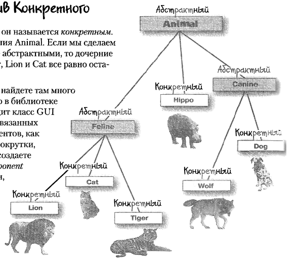

Объект - это экземпляр класса.
Классы могут быть
- предметными
- абстрактными

Например, класс dog является предметным, потому что описывает свойства и функции собак.

А класс BigInteger является абстрактным, потому что он нужен просто для работы с большими целыми числами.

Класс описывает свойства и действия, которые присущи объектам класса.
Свойства называются полями, а действия - методами.

[Инкапсуляцией](incapsulation.md) называется объединение внутри класса данных и операций с ними, а также сокрытие деталей реализации методов от прямого доступа.

[Наследованием](inheritance.md) называется возможность создания производных классов на основе существующих.

В наследованный класс можно что-то добавить в дополнение к базовому или переопределить от базового.

Можно создавать объекты наследованных классов следующим образом
```java
ClassName name = new NasledovanniyClass();
```
но это уже является свойством полиморфизма.

[Полиморфизм](polymorphism.md) - перегрузка одних и тех же методов для объектов разных подклассов, наследованных от одного класса.

Абстракция - выделение главных, наиболее значимых характеристик предмета и отказ от менее значимых.

В классе могут быть как поля, необходимые для создания объектов, так и поля нужные для работы внутри класса. Например, таким полем может являться счетчик созданных объектов класса.

```java
public class Dog {
    String name;
    int age;

    static int count = 0; //Счетчик для подсчета количества созданных экземпляров класса.

    public Dog(){ //Пустой конструктор
        count++;
    }
}
```

Такие поля вводятся с ключевым словом static.
Вызывать такие переменные внутри методов класса можно без указания объектов.

**Класс Object**

Главный класс - класс всех классов и хозяин семи морей - это класс Object. Он прародитель всех остальных классов. Все неунаследованные классы, на самом деле в неявном виде наследованы от Object.

Вот некоторые методы класса Object, которые можно вызвать из любого объекта

- `boolean equals(Object o)` - сравнивает ссылки на объекты
- `int hashCode()` - возвращает хэш-код (при каждом вызове вычисляет новое значение)
- `String toString()` - возвращает строку с именем класса и какими-то числами.
- `Class getClass()` - возвращает класс объекта (переопределять не нужно, это делается неявно)
- `void finalize()` - освобождает ресурсы
- `Object clone()` - создает дубликат объекта, при этом в клонированный объект копируются не поля, а ссылки на них. Так что этот метод тоже лучше переопределять. Те классы, которые устраивает копирование по ссылкам помечаются маркерным интерфейсом Clonable и в них переопределяется метод clone() с вызовом super.clone(). Если у пользовательского класса не реализован такой интерфейс, то при вызове метода clone() вылетит CloneNotSupportedException.
- для работы с [многопоточностью](../multithreading/threads.md):
    - `final void notify()` - возобновляется выполнение одного ожидающего потока.
    - `final void notifyAll()` - возобновляется выполнение всех ожидающих этот объект потоков.
    - `final void wait()` - поток приостанавливается, давая возможность другим потокам поработать с объектом до получения уведомления с помощью `notify()`
    - `final void wait(long)` - ожидание длится указанное количество миллисекунд или до получения уведомления
    - `final void wait(long, int)` - ожидание длится указанное количество миллисекунд и наносекунд.

Методы `equals()`, `hashCode()` и `toString()` рекомендуется переопределять для собственных классов.

Если вы создали ссылку типа Object и записали в нее объект другого класса, то использовать методы этого класса будет невозможно. Чтобы воспользоваться этим классом сполна, нужно записать ссылку на него в ссылочную переменную этого класса.

У каждого объекта есть мьютекс, предназначенный для работы в многопоточности. Мьютекс свидетельствует о том, занят ли в настоящий момент объект каким-либо потоком. Если поток захватил мьютекс объекта, то остальные потоки не смогут работать с этим объектом. Мьютекс захватывается с помощью ключевого слова synchronized.


### Сравнение объектов класса
Сравнение объектов может происходить
- по ссылке
- по значению

Для сравнения объектов по ссылке (обе переменные ссылаются на один и тот же объект) используется оператор ==
```java
MyClass myObject1 = new MyClass();
MyClass myObject2 = new MyClass();
System.out.println(myObject1 == myObject2); //false - переменные содержат разные ссылки на разные объекты
myObject2 = myObject1;
System.out.println(myObject1 == myObject2); //true - переменные имеют одинаковые ссылки
```

Для сравнения объектов по значению используется метод `equals()`
```java
String s1 = "Arty B";
String s2 = "Arty B";
System.out.println(s1 == s2); //false - переменные содержат разные ссылки на разные объекты
System.out.println(s1.equals(s2)); //true - переменные содержат одно и то же значение
// метод equals вызывается из объекта и принимает аргумент в виде другого объекта
```

Для пользовательских классов необходимо писать метод equals() самостоятельно.
```java
class Coord{
    int x;
    int y;
    //метод сравнивает координаты двух точек и выдает true, если они совпадают
    public boolean equals(Coord dot){
        return this.x == dot.x && this.y == dot.y ? true : false;
    }
}
```

Чтобы узнать, принадлежит ли объект определенному классу, можно воспользоваться instanceof
```java
if (o instanceof Dog) {
}
```
Этот оператор работает и с полиморфизмом
```java
boolean isDog =  o instanceof Dog;
boolean isAnimal = o instanceof Animal; //Если Dog унаследован от Animal, то и то, и другое true
```

Если ты часто используешь instanceOf, значит у тебя что-то не так с ООП. В основном этот оператор применяется в переопределенных методах equals().

## Абстрактные классы

Классы, создание объектов которых бессмысленно, можно сделать абстрактными с помощью ключевого слова abstract

```java
abstract class Figure{ //создавать фигуру бессмысленно - мы не знаем какого она вида

}

class Circle extends Figure{ //а вот создать круг уже можно, хотя он является дочерним классом для фигуры

}
```

Классы, не являющиеся абстрактными, называют конкретными.



Конкретные классы должны реализовывать все абстрактные методы, объявленные в родительских классах.

## Immutable-классы
Созданные объекты таких классов больше нельзя изменить.
При повторном присвоении создается новый объект и ссылка ведет уже на него
```java
String s1 = "lol";
String s2 = s1; //скопирована ссылка на "lol"

s1 = "kek"; //создан новый объект "kek" и ссылка s1 теперь ведет на него, ссылка s2 по прежнему ведет на "lol"

System.out.println(s1); //выведет - kek
System.out.println(s2); //выведет - lol
```
К таким классам относятся:

- `String`
- все классы обертки: `Integer`, `Byte`, `Character` и другие
- `StackTraceElement`

Можно создать Immutable класс самостоятельно. Для этого нужно сделать все поля приватными, убрать все геттеры, а все операции преобразования объекта должны не изменять объект, а возвращать новый с измененными полями.

Преимущества Immutable-классов:
- их проще реализовать.
- их можно свободно использовать одновременно из разных нитей.

Очень часто создают две версии класса: Mutable и Immutable.

## Хранение объектов

При создании нового объекта он помещается в кучу. Переменной присваивается лишь ссылка на этот объект.

Переменные экземпляра хранятся в куче (потому что они являются составной частью объектов).

Локальные переменные хранятся в стеке.

## Копирование объектов
Копирование объектов бывает двух типов:
- Поверхностное - копируются ссылки на поля
- Глубокое - копируются сами поля

Для проведения поверхностного копирования можно вызвать метод clone(), но только если класс помечен маркерным интерфейсом Clonable.

Для глубокого копирования можно воспользоваться сериализацией, либо переопределить метод clone так, чтобы он создавал новые объекты, а не копировал ссылки.

Копирование с помощью сериализации можно проводить с использованием байтовых потоков:
```java
BigObject objectOriginal = new BigObject();

ByteArrayOutputStream writeBuffer = new ByteArrayOutputStream();
ObjectOutputStream outputStream = new ObjectOutputStream(writeBuffer);
outputStream.writeObject(objectOriginal);
outputStream.close();

byte[] buffer = writeBuffer.toByteArray();
ByteArrayInputStream readBuffer = new ByteArrayInputStream(buffer);
ObjectInputStream inputStream = new ObjectInputStream(readBuffer);
BigObject objectCopy = (BigObject)inputStream.readObject();
```

--- 

Внутри класса можно объявлять вложенные классы следующих видов:

- Внутренние классы
    - Обычные вложенные классы - объявлены внутри класса без модификатора static
    - Локальные классы - объявлены внутри метода класса
    - Анонимные классы - переопределяют какой-либо класс, наследуясь от него и возвращают объект переопределенного класса.
- Статические вложенные классы - объявлены внутри класса с модификатором static

****

## Внутренние классы (inner)

Внутренние классы обычно создают для выделения каких-либо сущностей, которые не могут существовать вне другой сущности.

Внутренние классы объявляются без модификатора static.
Особенности:
1. Объект внутреннего класса не может существовать без объекта внешнего класса
2. Внутренние классы имеют доступ ко всем полям и методам внешнего класса (даже приватным).
3. Объект внутреннего класса нельзя создать в статическом методе внешнего класса
4. Внутренний класс не может содержать статические переменные и методы.
5. Приватные внутренние классы могут вызываться только из внешнего класса

Можно создавать объекты внутреннего класса извне даже внешнего класса:
```java
OuterClass outer = new OuterClass();
OuterClass.InnerClass inner = outer.new InnerClass();
```

Для того чтобы получить доступ к полям внешнего класса из внутреннего класса, если и тот и другой имеют одинаково названные поля, нужно использовать:

```java
OuterClass.this.field //Вызов поля внешнего класса из внутреннего
this.field // Вызов поля внутреннего класса из внутреннего класса
```

При наследовании одного внутреннего класса от другого

### Вложенные классы (nested) (Их также называют статическими внутренними классами)

Это классы, объявленные внутри другого класса с модификатором static.
Вложенные классы не имеют доступа к нестатическим полям внешнего класса

При создании объекта вложенного класса извне необходимо через точку упоминать его внешний класс:

```java
OuterClass.NestedClass inner = new OuterClass.NestedClass();
```

### Анонимные классы

Анонимные классы чаще всего используются когда вам нужен локальный класс для одноразового использования.

Анонимные классы объявляются при создании какого-либо объекта, класс которого должен быть унаследован от известного класса или должен реализовывать какой-либо известный интерфейс.
```java
class myClass extends StringBuilder {
    public static void main(String[] args) {

        Thread thread = new Thread(){ //класс уже унаследован от StringBuilder и унаследовать его от Thread не получается

            public void run() { //Переопределяем нужные методы, добавляем нужные поля

                doSmth();
            }
        }; //Тут не забываем про точку с запятой
        thread.start();
    }
}
```
Анонимный класс может обращаться ко всем полям и методам внешнего класса.

У анонимного класса не может быть конструктора. Но можно инициализировать переменные внутри блока кода:
```java
list.add(new Object(){ //В каком-то методе программы к списку добавляется новый объект анонимного класса

    int variable;
    { //По сути этот блок является конструктором
        variable = 5;
    }
});
```

Анонимные классы в Java 8 зачастую с успехом заменяются на [Лямбда-выражения](../stream_and_lambda/lambda_expressions.md).

### Локальные классы
Локальные классы объявляются в методе другого класса
Особенности:

1. Объект локального класса может быть создан только в том методе, где он объявлен, и нигде больше
2. За пределами метода, где объявлен локальный класс, никто не может от него унаследоваться
3. В классе могут использоваться переменные, объявленные в методе, и параметры метода
    1. При этом переменные и параметры не должны меняться! Такие переменные называют effective-final

---

## К изучению
- [ ] https://habr.com/ru/post/342090/